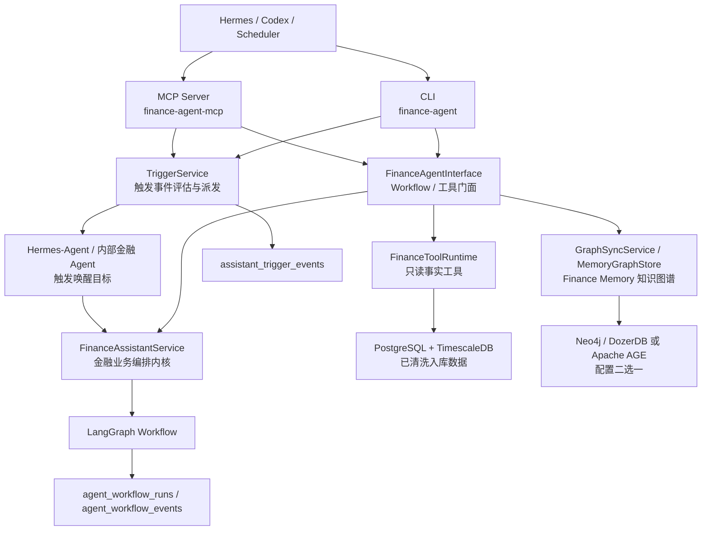

# CLI 与 MCP 工具入口

本文记录当前阶段给 Hermes-Agent、Codex、Scheduler 和后续前端 API 使用的工具入口。结论是：CLI 和 MCP 都保持薄入口；Workflow 与事实工具共用 `FinanceAgentInterface`，V1.2 触发事件入口调用 `TriggerService` 并唤醒 Hermes-Agent 或内部金融 Agent，入口层只做参数解析、事务边界、JSON 序列化和调用转发，不承载金融决策逻辑。

## 1. 分层



## 2. CLI 入口

CLI 入口：

```bash
python -m finance_agent.cli workflows list
python -m finance_agent.cli tools list
```

安装为 console script 后也可以使用：

```bash
finance-agent workflows list
finance-agent tools list
```

运行报告类 Workflow 示例：

```bash
finance-agent workflows run asset_deep_analysis \
  --owner-id owner:demo \
  --asset-id asset:demo:600519 \
  --portfolio-id portfolio:demo \
  --watchlist-id watchlist:demo
```

运行推荐决策 Workflow 示例：

```bash
finance-agent workflows run recommendation_decision \
  --owner-id owner:demo \
  --portfolio-id portfolio:demo \
  --watchlist-id watchlist:demo \
  --recommendation-run-id run:demo:ashare:latest
```

读取审计和报告：

```bash
finance-agent workflows show workflow:demo:asset_deep_analysis:20260518160000
finance-agent reports show workflow:demo:asset_deep_analysis:20260518160000
finance-agent reports show workflow:demo:asset_deep_analysis:20260518160000 --markdown
```

调用只读事实工具：

```bash
finance-agent tools call factor.get_asset_factor_context \
  --arguments "{\"asset_id\":\"asset:demo:600519\",\"horizon\":\"swing\"}"
```

CLI 默认输出结构化 JSON；`reports show --markdown` 可只输出中文 Markdown 正文。

知识图谱命令示例：

```bash
finance-agent graph health
finance-agent graph init
finance-agent graph sync-asset --owner-id owner:demo --asset-id asset:demo:600519
finance-agent graph sync-owner --owner-id owner:demo
finance-agent graph trace --owner-id owner:demo --asset-id asset:demo:600519
finance-agent graph reason-chain --owner-id owner:demo --asset-id asset:demo:600519
finance-agent graph similar-decisions --owner-id owner:demo --asset-id asset:demo:600519
finance-agent graph risk-contagion --owner-id owner:demo --asset-id asset:demo:600519
finance-agent graph conflicts --owner-id owner:demo --asset-id asset:demo:600519
```

图谱命令只访问当前配置选择的一个后端：默认 `neo4j` / DozerDB，也可以显式配置为 `apache_age`；不做双写、双读或自动 fallback。

CLI 聊天窗口示例：

```bash
finance-agent chat --owner-id owner:demo
finance-agent chat --owner-id owner:demo --new-session
finance-agent chat --owner-id owner:demo --session-id chat:owner-demo:xxxx --message "查看历史"
```

聊天窗口会把会话写入 `assistant_chat_sessions`，把用户消息和 Agent 回复写入 `assistant_chat_messages`，用于跨进程恢复和 `/history` 历史查看。它只保存普通聊天上下文；可审计的金融长期记忆仍由 Workflow、决策日志、复盘和用户反馈写入 `assistant_memories`。

当前聊天窗口已支持两类模式：

- 固定意图模式：查询 Workflow、工具、模型配置、路由预览和历史消息时，直接走确定性接口，不调用外部模型。
- 模型工具循环模式：普通自然语言问题在主分析模型 ready 时，模型可以按需请求 `FinanceToolRuntime` 只读工具，例如因子、信号风险、Finance Memory 和图谱工具；工具结果压缩后再交给模型输出 `summary_zh`。模型不可用、输出不可解析或请求非法工具时，会降级为能力说明，不阻断会话。

## 3. MCP 入口

MCP Server 入口：

```bash
python -m finance_agent.mcp_server
finance-agent-mcp
```

当前 MCP tools：

| MCP Tool | 作用 |
| --- | --- |
| `list_workflows` | 列出 6 个金融团队 Workflow |
| `run_workflow` | 运行 Workflow，返回结构化结果和报告 |
| `get_workflow_run` | 查询 Workflow run 和审计事件 |
| `get_report` | 查询中文解释报告，可返回 Markdown |
| `list_tools` | 列出只读金融事实工具 |
| `call_tool` | 调用 `FinanceToolRuntime` 中的只读事实工具 |
| `evaluate_triggers` | 评估已入库事实并生成触发事件 |
| `dispatch_triggers` | 派发待处理触发事件到 Agent 唤醒队列 |
| `run_triggers_once` | 执行一次触发评估并立即唤醒 Agent |
| `graph_health` | 检查当前图谱后端健康状态 |
| `graph_initialize` | 初始化图谱约束、索引或 AGE 图空间 |
| `graph_sync_asset` | 同步单标的图谱投影 |
| `graph_sync_owner` | 同步某个用户的图谱投影 |
| `graph_trace_asset` | 追踪单标的决策、记忆、观察池、风险和证据路径 |
| `graph_explain_candidate_reason_chain` | 解释入池或持续关注原因链 |
| `graph_find_similar_decision_paths` | 查找相似历史决策路径 |
| `graph_detect_risk_contagion` | 检测风险传导路径 |
| `graph_find_memory_conflicts` | 发现 Finance Memory 冲突 |

MCP 依赖写入 `pyproject.toml`：`mcp>=1.16,<2.0`。当前本地已验证 `mcp 1.27.1` 可以创建 server。

## 4. 约束

- CLI 和 MCP 不直接调用 AKShare、Binance、ccxt 或网页。
- CLI 和 MCP 不直接计算指标、因子、评分或信号。
- CLI 和 MCP 不让外部 LLM 直接访问行情源；CLI 聊天和内部 Agent Loop 可在模型配置 ready 时调用 OpenAI-compatible 模型，但模型只能通过白名单只读工具读取已入库事实。
- CLI 和 MCP 不绕过 `FinanceAssistantService` 写决策、记忆或审计。
- CLI 和 MCP 图谱入口不直接写业务事实，只把 PostgreSQL 事实源同步为可重建图谱投影。
- 图谱入口只使用配置选择的一个图数据库后端，不自动切换后端。
- 触发入口不直接给买卖结论，也不直接运行 Workflow；只写 `assistant_trigger_events` 并唤醒 Hermes-Agent 或内部金融 Agent。
- 真实交易下单仍不在本项目第一阶段范围内，后续必须增加人工确认和交易权限开关。

## 5. 验证

当前验证脚本：

```bash
python scripts/storage/smoke_agent_cli_interface.py
python scripts/storage/smoke_agent_mcp_server.py
python scripts/storage/smoke_graph_store.py
python scripts/storage/smoke_v12_trigger_events.py
python scripts/storage/smoke_real_model_agent_loop_planner.py
python scripts/storage/smoke_agent_chat_model_tool_loop.py
```

已验证：

- `FinanceAgentInterface` 和 CLI 暴露一致的 Workflow 清单。
- CLI 可以输出结构化 JSON。
- CLI 可以运行 `asset_deep_analysis` 圆桌报告 Workflow。
- CLI/MCP 可通过独立 graph 命令和 tool 调用覆盖图谱健康检查、初始化、同步、路径追踪、入池原因链、相似历史决策、风险传导和记忆冲突。
- CLI 聊天窗口可以持久化 `chat_session_id`，并通过 `--session-id` 恢复最近聊天流水。
- CLI 聊天窗口可在模型 ready 时进入模型工具循环，按需调用只读事实工具并返回中文摘要。
- 内部 Agent Loop 默认使用模型增强 planner；没有模型配置时自动 fallback，不破坏触发闭环。
- MCP SDK 安装后可以创建 MCP Server。
- V1.2 触发层能生成 6 类触发事件、冷却去重，并通过 CLI 重复评估返回结构化 JSON。
