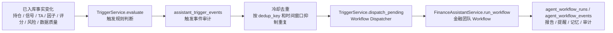

# V1.2 触发事件层设计

V1.2 的目标是让私人金融助手可以被已入库的数据变化唤起，而不是让 Workflow 常驻轮询。触发层不直接抓取 AKShare、Binance、ccxt，也不临时计算 TA、因子、评分或信号；它只读取数据层已经清洗并写入 PostgreSQL + TimescaleDB 的事实。

## 1. 链路



触发层只是“唤醒器”。是否买入、卖出、换股、入池或移除观察池，仍由底层金融团队 Workflow 决策并写入审计链路。

## 2. 已支持触发类型

| 触发类型 | 数据来源 | 调用 Workflow | 说明 |
| --- | --- | --- | --- |
| `position_drawdown` | `positions` | `portfolio_monitoring` | 当前持仓未实现盈亏比例超过组合阈值或默认阈值 |
| `signal_flip` | `signal_snapshots` | `portfolio_monitoring` | 持仓标的最新信号从非空头转为空头 |
| `watchlist_condition_hit` | `signal_snapshots`、`indicator_frames`、`factor_frames`、`asset_scores` | `asset_deep_analysis` | 观察池启动条件命中，可同时使用信号、TA 指标、因子可用组和多维评分 |
| `recommendation_run_ready` | `recommendation_runs` | `recommendation_decision` | 新推荐运行可用后触发 Agent 判断是否入池、买入、卖出或换股 |
| `risk_event_detected` | `risk_findings` | 持仓走 `portfolio_monitoring`，观察池走 `asset_deep_analysis` | 新增 high / critical 风险后触发复核 |
| `data_quality_degraded` | `data_quality_snapshots` | 持仓走 `portfolio_monitoring`，观察池走 `asset_deep_analysis` | 数据缺失、失败、部分可用、过期或 stale 时触发复核 |

## 3. 观察池条件

`watchlist_items.trigger_conditions` 可以使用以下字段。所有字段都来自已入库快照，不在触发层实时计算：

| 条件字段 | 对应数据 | 示例 |
| --- | --- | --- |
| `signal_direction` / `direction` | `signal_snapshots.direction` | `bullish` |
| `min_signal_score` | `signal_snapshots.score` | `80` |
| `min_signal_confidence` | `signal_snapshots.confidence` | `0.70` |
| `min_total_score` | `asset_scores.total_score` | `80` |
| `min_factor_groups` | `factor_frames.total_available_groups` | `3` |
| `factor_status` | `factor_frames.status` | `available` |
| `min_rsi_14` / `max_rsi_14` | `indicator_frames.rsi_14` | `50` / `75` |
| `require_macd_positive` | `indicator_frames.macd_hist` | `true` |

这回答了“信号触发是否需要使用 TA 因子”的问题：触发层读取的是已经由 TA-Lib、pandas/numpy、AKShare、Binance/ccxt 输入生成并入库的指标、因子、评分和信号，不在触发时重新计算。

## 4. 去重和冷却

触发事件写入 `assistant_trigger_events`：

- `trigger_type`：触发类型。
- `trigger_ref`：来源对象，例如推荐运行、风险、数据质量快照或持仓 ID。
- `dedup_key`：同类触发冷却键。
- `cooldown_until`：冷却到期时间。
- `workflow_type`：后续派发的 Workflow。
- `status`：`pending`、`dispatched`、`skipped`。
- `payload`：触发原因、信号 ID、因子 ID、评分 ID、风险 ID、数据质量状态等上下文。

`TriggerService.evaluate()` 会在冷却窗口内抑制重复事件；`TriggerService.dispatch_pending()` 只派发 `pending` 事件，并把结果标记为 `dispatched` 或 `skipped`。

## 5. CLI 和 MCP

CLI：

```bash
finance-agent triggers evaluate --owner-id owner:demo --portfolio-id portfolio:demo
finance-agent triggers dispatch --owner-id owner:demo --limit 20
finance-agent triggers run-once --owner-id owner:demo --portfolio-id portfolio:demo --watchlist-id watchlist:demo
```

MCP tools：

- `evaluate_triggers`
- `dispatch_triggers`
- `run_triggers_once`

这些入口同样只读已入库事实，不直接访问外部数据源。

## 6. 验证

当前冒烟脚本：

```bash
python scripts/storage/smoke_v12_trigger_events.py
```

已验证内容：

- 6 类触发事件均能生成。
- 观察池触发条件会使用 TA、因子和评分。
- 冷却期重复评估不会重复创建事件。
- 触发事件可以派发到 `portfolio_monitoring`、`asset_deep_analysis` 和 `recommendation_decision`。
- CLI `triggers evaluate` 能返回结构化 JSON。
