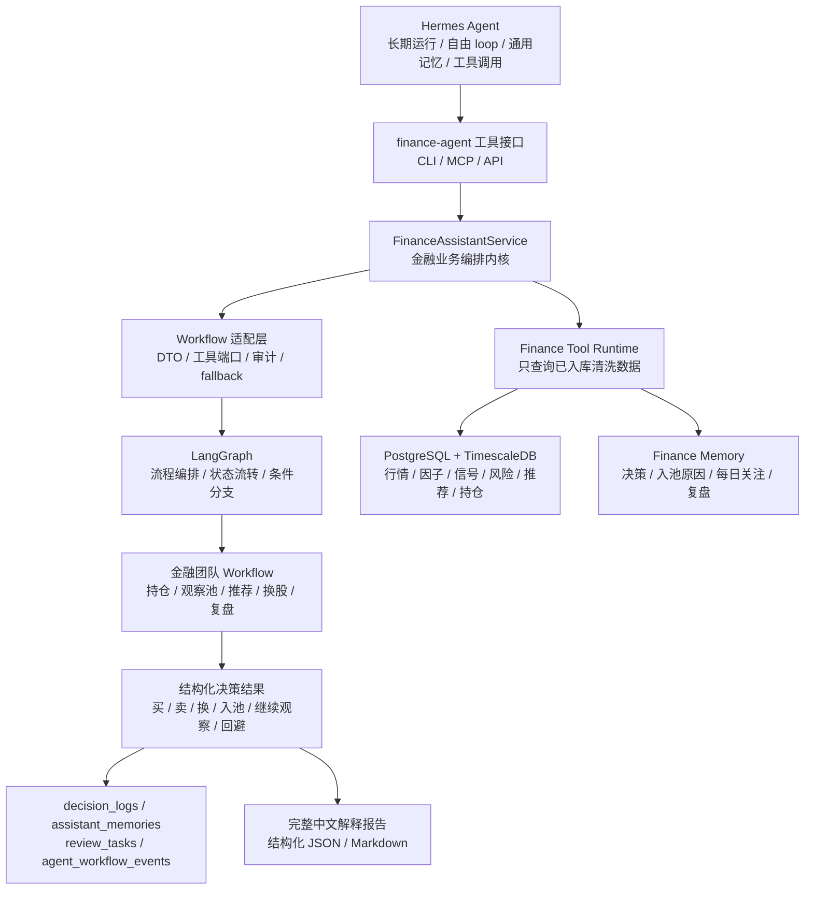
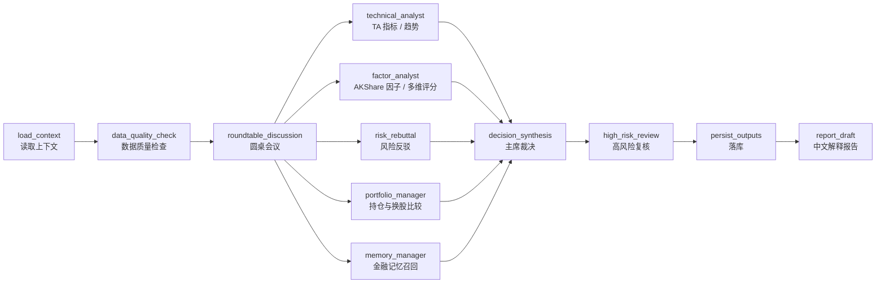

# Workflow 层设计

本文记录当前阶段对 Agent 层和 Workflow 层的最新设计决策。核心调整是：上层长期运行时优先使用 Hermes Agent，本项目不重复实现一个完整自由主 Agent；`finance-agent` 保留金融业务内核、工具接口、Workflow、Finance Memory 和审计落库能力。

## 1. 设计结论

`PersonalFinanceAgent` 不再作为独立 Agent 框架推进，而是收敛为金融业务编排内核。后续代码层建议逐步改名为 `FinanceAssistantService`。

新的职责分工：

| 层级 | 组件 | 职责 |
| --- | --- | --- |
| 上层外部运行时 | Hermes Agent | 长期运行、自由 loop、通用记忆、任务调度、工具调用和用户对话 |
| 上层内部运行时 | InternalFinanceAgentLoop | 不使用 Hermes 时的项目内受控 Agent Loop，基于 LangGraph 消费 `assistant_trigger_events` |
| 金融业务内核 | `FinanceAssistantService` | 聚合持仓、观察池、推荐、信号、风险、Finance Memory，并调用 Workflow |
| 工具接口 | CLI / MCP / API | 把金融事实查询、Workflow 调用和记忆写入能力暴露给 Hermes、Dashboard 和 Scheduler |
| Workflow 编排引擎 | LangGraph | 编排固定金融团队流程、节点状态流转、条件分支和可恢复执行 |
| Workflow 适配层 | 本项目业务适配与审计层 | 定义金融 DTO、工具端口、审计落库、fallback、高风险复核和结果落库 |
| Domain Workflow | 金融团队 Workflow | 基于 LangGraph 编排持仓监控、观察池管理、推荐决策、单标的分析、换股比较和每日复盘 |
| 数据与记忆 | PostgreSQL + TimescaleDB + Finance Memory | 保存清洗后事实、时序数据、决策日志、入池原因、每日关注原因和复盘结论 |

## 2. 总体结构



Hermes Agent 或内部 `InternalFinanceAgentLoop` 负责“什么时候关心什么”和“下一步调用哪个工具”。`FinanceAssistantService` 负责“金融事实怎么查、哪些动作能写库、决策怎么审计、Workflow 怎么落库”。内部 Agent Loop 的详细设计见 [内部金融AgentLoop设计.md](内部金融AgentLoop设计.md)。

## 3. 为什么不让 Hermes 直接承担全部金融逻辑

Hermes 适合做上层运行时，但不适合直接替代本项目的金融业务内核：

- Hermes Memory 是通用 Agent 记忆，不能当作行情、财务、风险或推荐事实。
- 买入、卖出、换股、入池和移除观察池必须能追溯到结构化事实、证据 ID、风险 ID、信号 ID 和 Finance Memory。
- 金融建议需要稳定输出协议，不能散落在自然语言对话里。
- 后续 Dashboard、Scheduler、CLI 和测试脚本也需要复用同一套金融业务能力。
- 如果未来替换 Hermes，上层运行时可以变，但金融业务内核和审计链路不能重写。

因此，Hermes 是宿主和调度器，`finance-agent` 是可审计的金融业务系统。

## 4. `FinanceAssistantService` 边界

`FinanceAssistantService` 是原 `PersonalFinanceAgentService` 的收敛方向。第一阶段可以保留旧类名，避免大范围重命名；新文档和新增代码应优先使用新命名。

它允许做：

- 读取组合、持仓、盈亏、仓位和风险预算。
- 读取私人观察池、入池原因、每日继续关注原因、启动条件和失效条件。
- 读取推荐结果、评分、信号、风险、证据和数据质量。
- 读取和写入 Finance Memory。
- 调用底层 Domain Workflow。
- 写入提醒、决策日志、Workflow 审计、复盘任务和观察池事件。
- 通过 `list_workflows()` 暴露本项目内部可调度的金融团队 Workflow。
- 通过 `run_workflow()` 统一调度 LangGraph Workflow，并把节点、圆桌、模型路由、高风险复核和完整中文报告写入审计表。

它不允许做：

- 直接抓 AKShare、Binance、ccxt 或外部网页。
- 直接计算因子、技术指标、评分和风险数值。
- 覆盖数据层已经生成的事实。
- 绕过风险反驳输出强买入结论。
- 绕过用户确认提交真实订单。

## 5. Workflow 编排边界

本项目不自研完整 AI Workflow 框架。Workflow 编排优先使用 LangGraph；我们只实现金融业务适配层，负责把 LangGraph 节点和本项目的数据库、工具、审计、记忆、模型路由连接起来。

分工如下：

| 能力 | 归属 | 说明 |
| --- | --- | --- |
| 节点图、边、条件分支、状态传递 | LangGraph | 使用成熟编排能力，不自己造图执行框架 |
| 金融状态对象和 DTO | 本项目 | 定义 `FinancialTeamState`、决策输出、证据引用和报告结构 |
| 工具调用端口 | 本项目 | 只查询 PostgreSQL + TimescaleDB、Finance Memory 和配置选择的 GraphStore |
| 审计落库 | 本项目 | 写入 `agent_workflow_runs`、`agent_workflow_events`、`decision_logs` |
| fallback 规则 | 本项目 | LLM 不可用或数据不足时回到确定性规则 |
| 高风险复核策略 | 本项目 | 决定是否升级到 GPT-5.5 Pro |
| 上层外部自由 loop | Hermes Agent | 不放进本项目 Workflow |
| 上层内部受控 loop | InternalFinanceAgentLoop | 可使用 LangGraph，但必须有轮次、工具调用和 Workflow 调用预算 |

标准步骤：



圆桌会议是 Workflow 中的受控阶段，不是无限自由 loop。第一阶段每个角色只输出一轮结构化观点，记录 `role`、`stance`、`summary`、`tool_calls`、`source_ids` 和 `evidence_ids`；主席节点再生成最终动作。后续接入 LLM 时，仍复用这套结构，不落隐藏推理链，只记录摘要、工具调用、输入输出引用和证据 ID。

## 6. Domain Workflow 列表

| Workflow | 作用 | 第一阶段策略 |
| --- | --- | --- |
| `portfolio_monitoring` | 监控持仓，判断持有、减仓、卖出或等待 | 保留现有规则版作为 fallback，再迁入 LangGraph 节点 |
| `watchlist_management` | 管理私人观察池，记录每日继续关注原因 | 保留现有规则版作为 fallback，再迁入 LangGraph 节点 |
| `recommendation_decision` | 判断推荐是否入池、买入、换股或回避 | 保留规则 fallback，升级为 LangGraph + 工具调用决策 |
| `asset_deep_analysis` | 单标的深度分析 | 已具备 LangGraph 圆桌报告基础版，读取因子/TA、信号风险、组合、观察池、推荐和记忆工具，用于买卖、入池、移除前复核 |
| `swap_decision` | 弱持仓和强候选之间做换股或换币比较 | 已具备 LangGraph 圆桌报告基础版，比较弱持仓与强候选，高风险动作进入复核 |
| `daily_review` | 每日盘后或每日定时复盘 | 已具备 LangGraph 圆桌报告基础版，可从组合、观察池或推荐运行自动派生复盘标的 |

`risk_rebuttal` 暂时作为每个 Workflow 的固定步骤，不单独做成入口 Workflow。

## 6.1 统一调度与审计事件

当前内部调度基础版已经落地；CLI 和 MCP 工具入口已经接入，Hermes Agent 后续可通过这两个入口调用，不需要直接依赖 Python 内部类：

- `FinanceAssistantService.list_workflows()`：列出 6 个可调度 Workflow。
- `FinanceAssistantService.run_workflow()`：按 `workflow_type` 找到 LangGraph 构建器，执行图，并统一写入 `agent_workflow_runs` / `agent_workflow_events`。
- `FinanceAgentInterface`：CLI / MCP 共用门面，负责参数归一化、DTO 组装、事务边界和 JSON 序列化。
- `FinanceToolRuntime.workflow.list_workflows`：给 Hermes、MCP、CLI 或前端查询可用 Workflow 使用。
- `list_langgraph_workflow_builders()`：作为本项目内部 Workflow 注册表，当前包含 `portfolio_monitoring`、`watchlist_management`、`recommendation_decision`、`asset_deep_analysis`、`swap_decision`、`daily_review`。

审计事件类型保持结构化：

| 事件类型 | 来源 | 用途 |
| --- | --- | --- |
| `workflow_node_completed` | 普通 LangGraph 节点 | 记录上下文加载、数据工具调用、主席裁决等节点摘要 |
| `roundtable_opinion` | `roundtable:*` 角色观点 | 记录技术分析、因子分析、风险反驳、组合经理、记忆管理员等结构化观点 |
| `high_risk_review` | `high_risk_review:*` 复核项 | 记录卖出、换股、强风险、数据缺口等是否需要升级复核 |
| `model_route` | `model_route:*` 路由项 | 记录 DeepSeek V4 Pro 常规分析路由和 GPT-5.5 Pro 高风险复核路由 |
| `model_review` | `model_review:*` 复核协议 | 记录高风险复核状态、复核模型、复核输入摘要和等待真实模型执行的状态 |
| `report_draft` | 报告节点 | 记录完整中文解释报告结构，包含 JSON 字段和 Markdown 文本 |

当前已接入完整中文报告模板，报告结构包含：

- `executive_summary`：执行摘要。
- `decision`：主席裁决和动作。
- `action_plan`：后续行动计划。
- `key_evidence`：证据、评分和指标引用。
- `roundtable_opinions`：圆桌角色观点。
- `risk_rebuttal`：风险反驳。
- `data_quality`：数据质量状态。
- `memory_references`：Finance Memory 引用。
- `review_status`：高风险复核状态。
- `model_routing`：模型路由和复核模型。
- `disclaimer`：非投资建议声明。
- `markdown`：可直接展示或归档的中文 Markdown。

当前阶段只落地模型路由与复核协议，不真实调用外部 LLM。Hermes-Agent 或后续模型客户端应消费 `model_route` / `model_review` 审计事件里的 `model_key`、`review_input` 和证据引用，再把真实复核结果回写到同一条 Workflow 审计链路。

## 6.2 CLI 与 MCP 入口

CLI 和 MCP 已经同时落地，二者都是薄入口。Workflow 和事实工具入口共用 `FinanceAgentInterface`；V1.2 触发事件入口调用 `TriggerService`，只把事件写入 `assistant_trigger_events` 并唤醒 Hermes-Agent 或内部金融 Agent。Agent 在自己的 loop 中读取触发事件、已入库事实和金融记忆，再按需调用 `FinanceAssistantService.run_workflow()`：

```text
Hermes / Codex / Scheduler / Trigger Engine
  -> CLI 或 MCP
  -> FinanceAgentInterface / TriggerService
  -> assistant_trigger_events
  -> Hermes-Agent 或内部金融 Agent
  -> FinanceAssistantService / FinanceToolRuntime
  -> 按需调用 LangGraph Workflow / PostgreSQL + TimescaleDB
```

CLI 更适合本地开发、批处理、冒烟验证和大模型直接调命令；MCP 更适合作为长期 Agent 的正式工具入口，具备工具发现、结构化参数和权限边界。

已提供的 CLI 命令：

```bash
finance-agent workflows list
finance-agent workflows run asset_deep_analysis --owner-id owner:demo --asset-id asset:demo
finance-agent workflows show <workflow_run_id>
finance-agent reports show <workflow_run_id> --markdown
finance-agent tools list
finance-agent tools call factor.get_asset_factor_context --arguments "{\"asset_id\":\"asset:demo\"}"
finance-agent triggers evaluate --owner-id owner:demo --portfolio-id portfolio:demo
finance-agent triggers dispatch --owner-id owner:demo
finance-agent triggers run-once --owner-id owner:demo --portfolio-id portfolio:demo --watchlist-id watchlist:demo
```

已提供的 MCP tools：

- `list_workflows`
- `run_workflow`
- `get_workflow_run`
- `get_report`
- `list_tools`
- `call_tool`
- `evaluate_triggers`
- `dispatch_triggers`
- `run_triggers_once`

CLI / MCP 入口约束：

- 不直接访问外部数据源。
- 不直接计算因子、指标、评分或信号。
- 不直接调用外部模型。
- 不绕过 `FinanceAssistantService` 写入决策、记忆和审计。
- 输出统一为 JSON；报告可以额外返回 Markdown。

## 6.3 V1.2 触发事件层

V1.2 新增 `assistant_trigger_events` 和 `TriggerService`。触发层不常驻运行 Workflow，也不直接运行 Workflow，而是把已入库事实变化转成可审计事件，再由 dispatcher 唤醒 Hermes-Agent 或内部金融 Agent。Workflow 只是 Agent 后续可按需调用的内部分析工具。

```mermaid
flowchart LR
    DB["已入库事实\n持仓 / 信号 / TA / 因子 / 评分 / 风险 / 数据质量"] --> TS["TriggerService.evaluate"]
    TS --> EV["assistant_trigger_events\npending / dispatched / skipped"]
    EV --> CD["dedup_key + cooldown\n去重和冷却"]
    CD --> DP["TriggerService.dispatch_pending"]
    DP --> AG["Hermes-Agent / 内部金融 Agent\n自由 loop / 工具调用"]
    AG --> FAS["FinanceAssistantService.run_workflow\n按需调用金融团队 Workflow"]
    FAS --> AUD["agent_workflow_runs / agent_workflow_events\n中文报告 / 记忆 / 审计"]
```



当前基础版支持：

| 触发类型 | 数据来源 | 建议内部 Workflow |
| --- | --- | --- |
| `position_drawdown` | `positions` | `portfolio_monitoring` |
| `signal_flip` | `signal_snapshots` | `portfolio_monitoring` |
| `watchlist_condition_hit` | `signal_snapshots`、`indicator_frames`、`factor_frames`、`asset_scores` | `asset_deep_analysis` |
| `recommendation_run_ready` | `recommendation_runs` | `recommendation_decision` |
| `risk_event_detected` | `risk_findings` | `portfolio_monitoring` 或 `asset_deep_analysis` |
| `data_quality_degraded` | `data_quality_snapshots` | `portfolio_monitoring` 或 `asset_deep_analysis` |

这层读取的是数据层已经由 TA-Lib、pandas/numpy、AKShare、Binance/ccxt 输入产出的指标、因子、评分和信号，不在触发时重新计算。

## 7. 工具能力

Workflow 和 Hermes 都只能通过本项目工具查询已经入库的数据：

| 工具 | 读取内容 | 写入内容 |
| --- | --- | --- |
| `PortfolioTool` | 组合、持仓、成本、盈亏、仓位 | 不直接写交易 |
| `WatchlistTool` | 观察池、观察项、入池原因、每日关注原因 | 观察项状态、观察事件 |
| `RecommendationTool` | 推荐运行、推荐项、评分、信号、证据 | 不直接改推荐分 |
| `SignalRiskTool` | 信号快照、风险发现、证据引用 | 不直接改信号和风险 |
| `FactorTool` | TA 指标、因子快照、多维评分、AKShare/Binance/ccxt 数据形成的证据 | 不直接计算或覆盖指标、因子、评分 |
| `MemoryTool` | Finance Memory、相似历史、GraphStore 图谱路径 | 决策摘要、入池原因、复盘结论 |
| `WorkflowTool` | 可调用 Workflow 列表和运行结果 | Workflow run、event、输出引用 |
| `ReportTool` | 决策结构、证据、记忆 | 中文解释报告 |

工具层不允许直接访问外部数据源。数据采集、清洗、因子和信号计算仍由数据层调度器完成。

当前第一版已落地的工具名包括：

- `portfolio.get_snapshot`
- `watchlist.get_active_items`
- `recommendation.get_run`
- `signal_risk.get_asset_context`
- `factor.get_asset_factor_context`
- `memory.recall_asset_memories`
- `workflow.list_workflows`

## 8. 输出协议

每个 Workflow 最终输出统一结构：

```text
workflow_run_id      # Workflow 运行 ID
workflow_type        # Workflow 类型
decision_type        # buy / sell / swap / hold / watch / add_to_watchlist / remove / avoid
suggested_action     # 中文动作建议
confidence           # 置信度
severity             # low / medium / high / critical
risk_rebuttal        # 风险反驳
reason_ids           # 推荐、评分、因子、入池原因引用
signal_ids           # 信号引用
risk_ids             # 风险引用
evidence_ids         # 证据引用
memory_ids           # Finance Memory 引用
next_review_at       # 下次复盘时间
report_sections      # 中文报告结构
```

输出必须落到：

- `decision_logs`
- `assistant_memories`
- `review_tasks`
- `agent_workflow_runs`
- `agent_workflow_events`
- 必要时写入 `watchlist_item_events`

## 9. 高风险复核

默认模型分配：

- DeepSeek V4 Pro：普通日常决策、工具调用、结构化总结和中文解释。
- GPT-5.5 Pro：卖出、换股、大仓位调整、强冲突信号、重大风险、数据质量缺口和用户连续否定后的复核。

高风险复核不是另起一套系统，而是复查 DeepSeek V4 Pro 或规则 Workflow 的初步建议。复核输出仍必须回写同一套 `decision_logs`、`assistant_memories`、`review_tasks` 和 Workflow 审计链路。

当前代码已实现 `ModelRoutingPolicy`：

- 常规圆桌分析路由为 `deepseek-v4-pro`。
- 触发高风险复核时生成 `gpt-5.5-pro` 路由。
- `high_risk_review` 会把 `requires_review`、复核原因、复核输入和模型路由写入 `model_review`。
- 当前不直接请求模型 API，避免在 Hermes 接入前把模型调用散落到 Workflow 内部。

## 10. 迁移策略

第一阶段不做大重命名：

1. 保留 `src/finance_agent/agents/personal_assistant.py` 和 `PersonalFinanceAgentService`。
2. 文档和新接口开始使用 `FinanceAssistantService` 作为目标名称。
3. 新增 `FinanceToolRuntime`、LangGraph 工作流构建器和 Workflow 审计适配层。（基础版已落地）
4. 不自研图执行框架，也不把 Hermes 的自由 loop 写进业务服务。
5. Hermes 通过 CLI / MCP / API 调用本项目工具。
6. `FinanceAssistantService` 先作为兼容包装继承 `PersonalFinanceAgentService`，后续等工具层和 LangGraph 适配稳定后再决定是否物理重命名。

这样可以避免当前 M2/M3/M4 已完成的持仓监控、观察池管理和推荐决策闭环被大改破坏。

## 11. 验收标准

- Hermes 可以通过工具触发 LangGraph 金融团队 Workflow。
- 工具返回结构化 JSON，不只返回自然语言。
- 所有决策都能追溯到信号、风险、推荐、证据和 Finance Memory。
- 入池原因和每日继续关注原因继续写入 `watchlist_item_events` 与 `assistant_memories`。
- 知识图谱查询通过 `GraphStore` 访问配置选择的唯一后端，默认 Neo4j / DozerDB，可选 Apache AGE，不自动 fallback。
- 数据质量不足时只允许输出等待、继续观察或补数建议，不能强买卖。
- 卖出、换股和大仓位调整必须进入 GPT-5.5 Pro 复核策略。
- 不接外部实时网页查询，不让 Hermes 或 Workflow 直接调用 AKShare、Binance、ccxt。
- Workflow 运行过程写入 `agent_workflow_runs` 和 `agent_workflow_events`。
- `asset_deep_analysis`、`swap_decision`、`daily_review` 至少具备可运行圆桌报告基础版，能调用已入库数据工具并落库圆桌观点、复核和完整中文报告。
