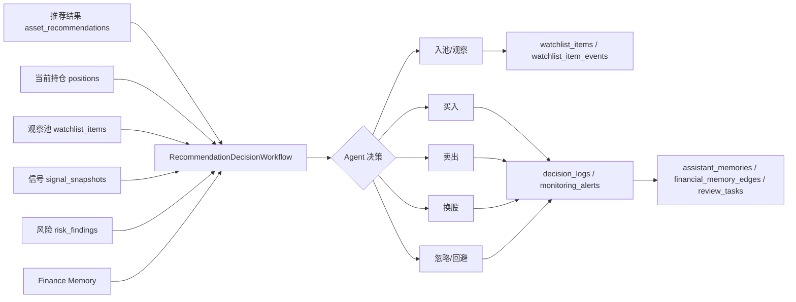
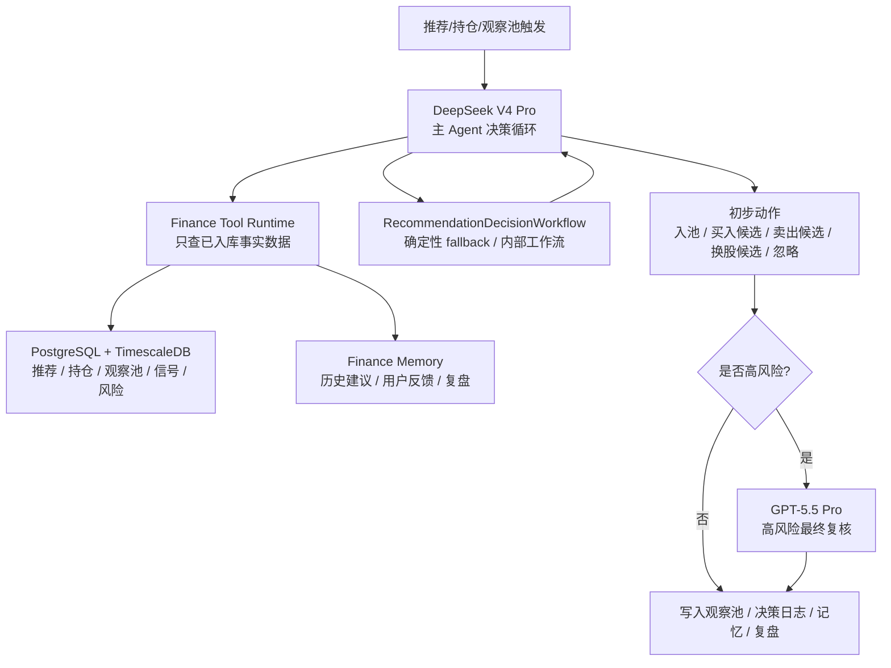

# M4 Agent 决策层实现记录

> 本文档记录本轮实现结果。当前 M4 是可审计的确定性 Agent 决策工作流，不是最终 LLM/Hermes Agent。后续接入 Hermes 或 LangGraph 时，应保留本轮 DTO、落库链路和烟测场景。

## 目标

把“推荐结果是否入池、是否买入、是否卖出、是否换股”从规则搬运升级为 Agent 决策。

M4 决策输入包括：

- 推荐结果：`asset_recommendations`
- 当前持仓：`positions`
- 私人观察池：`watchlist_items`
- 信号快照：`signal_snapshots`
- 风险发现：`risk_findings`
- 长期记忆：`assistant_memories`

M4 决策输出包括：

- `agent_action`：`add_to_watchlist` / `buy` / `sell` / `swap` / `reject` / `ignore` / `hold_position`
- `trade_action`：`watch` / `buy` / `sell` / `swap` / `avoid` / `hold`
- 观察池状态、风险反驳、复盘问题、证据引用和持仓换出引用

## 已完成文件

- 新增：`src/finance_agent/agents/workflows/recommendation_decision.py`
  - `RecommendationDecisionInput`
  - `RecommendationDecision`
  - `RecommendationDecisionResult`
  - `RecommendationDecisionWorkflow`
- 修改：`src/finance_agent/agents/workflows/__init__.py`
  - 导出推荐 Agent 决策 DTO 和 Workflow。
- 修改：`src/finance_agent/agents/personal_assistant.py`
  - 新增 `RecommendationAgentDecisionRunSummary`。
  - 新增 `decide_recommendation_actions(...)`。
  - 新增推荐 Agent 决策 Workflow 审计、观察池写入、提醒、决策日志、Finance Memory、轻量图谱边和复盘任务落库。
- 新增：`scripts/storage/smoke_m4_agent_decision_workflow.py`
  - 构造“高分推荐 + 当前弱持仓 + 高风险 + 历史记忆”的场景。
  - 验证 Agent 输出 `swap`，而不是直接规则入池。
- 修改：`scripts/storage/smoke_portfolio_monitoring_workflow.py`
  - 隔离冒烟资产 ID，避免被其他烟测写入的风险记录污染。

## 决策链路

当前 M4 链路是确定性 Agent 决策基础版：



后续升级为 LLM/Hermes Agent 后，链路应调整为“双模型主方案”：



模型边界：

- DeepSeek V4 Pro 是默认主 Agent，负责大多数日常决策循环。
- GPT-5.5 Pro 只在卖出、换股、大仓位调整、强冲突信号、数据缺口和重大风险事件中做最终复核。
- Qwen 等其他国产模型只作为成本敏感场景的可选补充，不是 M4 默认依赖。
- MiMo-V2.5-Pro 暂放在后续私有化和量化实验室评估位，不进入第一版主决策链路。
- 所有模型只能调用本项目工具层查询清洗后入库数据，不能直接调用 AKShare、Binance、ccxt 或上网抓取数据。

## 与 M3 的区别

M3 的 `sync_recommendations_to_watchlist(...)` 是规则同步：

```text
推荐结果 -> 跳过 avoid -> 写观察池
```

M4 的 `decide_recommendation_actions(...)` 是 Agent 决策：

```text
推荐结果 + 持仓 + 观察池 + 信号 + 风险 + 记忆
 -> Agent 决定入池/买/卖/换股/忽略
 -> 再调用工具写数据库
```

## 入池原因记忆增强

本轮补齐了 Agent 入池原因记忆，不新增数据库表：

- 当 `decide_recommendation_actions(...)` 决定写入观察池时，写入 `watchlist_item_events.event_type = candidate_intake_reason`。
- 事件 `payload` 保存 `intake_reason`、`rationale`、`risk_rebuttal`、`signal_ids`、`risk_ids` 和 `evidence_ids`。
- 同步写入 `assistant_memories.memory_type = candidate_intake_reason`，作为后续 Agent loop 和中文解释报告可召回的金融记忆。
- 通过 `financial_memory_edges.source_type = watchlist_event`、`relation_type = summarizes` 把观察池事件和记忆摘要连接起来。

这样保留“为什么纳入候选/观察体系”的长期记忆，但不把 M4 做成新的记忆中间件。

## 红灯记录

首次运行：

```text
AttributeError: 'PersonalFinanceAgentService' object has no attribute 'decide_recommendation_actions'
```

该失败证明 M4 烟测先于实现存在，并且验证的是新的 Agent 决策入口。

## 绿灯记录

M4 冒烟命令：

```bash
.venv\Scripts\python.exe scripts/storage/smoke_m4_agent_decision_workflow.py
```

输出摘要：

```text
'agent_actions': ['swap']
'trade_actions': ['swap']
'intake_reason_memory_ids': [...]
```

说明 Agent 结合强推荐和弱持仓做出了换股决策，并写入 `candidate_intake_reason` 事件和记忆，而不是直接把推荐搬进观察池。

## 回归验证

| 验证项 | 命令 | 结果 |
| --- | --- | --- |
| M4 Agent 决策烟测 | `.venv\Scripts\python.exe scripts/storage/smoke_m4_agent_decision_workflow.py` | 通过，输出 `swap` |
| 持仓监控回归 | `.venv\Scripts\python.exe scripts/storage/smoke_portfolio_monitoring_workflow.py` | 通过，输出 `hold` |
| 观察池管理回归 | `.venv\Scripts\python.exe scripts/storage/smoke_watchlist_management_workflow.py` | 通过，输出 `keep_watch` / `active`，并写入 `daily_watch_reason` |
| M3 推荐入池回归 | `.venv\Scripts\python.exe scripts/storage/smoke_m3_reliability_and_recommendation_intake.py` | 通过 |
| 编译检查 | `.venv\Scripts\python.exe -m py_compile ...` | 通过 |
| Ruff 检查 | `.venv\Scripts\python.exe -m ruff check ...` | `All checks passed!` |
| Alembic 当前版本 | `.venv\Scripts\python.exe -m alembic current` | `20260517_0005 (head)` |

## 后续建议

下一步应保留 `RecommendationDecisionWorkflow` 的 DTO 和落库链路，把内部确定性规则升级为可插拔 Agent/Workflow 工具调用运行时。当前 `RecommendationDecisionWorkflow` 不应删除，而应作为确定性 fallback 和内部工作流，供 DeepSeek V4 Pro 主 Agent 按需调用。

建议下一步拆成 5 个实现点：

1. `FinanceToolRuntime`：统一封装持仓、观察池、推荐、信号、风险、数据质量和 Finance Memory 查询工具。
2. `PersonalFinanceAgentLoop`：由 DeepSeek V4 Pro 执行 plan -> tool call -> observe -> reflect -> decide 的循环。
3. `HighRiskReviewPolicy`：根据动作、仓位、数据质量、风险冲突和置信度决定是否触发 GPT-5.5 Pro 复核。
4. `RecommendationDecisionWorkflow`：保留为确定性 fallback，可被主 Agent 当作内部工作流调用。
5. `DecisionReportService`：生成中文解释报告，优先使用 DeepSeek V4 Pro；成本敏感时再考虑 Qwen 等国产模型作为可选补充。

M4 升级后的最小验收标准：

- 普通推荐只调用 DeepSeek V4 Pro，能读取事实库工具并输出固定动作枚举。
- `sell_candidate`、`swap_candidate` 或大仓位调整必须触发 GPT-5.5 Pro 复核。
- 模型输出必须引用推荐 ID、风险 ID、信号 ID、数据质量状态和记忆 ID。
- 模型不能直接抓外部数据，也不能覆盖因子、信号、评分和风险数值。
- 复核结果必须写入 `decision_logs`、`assistant_memories`、`review_tasks` 和 `agent_workflow_events`。
