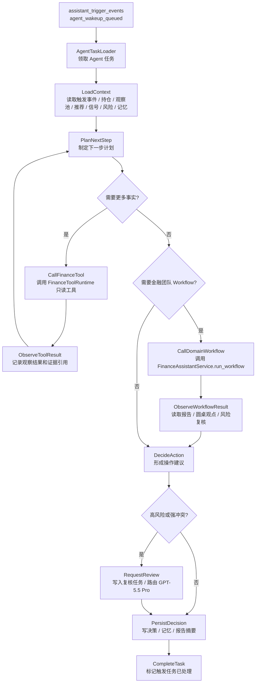
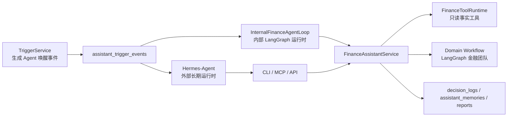

# 内部金融 Agent Loop 设计

本文定义不依赖 Hermes-Agent 时，本项目内部可独立运行的金融 Agent Loop。它不是新的数据采集器，也不是新的因子计算器；它只消费 PostgreSQL + TimescaleDB 中已经清洗入库的事实、Finance Memory、`assistant_trigger_events` 和已注册的金融团队 Workflow。

## 1. 设计结论

内部金融 Agent 可以使用 LangGraph 实现，但它和现有金融团队 Workflow 分属两层：

| 层级 | 组件 | 定位 |
| --- | --- | --- |
| 上层外部运行时 | Hermes-Agent | 首选长期运行时，负责自由 loop、通用记忆、用户对话和跨工具调度 |
| 上层内部运行时 | InternalFinanceAgentLoop | 不使用 Hermes 时的项目内受控 Agent Loop，消费触发事件并做下一步决策 |
| 金融业务内核 | `FinanceAssistantService` | 统一调度金融团队 Workflow，写入审计、报告、记忆和决策日志 |
| 底层分析流程 | Domain Workflow | 固定、可审计的金融团队圆桌流程，例如持仓监控、单标的分析、换股比较 |

因此，内部 Agent Loop 的职责是“决定下一步该做什么”，而不是直接替代 Domain Workflow 的专业分析。

## 2. 为什么使用 LangGraph

内部 Agent Loop 需要具备有限自由度：它可以多轮调用工具、观察结果、决定是否调用 Workflow，但必须有预算、停止条件和审计边界。LangGraph 适合表达这种受控状态机：

- 节点清晰：每一步都有输入、输出和可审计摘要。
- 条件分支清晰：是否需要更多事实、是否需要调用 Workflow、是否需要高风险复核都可显式建边。
- 状态可恢复：后续可以把 loop 状态落库或从 `agent_task_id` 恢复。
- 便于 fallback：模型不可用时可以回到确定性策略。
- 与现有 Domain Workflow 技术栈一致，减少维护成本。

内部 Agent Loop 不应设计成无限 while loop。第一阶段每个任务设置最大轮次、最大工具调用次数、最大 Workflow 调用次数和明确终止状态。

## 3. 总体流程



## 4. 节点职责

| 节点 | 输入 | 输出 | 说明 |
| --- | --- | --- | --- |
| `AgentTaskLoader` | `agent_task_id` 或待处理触发事件 | `AgentLoopState` 初始状态 | 领取 `assistant_trigger_events` 中已派发但未处理的事件 |
| `LoadContext` | 触发事件和 owner_id | 结构化上下文 | 加载持仓、观察池、推荐、信号、风险、数据质量和 Finance Memory |
| `PlanNextStep` | 当前状态和观察结果 | 下一步动作 | 可由 DeepSeek V4 Pro 或确定性策略决定下一步 |
| `CallFinanceTool` | 工具名称和参数 | 工具返回 JSON | 只能调用本项目只读事实工具，不直接联网 |
| `ObserveToolResult` | 工具返回 | evidence_refs / observations | 归纳观察结果，记录工具调用轨迹 |
| `CallDomainWorkflow` | `requested_workflow_type` 和上下文 | Workflow run summary | 按需调用 `portfolio_monitoring`、`asset_deep_analysis`、`recommendation_decision` 等 |
| `ObserveWorkflowResult` | Workflow 审计和报告 | 圆桌观点、风险反驳、报告摘要 | 把底层 Workflow 结果作为 Agent 决策证据 |
| `DecideAction` | 上下文、工具观察、Workflow 结果 | 操作建议 | 输出买入、卖出、换股、入池、继续观察、回避或等待 |
| `RequestReview` | 高风险建议 | 复核任务 | 卖出、换股、大仓位调整、强风险冲突进入 GPT-5.5 Pro 复核协议 |
| `PersistDecision` | 最终建议 | 决策、记忆、报告摘要 | 写入 `decision_logs`、`assistant_memories`、`review_tasks` 和必要审计事件 |
| `CompleteTask` | 处理结果 | 任务完成状态 | 标记本次 Agent 唤醒已处理，避免重复执行 |

## 5. Agent Loop 状态

第一阶段建议使用内存态 + 审计落库，后续再把完整状态持久化为专门的 `agent_loop_runs` / `agent_loop_events` 表。

```text
AgentLoopState
  owner_id
  agent_task_id
  trigger_event_id
  trigger_type
  requested_workflow_type
  portfolio_id
  watchlist_id
  recommendation_run_id
  asset_id
  context
  observations
  tool_calls
  workflow_runs
  evidence_refs
  memory_refs
  risk_flags
  proposed_action
  review_required
  final_status
  error
  step_count
```

关键约束：

- `step_count` 必须有上限，第一阶段建议默认 6 步。
- `tool_calls` 必须有上限，第一阶段建议默认 5 次。
- `workflow_runs` 必须有上限，第一阶段建议默认 1 次，避免一个触发事件递归拉起多个分析链路。
- `final_status` 必须是结构化枚举：`completed`、`skipped`、`waiting_review`、`waiting_user_confirmation`、`failed`。

## 6. 工具与数据边界

内部 Agent Loop 只能调用本项目暴露的工具和服务：

- `FinanceToolRuntime`：只读已入库事实。
- `FinanceAssistantService.run_workflow()`：调用内部金融团队 Workflow。
- `MemoryService` / `MemoryRepository`：读取和写入 Finance Memory。
- `DecisionLogRepository` / `ReviewTaskRepository`：写入决策日志和复核任务。

禁止行为：

- 不直接访问 AKShare、Binance、ccxt 或外部网页。
- 不临时计算 TA 指标、因子、评分或信号。
- 不绕过风险反驳直接输出强买入、卖出或换股建议。
- 不直接执行真实下单。

## 7. 与 Hermes-Agent 的关系

Hermes-Agent 和内部 Agent Loop 不是互斥关系：

- 有 Hermes 时，Hermes 是首选上层运行时，负责长期在线、对话和跨工具调度。
- 无 Hermes 时，内部 Agent Loop 可以作为本项目自带运行时消费 `assistant_trigger_events`。
- 两者都通过 CLI/MCP/API 或内部服务调用同一套 `FinanceAssistantService` 和 `FinanceToolRuntime`。
- 两者都必须把金融决策写入同一套审计、报告和 Finance Memory。



## 8. 与 Domain Workflow 的关系

内部 Agent Loop 不直接承担技术分析、因子分析、风险反驳、换股比较和完整报告生成。这些能力继续放在 Domain Workflow：

| 场景 | Agent Loop 决策 | 调用的 Workflow |
| --- | --- | --- |
| 持仓回撤或风险突发 | 判断是否需要持仓复核 | `portfolio_monitoring` |
| 观察池条件命中 | 判断是否需要单标的深度分析 | `asset_deep_analysis` |
| 推荐运行完成 | 判断是否入池、买入、换股或回避 | `recommendation_decision` |
| 弱持仓遇到强候选 | 判断是否需要换股比较 | `swap_decision` |
| 每日复盘 | 判断需要复盘的组合和观察池 | `daily_review` |

Agent Loop 可以跳过 Workflow，但必须给出结构化原因，例如数据不足、重复触发、冷却期内、风险已知且无新证据。

## 9. 第一阶段落地范围

第一阶段只做最小可用内部运行时：

1. 消费已派发的 `assistant_trigger_events`。（已完成基础版）
2. 加载结构化上下文。（已通过 Workflow 初始 state 和只读工具调用计划完成基础版）
3. 根据 `requested_workflow_type` 决定是否调用一个 Domain Workflow。（已完成基础版）
4. 写入 Agent 任务处理摘要、跳过原因或失败原因。（已完成基础版，决策日志和记忆继续由 Domain Workflow 负责）
5. 提供 CLI：`finance-agent agent run-once` / `finance-agent agent run-task`。（已完成基础版）
6. 提供 smoke：验证触发事件可以被内部 Agent Loop 消费，并且不会重复处理。（已完成）

第一阶段不做：

- 真实下单。
- 无限循环常驻进程。
- 外部数据源直接调用。
- 多模型并发辩论。
- 独立向量数据库或图数据库。

## 10. 后续实现建议

建议新增目录：

```text
src/finance_agent/agents/loop/
  state.py          # AgentLoopState 和动作枚举
  graph.py          # LangGraph 状态图构建
  runner.py         # 领取任务、执行图、提交事务
  planner.py        # 确定性 planner，后续接 DeepSeek V4 Pro
  persistence.py    # 任务状态和审计写入
```

当前基础版已落地 `state.py`、`planner.py`、`runner.py`、`graph.py` 和 `__init__.py`。其中：

- `runner.py` 负责从 `assistant_trigger_events` 领取已派发任务、调用 `FinanceAgentInterface.run_workflow()`、回写 `agent_loop_status` 和 `workflow_run_id`。
- `planner.py` 当前是确定性策略，后续可接 DeepSeek V4 Pro 做 `PlanNextStep`。
- `graph.py` 先作为 LangGraph loop 扩展入口保留，避免第一阶段过度抽象。
- 暂未新增 `persistence.py`，因为当前持久化已由 `AssistantTriggerRepository` 承担；后续若增加 `agent_loop_runs` / `agent_loop_events` 再拆出。

建议新增脚本：

```text
scripts/storage/smoke_internal_agent_loop.py
```

建议新增 CLI：

```bash
finance-agent agent run-once --owner-id owner:demo --limit 5
finance-agent agent run-task --agent-task-id agent_task:...
```

实现优先级：

1. 先实现确定性 planner，保证触发事件能闭环。（已完成）
2. 再接 LangGraph 图节点和审计事件。
3. 再接模型客户端，让 DeepSeek V4 Pro 参与 `PlanNextStep` 和 `DecideAction`。
4. 最后接 Scheduler/Hermes 常驻唤醒。
