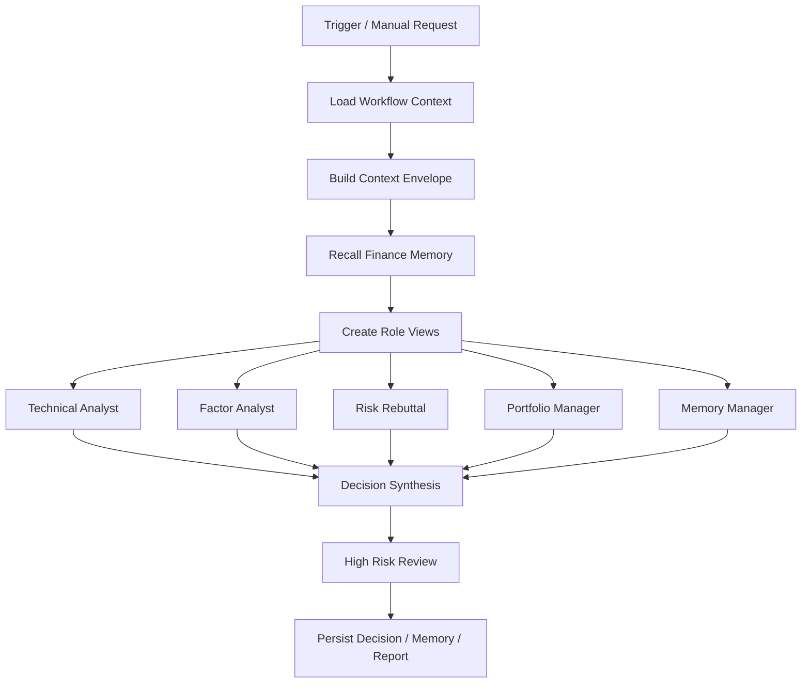

# Workflow 共享上下文设计

本文定义 `finance-agent` 中多个 workflow agent 的共享上下文方案。目标不是让每个角色都拿到全部信息，而是让它们共享同一份事实底座，并按角色裁剪出可控、可审计、低噪声的上下文视图。

## 1. 设计目标

1. 让技术分析、因子分析、风险反驳、组合经理、记忆管理员等角色共享同一份事实底座。
2. 让 A 股与数字货币保持分链路，不混用同一套候选池语义和评分口径。
3. 让记忆只作为动态上下文注入，不写死在稳定系统提示词里。
4. 让每个角色只看到自己需要的内容，避免 token 浪费和上下文污染。
5. 让上下文结构可审计、可回放、可测试。

## 2. 核心结论

Workflow 内多个 agent 应共享同一套 `Context Envelope`，但不能共享同一份“全量 prompt”。

推荐分为三层：

- `stable`：身份、职责、安全边界、工具纪律、ACT 引导、输出协议。
- `context`：本次 workflow 的目标、触发事件、任务参数、可用工具、候选标的、链路类型。
- `volatile`：金融记忆、历史决策、复盘结论、冲突信号、图谱召回、最新风险摘要。

其中记忆必须放在 `volatile` 层，按角色和标的裁剪后注入。

## 3. 上下文对象

建议新增统一上下文对象，用于承载 workflow 运行时信息：

```text
WorkflowContextEnvelope
  stable
  context
  volatile
  role_views
  audit
```

### 3.1 stable

稳定层只放长期不变内容：

- 角色身份
- 业务边界
- 不可越权动作
- 工具使用纪律
- 输出格式要求
- 风险复核规则
- ACT 风格“先行动再解释”约束

### 3.2 context

上下文层只放当前任务相关内容：

- workflow_type
- market_type：`ashare` / `crypto`
- trigger_event
- asset_id / asset_ids
- portfolio_context
- watchlist_context
- recommendation_context
- data_quality_summary
- available_tools
- current_step

### 3.3 volatile

波动层只放本次任务相关、会变化的内容：

- Finance Memory 摘要
- 相似历史决策
- 用户反馈
- 近期复盘结果
- 风险冲突摘要
- 图谱路径摘要
- 最新工具结果摘要

## 4. 角色视图

同一份 envelope 要派生出不同 `role_view`。

### 4.1 技术分析 Agent

输入应包含：

- K 线、指标、趋势、量价
- 近期信号变化
- 必要的风险摘要

不应包含：

- 全量历史记忆
- 无关财务细节
- 组合经理信息

### 4.2 因子分析 Agent

输入应包含：

- 因子帧
- 指标帧
- 评分帧
- 估值和财务摘要
- 因子缺口

不应包含：

- 交易执行细节
- 无关的用户长期记忆

### 4.3 风险反驳 Agent

输入应包含：

- 风险事件
- 数据质量
- 信号冲突
- 历史失败记忆
- 监管/流动性/杠杆/停牌类事实

### 4.4 组合经理 Agent

输入应包含：

- 持仓
- 仓位约束
- 观察池
- 推荐排序
- 资金暴露

### 4.5 记忆管理员 Agent

输入应包含：

- 决策摘要
- 复盘结果
- 用户反馈
- 可写入的长期事实

记忆管理员负责“写回”，不负责交易判断。

## 5. Prompt 组织方式

建议不要把 prompt 散落在 workflow 节点里，而是集中为一个注册表：

```text
src/finance_agent/agents/runtime/prompts/
  registry.py
  stable.py
  context.py
  volatile.py
  roles/
    technical.py
    factor.py
    risk.py
    portfolio.py
    memory.py
```

### 5.1 顶层 prompt

顶层 prompt 只负责：

- 统一身份
- 统一工具纪律
- 统一安全边界
- 统一 ACT 风格指令
- 统一模型路由意识

### 5.2 角色 prompt

角色 prompt 只负责：

- 该角色的职责
- 该角色可见的字段
- 该角色的输出格式
- 该角色的判定规则

## 6. 记忆注入策略

记忆不应全量注入，应按三步处理：

1. 召回：从 Finance Memory 和图谱中取候选记忆。
2. 过滤：按 market_type、asset_id、workflow_type、risk_level 过滤。
3. 压缩：只保留与当前角色有关的摘要。

建议规则：

- 顶层调度 Agent：只保留轻量摘要。
- 技术分析 Agent：保留少量历史信号偏差。
- 因子分析 Agent：保留因子失效和历史失准记录。
- 风险反驳 Agent：保留高风险、冲突和失败案例。
- 组合经理 Agent：保留持仓偏差、换股历史和仓位约束。
- 记忆管理员 Agent：保留可写回的长期事实。

## 7. A 股与数字货币分链路

A 股和数字货币必须共享同一套上下文框架，但不能共享同一套候选池语义。

### 7.1 共享内容

- 上下文三层结构
- 角色视图机制
- 记忆注入策略
- 审计协议
- 模型路由策略

### 7.2 必须隔离的内容

- 候选池定义
- 风险口径
- 信号阈值
- 因子解释方式
- 交易规则

建议在 envelope 中增加：

```text
market_type = ashare | crypto
```

所有角色都必须显式读取这个字段。

## 8. 与现有系统对齐

当前已有的结构可以直接承接这套设计：

- `FinanceAssistantService` 作为业务编排内核。
- `FinanceToolRuntime` 作为只读事实入口。
- `ModelRoutingPolicy` 作为模型路由协议。
- `HighRiskReviewPolicy` 作为复核门禁。
- `LangGraph` workflow 作为角色圆桌执行器。
- `Finance Memory` 作为波动层的主要来源。

当前代码里已有的“圆桌角色”可以直接映射到 role views：

- `technical_analyst`
- `factor_analyst`
- `risk_rebuttal`
- `portfolio_manager`
- `memory_manager`

## 9. 推荐的数据流



## 10. 运行时约束

- 不允许任何角色直接访问外部数据源。
- 不允许任何角色直接覆盖因子、指标、评分或风险事实。
- 不允许任何角色把记忆当成事实来源替代数据库。
- 不允许任何角色绕过高风险复核。
- 不允许把全部上下文塞给所有角色。

## 11. 落地步骤

### 第一步

定义统一 `Context Envelope` 数据结构和序列化格式。

### 第二步

把现有 workflow node 适配为角色视图生成器。

### 第三步

把 Finance Memory 召回改成按 role / market / asset 过滤。

### 第四步

把 prompt registry 拆出来，统一管理 stable / context / volatile / roles。

### 第五步

把高风险复核的上下文裁剪规则固化到 `ModelRoutingPolicy` 或相邻层。

## 12. 验收标准

- 每个 workflow 角色只看到自己需要的字段。
- A 股和数字货币上下文链路明显分开。
- 记忆只在 volatile 层出现。
- 高风险复核能拿到最小必要上下文。
- 审计里能回放一次决策使用了哪些角色视图和记忆摘要。

