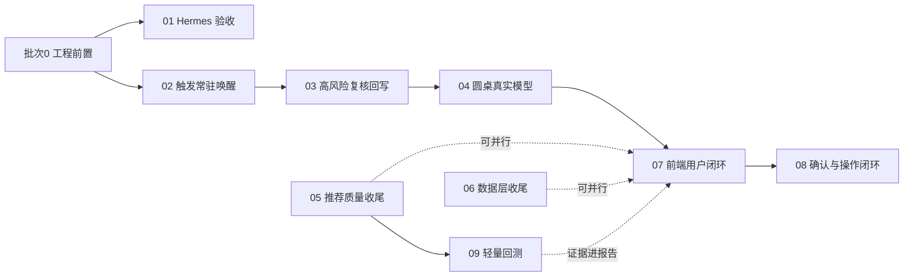

# 开发方案总体规划与执行约定

> 文档版本：2026-06-11
> 角色说明：本目录由总负责人/架构师维护，每份方案是给执行 AI（Codex）的开发指令书。执行者必须先读本文件，再读对应批次方案。

## 1. 背景与当前基线

截至 2026-06-11，项目已完成（含未提交改动）：

- **数据层生产化（V1.5/O5）基本完成**：任务队列通用化（`task_queue_model.py`）、水位增量（`data_sync_watermarks`）、按源限流（`source_rate_limiter.py`）、K 线生命周期调度、基金市场接入（ETF/开放式基金，LOF 阻塞）、技术初筛池并接入推荐流水线。
- **任务控制与监控**：8 个调度器控制 API（运行/暂停/恢复/取消/失败重跑）、前端任务监控页、配置热生效。
- **Agent 基础设施**：6 个 LangGraph Workflow（规则版圆桌）、内部 Agent Loop（真实模型 Planner）、模型路由协议、CLI/MCP 入口、Finance Memory 闭环、GraphStore。
- **Hermes Skill 已编写**（位于 Hermes 侧）：`finance-agent-recommendation` skill 文档与可见性检查脚本已存在，定义了职责边界、推荐链路、Workflow 选择表和输出规则。

全量后端测试 284 个通过；前端构建通过。

## 2. 最终目标回顾

项目最终目标（见 `docs/项目计划.md`）：**一个会记账、会复盘、会解释的私人金融助手闭环**——

```text
数据入库 -> 因子/信号/评分 -> 触发唤醒 -> Agent 真实模型分析 -> 高风险复核
 -> 中文报告 -> 用户确认/反馈 -> 执行登记 -> 复盘 -> Finance Memory 反写
```

当前断点：Hermes 接入（O1）、触发常驻唤醒（O2）、高风险复核回写开发（O3）、圆桌模型节点（O4）、推荐链路质量收尾（O6）、前端用户闭环页面（O8）和人工确认与操作闭环（O9）均已完成开发；O3/O4 真实模型联调和 07-T8 真实 Workflow 到 `decision_logs` 落库端到端验收按跳过策略留到统一联调阶段补验。

## 3. 批次划分与依赖关系

### 批次 0：工程前置（任何方案开工前必须完成）

当前仓库有约 1.9 万行未提交改动（数据层生产化 + 任务监控 + 基金接入 + 资产池重构），且两份进度表停在 2026-05-21。开工前必须：

- [x] P0-1 按功能主题分批提交现有改动（已提交：`c4174b1` 存储迁移与水位、`22b4ebd` 限流与任务队列模型、`d699efc` 采集脚本/基金接入/资产过滤、`8e58cc3` 调度器与控制服务/技术初筛调度、`2644fdf` 推荐研究池与模型工具协议、`1daa2be` 前端任务监控、`615bf73` 测试与文档基线；验证：后端全量 `284 passed`，前端 `npm run build` 通过）。
- [x] P0-2 更新 `docs/项目进度跟踪表.md` 与 `docs/优化版本进度跟踪表.md` 到当前真实状态（数据层 V1.5 完成、O1 修正为"Skill 已写待验收"、任务监控页完成）；验证：文档 diff 检查通过。
- [x] P0-3 打基线 tag（`v1.5-data-production`），作为后续批次的回退锚点。
- [x] P0-4 **暂停并通知总负责人**：总负责人已在 WSL 执行 `npx gitnexus analyze` 重建图谱索引；验证：`npx gitnexus status` 显示 Indexed commit 与 Current commit 均为 `5ba498d`，状态 `up-to-date`，批次 0 完成。

### 批次 1~4

| 批次 | 方案文档 | 主线 | 目标 | 依赖 |
| --- | --- | --- | --- | --- |
| 批次 1 | `01-Hermes接入验收与冒烟.md` | O1 | Hermes 能稳定调用金融内核 | 批次 0 |
| 批次 1 | `02-触发引擎常驻唤醒.md` | O2 | 系统能被行情/风险自动唤醒 | 无 |
| 批次 2 | `03-高风险复核回写.md` | O3 | 复核模型真实调用并回写审计 | 02（事件驱动入口） |
| 批次 2 | `04-圆桌Workflow真实模型节点.md` | O4 | 圆桌观点由真实模型生成 | 03（共用模型调用与降级协议） |
| 批次 3 | `05-推荐链路质量收尾.md` | O6 | 回避池/合并池/策略权重进推荐入口 | 无（可与批次 2 并行） |
| 批次 3 | `06-数据层收尾与部署模板.md` | O5 尾巴 | LOF 备源、北向/解禁/质押、部署模板 | 无（可并行） |
| 批次 4 | `07-前端用户闭环页面.md` | O8 | 报告/推荐/持仓/提醒/记忆页面接真实后端 | 03、04（有真实报告可展示） |
| 批次 4 | `08-人工确认与操作闭环.md` | O9 | 确认、订单草案、执行登记、复盘反写 | 07（前端确认入口） |
| 批次 4 | `09-轻量回测与绩效验证.md` | M3 欠账 | 推荐策略有回测证据与绩效摘要 | 05（策略权重就绪后回测才有意义） |

依赖图：



执行顺序建议：批次 0 先行；01 和 02 随后同时开工（都是 P0 且互不依赖）；03、04 串行；05、06 可穿插并行；07、08、09 收尾。

## 4. 执行 AI（Codex）全局约定

以下约定适用于全部批次，每份方案不再重复：

### 4.1 环境与命令

- 工作目录：`D:\Code\aiAgents\finance-agent`（Windows）。
- Python：一律使用 `.\.venv\Scripts\python.exe`，不要用系统 Python。
- 后端测试：`.\.venv\Scripts\python.exe -m pytest -q`（当前基线 284 passed，任何批次结束必须全绿）。
- 前端构建：`cd apps\agent-office; npm run build`。
- 前端脚本测试遵循既有模式：`apps/agent-office/scripts/test-*.mjs`，用 `node` 直接运行。
- 数据库迁移：`.\.venv\Scripts\python.exe -m alembic upgrade head`；新迁移版本号顺延（当前最新 `20260606_0016_create_fund_nav_snapshots.py`，新表从 `0017` 开始）。

### 4.2 GitNexus 政策（覆盖 CLAUDE.md 的执行细则）

GitNexus 安装在 WSL，**索引重建（`npx gitnexus analyze`）一律由总负责人手动执行，执行 AI 不得自行运行**。执行 AI 的职责是在正确的时机暂停并提醒：

- 需要提醒重建索引的时机：① 批次 0 全部提交完成后；② 每个批次的代码全部合入后；③ 任何 GitNexus 工具提示索引过期（stale）时。此时停下当前任务，输出一行明确请求："请在 WSL 执行 npx gitnexus analyze，完成后回复确认"，等确认后继续。
- 若执行环境中可用 GitNexus MCP 工具：修改已有函数/类/方法前必须 `gitnexus_impact({target, direction: "upstream"})`；HIGH/CRITICAL 风险必须先报告；提交前运行 `gitnexus_detect_changes()`；重命名用 `gitnexus_rename`。
- 若执行环境中**没有** GitNexus 工具：在每次提交说明中列出本次修改的符号清单（类/函数名），并在批次结束的索引重建提醒中一并汇报，由总负责人自行做影响复核。两种情况下都禁止用全文替换做重命名。

### 4.3 代码与协议红线

- **不自动交易**：任何批次都不得引入真实下单、券商/交易所写接口；订单只能到"草案"为止。
- **LLM 不覆盖确定性数据**：模型节点只能产出解释、反驳、比较和建议文本，不得修改 `asset_scores.total_score`、信号方向、风险标记。
- **事实只来自入库数据**：模型上下文一律通过 `FinanceToolRuntime` 只读工具组装，禁止在 Agent 层直接发 HTTP 抓行情。
- **市场边界**：A 股与数字货币不混池；`mixed` 仅允许作为信号冲突枚举。
- **模型可降级**：所有真实模型调用必须有确定性 fallback，模型不可用时不阻塞主链路，只降置信度或标记待复核。
- 测试密钥一律用 `test-api-key-*` 占位；禁止提交 `.env`、`runtime/` 数据。

### 4.4 测试与验收纪律

- 先写失败测试再实现（项目既有 TDD 习惯，见 `docs/superpowers/plans/` 中的任务模板）。
- 涉及模型调用的测试必须注入 fake client，禁止真实外呼。
- 每个任务完成后运行该方案"验收命令"小节列出的命令；每个批次结束运行全量 pytest + 前端构建。

### 4.5 文档同步义务

每完成一个批次，必须更新：

1. 对应方案文档内的进度表（状态：未开始 / 进行中 / 已完成 / 阻塞）。
2. `docs/优化版本进度跟踪表.md` 对应 O 线状态。
3. `docs/项目进度跟踪表.md` 总体状态表（如有结构性变化）。

### 4.6 提交规范

- 遵循仓库现有风格：`类型(范围): 中文描述`，例如 `feat(触发): 接入调度器常驻触发评估任务`。
- 按功能主题分批提交，不要把多个批次混进一个 commit。

## 5. 各方案进度总览

| 方案 | 状态 | 最近更新 |
| --- | --- | --- |
| 01 Hermes 接入验收与冒烟 | 已完成 | 2026-06-12：Skill 规范副本、CLI direct/WSL bridge 冒烟、MCP 接入模板、MCP initialize/list_tools 握手和工具边界防回归均完成；全量 pytest `296 passed` |
| 02 触发引擎常驻唤醒 | 已完成 | 2026-06-12：触发评估与 Agent 事件消费已纳入基础数据调度器；盘中急跌/放量异动规则已落地；runtime 解析、单任务真实冒烟和相关 pytest 通过；批次 1 收尾全量后端 `304 passed`、前端构建通过 |
| 03 高风险复核回写 | 已完成 | 2026-06-12：完成 `HighRiskReviewService`、`agent review-pending` CLI、`analytics.high_risk_reviews.*` 调度任务和聊天摘要沉淀服务；T6 真实模型联调按跳过策略标记为待联调；方案收尾全量后端 `316 passed` |
| 04 圆桌 Workflow 真实模型节点 | 已完成 | 2026-06-12：新增圆桌模型观点节点和 Prompt，6 个 Workflow 均接入“规则版观点 → 模型增强 → fallback”层；报告已展示模型/规则来源、要点、反方和缺口；决策反馈 API 已落地；T6 真实模型联调按跳过策略标记为待联调；批次收尾全量后端 `329 passed`，前端构建通过 |
| 05 推荐链路质量收尾 | 已完成 | 2026-06-12：回避池接入、多候选池合并/回避池重建调度任务、策略权重中心、调度透传、研究池冷却和离线端到端冒烟均完成；推荐运行和单条推荐 payload 可追溯评分策略与回避剔除审计。 |
| 06 数据层收尾与部署模板 | 已完成 | 2026-06-12：T1 LOF 腾讯直连备源、T2 基金放量能力、T3 北向资金、T4 限售解禁、T5 股权质押、T6 Windows 任务计划模板、T7 Docker 调度器模板、T8 运维手册、T9 `market_bars_intraday` 预留决策和 T10 文档同步均已完成；Windows 真实注册因当前权限不足标记为待联调，FUND-015 全量基金初始化按断点队列持续分批执行。 |
| 07 前端用户闭环页面 | 已完成，T8 待联调 | 2026-06-13：报告、推荐、持仓、风险中心、Agent 运行、Finance Memory 和任务监控页面已接真实后端接口；`main.tsx` 已拆分为独立页面组件；T8 真实 Workflow 到 `decision_logs` 落库端到端验收按跳过策略留到统一联调阶段 |
| 08 人工确认与操作闭环 | 已完成 | 2026-06-13：T1-T8 已完成，订单草案与执行登记闭环已实现；`confirm_decision`、`order_drafts`、`execution_records`、`reviews_due`、前端确认/草案/执行登记/待复盘入口和端到端闭环冒烟均已落地；系统仍不接券商或交易所写接口，也不会自动真实下单；方案收尾相关回归和全量后端测试通过 |
| 09 轻量回测与绩效验证 | 进行中 | 2026-06-13：T1 依赖确认、T2 适配器和 T3 `factor_score_topn` 策略服务已完成；`BacktestService` 支持 replayed/historical 两种评分模式、TopN 选股、宽表价格回测和数据不足 `partial` 降级；下一步进入 T4 `backtest_results` 落库。 |

> 执行者每完成一个任务就回到这里更新状态，这张表是总负责人检查进度的唯一入口。
