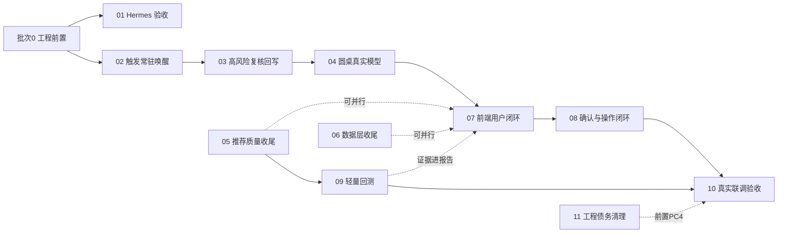

# 开发方案总体规划与执行约定

> 文档版本：2026-06-11
> 角色说明：本目录由总负责人/架构师维护，每份方案是给执行 AI（Codex）的开发指令书。执行者必须先读本文件，再读对应批次方案。

## 1. 背景与当前基线

截至 2026-06-11，项目已完成（含未提交改动）：

- **数据层生产化（V1.5/O5）基本完成**：任务队列通用化（`task_queue_model.py`）、水位增量（`data_sync_watermarks`）、按源限流（`source_rate_limiter.py`）、K 线生命周期调度、基金市场接入（ETF/LOF 已完成，开放式基金分批初始化中）、技术初筛池并接入推荐流水线。
- **任务控制与监控**：8 个调度器控制 API（运行/暂停/恢复/取消/失败重跑）、前端任务监控页、配置热生效。
- **Agent 基础设施**：6 个 LangGraph Workflow（规则版圆桌）、内部 Agent Loop（真实模型 Planner）、模型路由协议、CLI/MCP 入口、Finance Memory 闭环、GraphStore。
- **Hermes Skill 已编写**（位于 Hermes 侧）：`finance-agent-recommendation` skill 文档与可见性检查脚本已存在，定义了职责边界、推荐链路、Workflow 选择表和输出规则。

全量后端测试 284 个通过；前端构建通过。

## 2. 最终目标回顾

项目最终目标（见 `docs/项目计划.md`）：**一个会记账、会复盘、会解释的私人金融助手闭环**——

```text
数据入库 -> 因子/信号/评分 -> 触发唤醒 -> Agent 真实模型分析 -> 高风险复核
 -> 中文报告 -> 用户确认/反馈 -> 执行登记 -> 复盘 -> Finance Memory 反写
```

当前断点：Hermes 接入（O1）、触发常驻唤醒（O2）、高风险复核回写开发（O3）、圆桌模型节点（O4）、推荐链路质量收尾（O6）、前端用户闭环页面（O8）和人工确认与操作闭环（O9）均已完成开发；O3/O4 真实模型联调和 07-T8 真实 Workflow 到 `decision_logs` 落库端到端验收按跳过策略留到统一联调阶段补验。

## 3. 批次划分与依赖关系

### 批次 0：工程前置（任何方案开工前必须完成）

当前仓库有约 1.9 万行未提交改动（数据层生产化 + 任务监控 + 基金接入 + 资产池重构），且两份进度表停在 2026-05-21。开工前必须：

- [x] P0-1 按功能主题分批提交现有改动（已提交：`c4174b1` 存储迁移与水位、`22b4ebd` 限流与任务队列模型、`d699efc` 采集脚本/基金接入/资产过滤、`8e58cc3` 调度器与控制服务/技术初筛调度、`2644fdf` 推荐研究池与模型工具协议、`1daa2be` 前端任务监控、`615bf73` 测试与文档基线；验证：后端全量 `284 passed`，前端 `npm run build` 通过）。
- [x] P0-2 更新 `docs/项目进度跟踪表.md` 与 `docs/优化版本进度跟踪表.md` 到当前真实状态（数据层 V1.5 完成、O1 修正为"Skill 已写待验收"、任务监控页完成）；验证：文档 diff 检查通过。
- [x] P0-3 打基线 tag（`v1.5-data-production`），作为后续批次的回退锚点。
- [x] P0-4 **暂停并通知总负责人**：总负责人已在 WSL 执行 `npx gitnexus analyze` 重建图谱索引；验证：`npx gitnexus status` 显示 Indexed commit 与 Current commit 均为 `5ba498d`，状态 `up-to-date`，批次 0 完成。

### 批次 1~4

| 批次 | 方案文档 | 主线 | 目标 | 依赖 |
| --- | --- | --- | --- | --- |
| 批次 1 | `01-Hermes接入验收与冒烟.md` | O1 | Hermes 能稳定调用金融内核 | 批次 0 |
| 批次 1 | `02-触发引擎常驻唤醒.md` | O2 | 系统能被行情/风险自动唤醒 | 无 |
| 批次 2 | `03-高风险复核回写.md` | O3 | 复核模型真实调用并回写审计 | 02（事件驱动入口） |
| 批次 2 | `04-圆桌Workflow真实模型节点.md` | O4 | 圆桌观点由真实模型生成 | 03（共用模型调用与降级协议） |
| 批次 3 | `05-推荐链路质量收尾.md` | O6 | 回避池/合并池/策略权重进推荐入口 | 无（可与批次 2 并行） |
| 批次 3 | `06-数据层收尾与部署模板.md` | O5 尾巴 | LOF 备源、北向/解禁/质押、部署模板 | 无（可并行） |
| 批次 4 | `07-前端用户闭环页面.md` | O8 | 报告/推荐/持仓/提醒/记忆页面接真实后端 | 03、04（有真实报告可展示） |
| 批次 4 | `08-人工确认与操作闭环.md` | O9 | 确认、订单草案、执行登记、复盘反写 | 07（前端确认入口） |
| 批次 4 | `09-轻量回测与绩效验证.md` | M3 欠账 | 推荐策略有回测证据与绩效摘要 | 05（策略权重就绪后回测才有意义） |
| 批次 5 | `10-真实联调与验收.md` | 全线 | 真实模型+真实数据端到端跑通一次 | 01~09 开发完成 |
| 批次 5 | `11-工程债务清理与可复现性.md` | 收尾 | 清理空洞测试、锁死调度任务可复现性 | 01~09 开发完成（可与 10 并行） |
| 专项 | `12-基础数据调度资源池与优先级.md` | 数据层运维增强（计划外） | 调度器升级为全局闸门+资源池+优先级+互斥键 | 基础数据调度器、任务监控页可用 |

依赖图：



> 批次 5 是"开发完成后"的验收阶段：01~09 已全部完成开发并通过代码审查（2026-06-13），但模型层和真实数据链路从未真实联调。批次 5 用真实资源跑通一次（方案 10），并清理审查发现的工程债务（方案 11）。方案 11 的调度可复现性测试是方案 10 的前置 PC4，建议 11 先于或并行于 10。

执行顺序建议：批次 0 先行；01 和 02 随后同时开工（都是 P0 且互不依赖）；03、04 串行；05、06 可穿插并行；07、08、09 收尾。

## 4. 执行 AI（Codex）全局约定

以下约定适用于全部批次，每份方案不再重复：

### 4.1 环境与命令

- 工作目录：`D:\Code\aiAgents\finance-agent`（Windows）。
- Python：一律使用 `.\.venv\Scripts\python.exe`，不要用系统 Python。
- 后端测试：`.\.venv\Scripts\python.exe -m pytest -q`（当前基线 284 passed，任何批次结束必须全绿）。
- 前端构建：`cd apps\agent-office; npm run build`。
- 前端脚本测试遵循既有模式：`apps/agent-office/scripts/test-*.mjs`，用 `node` 直接运行。
- 数据库迁移：`.\.venv\Scripts\python.exe -m alembic upgrade head`；新迁移版本号顺延（当前最新 `20260606_0016_create_fund_nav_snapshots.py`，新表从 `0017` 开始）。

### 4.2 GitNexus 政策（覆盖 CLAUDE.md 的执行细则）

GitNexus 安装在 WSL，**索引重建（`npx gitnexus analyze`）一律由总负责人手动执行，执行 AI 不得自行运行**。执行 AI 的职责是在正确的时机暂停并提醒：

- 需要提醒重建索引的时机：① 批次 0 全部提交完成后；② 每个批次的代码全部合入后；③ 任何 GitNexus 工具提示索引过期（stale）时。此时停下当前任务，输出一行明确请求："请在 WSL 执行 npx gitnexus analyze，完成后回复确认"，等确认后继续。
- 若执行环境中可用 GitNexus MCP 工具：修改已有函数/类/方法前必须 `gitnexus_impact({target, direction: "upstream"})`；HIGH/CRITICAL 风险必须先报告；提交前运行 `gitnexus_detect_changes()`；重命名用 `gitnexus_rename`。
- 若执行环境中**没有** GitNexus 工具：在每次提交说明中列出本次修改的符号清单（类/函数名），并在批次结束的索引重建提醒中一并汇报，由总负责人自行做影响复核。两种情况下都禁止用全文替换做重命名。

### 4.3 代码与协议红线

- **不自动交易**：任何批次都不得引入真实下单、券商/交易所写接口；订单只能到"草案"为止。
- **LLM 不覆盖确定性数据**：模型节点只能产出解释、反驳、比较和建议文本，不得修改 `asset_scores.total_score`、信号方向、风险标记。
- **事实只来自入库数据**：模型上下文一律通过 `FinanceToolRuntime` 只读工具组装，禁止在 Agent 层直接发 HTTP 抓行情。
- **市场边界**：A 股与数字货币不混池；`mixed` 仅允许作为信号冲突枚举。
- **模型可降级**：所有真实模型调用必须有确定性 fallback，模型不可用时不阻塞主链路，只降置信度或标记待复核。
- 测试密钥一律用 `test-api-key-*` 占位；禁止提交 `.env`、`runtime/` 数据。

### 4.4 测试与验收纪律

- 先写失败测试再实现（项目既有 TDD 习惯，见 `docs/superpowers/plans/` 中的任务模板）。
- 涉及模型调用的测试必须注入 fake client，禁止真实外呼。
- 每个任务完成后运行该方案"验收命令"小节列出的命令；每个批次结束运行全量 pytest + 前端构建。

### 4.5 文档同步义务

每完成一个批次，必须更新：

1. 对应方案文档内的进度表（状态：未开始 / 进行中 / 已完成 / 阻塞）。
2. `docs/优化版本进度跟踪表.md` 对应 O 线状态。
3. `docs/项目进度跟踪表.md` 总体状态表（如有结构性变化）。

### 4.6 提交规范

- 遵循仓库现有风格：`类型(范围): 中文描述`，例如 `feat(触发): 接入调度器常驻触发评估任务`。
- 按功能主题分批提交，不要把多个批次混进一个 commit。

## 5. 各方案进度总览

| 方案 | 状态 | 最近更新 |
| --- | --- | --- |
| 01 Hermes 接入验收与冒烟 | 已完成 | 2026-06-12：Skill 规范副本、CLI direct/WSL bridge 冒烟、MCP 接入模板、MCP initialize/list_tools 握手和工具边界防回归均完成；全量 pytest `296 passed` |
| 02 触发引擎常驻唤醒 | 已完成 | 2026-06-12：触发评估与 Agent 事件消费已纳入基础数据调度器；盘中急跌/放量异动规则已落地；runtime 解析、单任务真实冒烟和相关 pytest 通过；批次 1 收尾全量后端 `304 passed`、前端构建通过 |
| 03 高风险复核回写 | 已完成真实 reject 验收 | 2026-07-15：`gpt-5.6-sol` 端点 HTTP 200、高风险路由 ready；复用原隔离事件得到真实 reject，决策日志为 `rejected_by_review`、订单草案 0、队列清空。成功后残留 unavailable 置信度惩罚的问题已按 TDD 修复，全量 708 passed |
| 04 圆桌 Workflow 真实模型节点 | L1 单角色真实联调通过 | 2026-07-15：6 个 Workflow 已接规则版/模型增强/fallback；真实 `deepseek-v4-pro` 单角色 `risk_rebuttal` 运行成功，`generated_by=model` 且 evidence 可追溯；完整五角色质量审阅作为模型质量项继续保留 |
| 05 推荐链路质量收尾 | 已完成 | 2026-06-12：回避池接入、多候选池合并/回避池重建调度任务、策略权重中心、调度透传、研究池冷却和离线端到端冒烟均完成；推荐运行和单条推荐 payload 可追溯评分策略与回避剔除审计。 |
| 06 数据层收尾与部署模板 | 主体完成，结构性基金缺口已接受 | 2026-07-15：LOF 备源、北向/解禁/质押、Docker、runbook 和基金初始化均已完成；FUND-015 保留 9 只终态无历史与 32 只中间年份结构性缺口，负责人已接受且最近窗口不缺失。Windows 计划任务真实注册仍需提升令牌，整机重启需用户授权 |
| 07 前端用户闭环页面 | 端到端真实验收完成 | 2026-07-15：报告、推荐采纳、订单草案、外部执行登记、持仓更新、执行历史和 Finance Memory 已用真实 Workflow 验收；执行登记仍是外部交易后的手工记账，不代表真实下单 |
| 08 人工确认与操作闭环 | 已完成 | 2026-06-13：T1-T8 已完成，订单草案与执行登记闭环已实现；`confirm_decision`、`order_drafts`、`execution_records`、`reviews_due`、前端确认/草案/执行登记/待复盘入口和端到端闭环冒烟均已落地；系统仍不接券商或交易所写接口，也不会自动真实下单；方案收尾相关回归和全量后端测试通过 |
| 09 轻量回测与绩效验证 | 真实冒烟与人工审阅完成 | 2026-07-15：真实 A 股五年 `factor_score_topn` 回测两次稳定复现，CAGR 12.14%、最大回撤 -37.37%、Sharpe 0.617、Sortino 0.880；`replayed` 前视偏差已在报告中明确，不代表实盘收益 |
| 10 真实联调与验收 | PC3/L1/L2/L3/L4/L6 已通过，部署项暂缓 | 2026-07-15：PC3、圆桌真实模型、高风险复核 reject、前端端到端、真实回测和全量基金初始化均已完成；基金保留约 0.20% 结构性源缺口。L5 Windows 计划任务按负责人决定暂缓，整机重启验证仍需明确授权。 |
| 11 工程债务清理与可复现性 | 已完成 | 2026-06-14：已删除 2 个空洞文档测试（共 4 个脆弱文案断言）、新增 `tests/test_scheduler_jobs_regenerable_from_preset.py` 锁定 `personal-comprehensive` 预设可从零导出方案 10 PC4 所需调度任务，并收口 `market_bars_intraday` 与 GitNexus 差异记录；全量后端 `452 passed`，前端构建通过。 |
| 12 基础数据调度资源池与优先级 | 已完成（待提交） | 2026-06-16（计划外专项，Codex 主导）：调度器保留 `max_concurrent_jobs` 全局上限并新增资源池+优先级+互斥键；7 个默认资源池分类、队首阻塞规避、任务监控页四层并发展示均落地；T1-T6 共 500 passed，T7 总负责人代码审查后补配置告警；**代码与文档在工作区未提交**，需按主题提交并重建 GitNexus 索引。已通过代码审查：设计合理、实现正确、向后兼容 |
| 13 新闻事件时效与保留策略 | Codex 自建 | 计划外专项（Codex 主导），新闻/事件数据的时效与保留策略；待总负责人审查纳入 |
| —— 批次 6：选股能力与顾问层升级（14 总纲统辖 15~19）—— | | 从"垃圾答案"倒推的系统性升级，让系统真的会选股 |
| 14 选股能力与顾问层升级总纲 | 已编写，待执行 | 2026-06-26：批次 6 锚点；固化五层架构（数据/画像/引擎/双因子/上下文）、Hermes 边界（嘴 vs 脑）、红线（顾问的嘴主观、选股的手有据）、依赖顺序 |
| 15 真实数据规模化入库 | 核心 A 股覆盖达标-推荐 ready | 2026-07-16：财务/估值口径、普通资金流和行业/概念成员覆盖均完成真实验收；静态主板行业覆盖 91.13%、概念覆盖 72.89%，完整成员快照会显式排除旧关系，源端不一致项保留 `partial`。`recommendation_readiness.status=ready`、`executable=true`；剩余数字货币和已接受结构性缺口按负责人决策处理 |
| 16 用户投资画像与个性化内核 | 已完成 | 2026-06-30：可审计 `UserInvestmentProfile` 实体、0020 迁移、画像仓储、`profile.get/upsert`、`advice.suggest_style`、Hermes 引导协议和受控写工具边界均已落地；方案 16 相关 15 个 pytest 通过 |
| 17 选股引擎修复与双脑合并 | 代码完成-真实模型冒烟通过 | 2026-07-03：评分缺失惩罚、相对分位裁决、聊天 Workflow 和数据真实性闸门均已落地；修正推荐合并池来源为主板可交易池 + 技术初筛池后重跑真实推荐 run `run:balanced_swing_v1:swing:20260702T223115Z:e3e1c7634d1a`，覆盖 2,919 条评分和 200 条推荐，动作分布 `buy_candidate=24`、`watch=170`、`avoid=6`；因评分截面仍混合多个 `as_of`，T3 只固化参考统计。T7 已在方案 10 L1 完成 ds-pro 单角色真实圆桌冒烟，完整“好答案规格”仍随方案 10 L3/L4 继续验收 |
| 18 双因子体系与板块龙头 | 多策略工程链完成-权重待无前视验证 | 2026-07-16：板块强度、龙头识别、题材策略、圆桌角色和 `ThemeContextService` 已进入生产链路；行业/概念覆盖为 91.13%/72.89%，题材因子覆盖 404 个资产。D-016 方案 A 已应用 `20260716_0021`，真实 screening 可并存短线/题材各 2,900 条评分，两套推荐与回测严格隔离，Top20 重合 7/20；全量 754 passed、前端构建通过。现有一年 `replayed` 仅为工程冒烟，最终权重仍等待无前视连续截面或历史重算。 |
| 19 选股上下文层与记忆回流 | 已完成-真实闸门验收通过 | 2026-07-03：大盘环境服务、买入分位环境闸门、可买入性校验、记忆回流排序和推荐 payload 呈现均已落地；已从现有 10 年 A 股日 K 生成弱市/震荡市/强市样本材料 `docs/选股大盘环境样本验收材料.md`，当前使用全市场等权代理指数，总负责人确认样本无问题；已新增只读验收脚本并用最新 200 个真实候选执行，弱市 `buy_candidate=22`、震荡 `39`、强市 `43`，以同一基础买入分位阈值 `20%` 为基准，弱市调整后为 `11%`，实际数量还受信号和风险过滤影响，真实闸门验收通过；后续补入真实指数后可重新生成增强版 |
| —— 批次 7：金融分析方法论技能库（20 总纲）—— | | 提升圆桌分析准确性：确定性引擎算结构、skill 只解读 |
| 20 金融分析方法论技能库 | 已完成-结构与 Ichimoku 已生产接入 | 2026-07-02：P0/P1/P2/P3/T8 已完成；新增 `skills/` 加载器、18 个 P1 高频方法论、22 个 P2 方法论、10 个 P3 方法论和圆桌角色 prompt 注入防回归；P2 缠论已完成 adapter 接口与解读 skill，真实 `czsc` 依赖暂缓；pair-trading 已引入 `statsmodels` 完成严格协整输出。2026-07-04：harmonic/elliott-wave/smc 由方案 22 structural-lite v2 接入。2026-07-12：方案 23 阶段二完成 portfolio/risk 纯知识扩容和 Ichimoku 日级入库/技能激活；correlation/pair-trading/seasonal 保持接口预留，onchain/defi 按 D-009 暂缓。 |
| 21 计算型方法论引擎完善 | 已完成-由方案 22 修复判别力后接入 | 2026-07-03：参考 Vibe-Trading 的 swing→结构识别路径，但不新增外部依赖；新增 `finance-agent-structural-lite`，支持 Swing 结构基座、Harmonic-lite、SMC-lite、Elliott-lite，输出统一 evidence_id、置信度、caveats 和 red_lines；harmonic/elliott-wave/smc skill 已改为只读取引擎输出；专项验证 `13 passed`。总负责人独立复核（2026-07-03）指出 v1 骨架合格但判别力不合格；2026-07-04 已由方案 22 升级为 structural-lite v2，补齐噪声地板、as-of、SMC/FVG/Elliott/谐波判别力修复后才接入业务链路 |
| 22 结构方法论引擎判别力修复与接入 | 已完成，T11 研究证据完成（不满足接入门槛） | 2026-07-04：完成 T1~T10/T12；判别力修复覆盖谐波四比例/窗口对齐/SMC 逐事件置信度/FVG ATR 地板与回补/as-of 语义/Elliott 门槛和 `*_v2` schema；系统接入完成收盘后批量任务 `analytics.structural.ashare.daily`、`indicator_frames` 幂等入库、`structure.get_asset_context`、圆桌技术分析师上下文和推荐页结构证据卡片；红线测试锁定结构信号不进评分。2026-07-16 T11 已用 161 个资产、17,488 个历史事件完成 5/10/20 日两周期研究，无信号达到稳定正向准入门槛；`czsc` 仅完成隔离对照并保持 fail-closed。追加 T13 前端离线演示披露已完成；T14 CHoCH 风险提示继续暂缓，详见方案 22 §11 |
| 23 方法论能力接入与技能激活策略 | 阶段一、阶段二已完成 | 2026-07-06：阶段一 T1~T5 完成，新增 active skill loader、推荐 payload 结构证据、technical_analyst 三个结构技能激活、prompt 预算和前端真实路径空态；真实结构调度 200 资产/800 条指标/0 错误。2026-07-12：阶段二 T6/T7 完成，组合经理与风险反驳员启用 8 个 L2 纯知识技能；Ichimoku 接入既有日级任务并写 `ichimoku_v1`，真实调度 200 资产/1000 条指标/Ichimoku 200/错误 0；数据库最新 Ichimoku 161 available、39 insufficient_data；全量 pytest 668 passed、前端 build 通过。2026-07-16 已完成 T11 历史事件研究证据，但无信号达到接入门槛；阶段三仍等待人工黄金样本/新的研究协议，`czsc` 保持 fail-closed，T14 不解禁。 |

> 执行者每完成一个任务就回到这里更新状态，这张表是总负责人检查进度的唯一入口。
>
> **批次 1~4 已完成开发并通过代码审查（2026-06-13）**：五条红线守住、跨模块协议一致、操作闭环幂等/超卖/复核闸门正确、回测前视偏差已标注。审查发现的工程债务已在方案 11 收口；下一步进入方案 10 真实联调与验收，需要总负责人在场提供真实模型 key、部署权限、真实数据放量确认和人工审阅。
>
> **批次 6（方案 14~19，2026-06-26 规划）**：从"有哪些适合买入→全是观察"的垃圾答案倒推，诊断出五层缺失（真实数据底座空、无个性化画像、评分引擎标度错配、缺题材龙头因子、缺选股上下文）+ 顾问人格层从未落地。方案 14 是总纲。执行顺序：15（数据，先起）→ 16（画像 schema）→ 18（双因子）→ 17（引擎校准，吃 15 真实数据 + 18 新因子）→ 19（上下文收尾），方案 10 真实联调贯穿。**校准必须在真实数据上做，画像 schema 必须最先定。**
