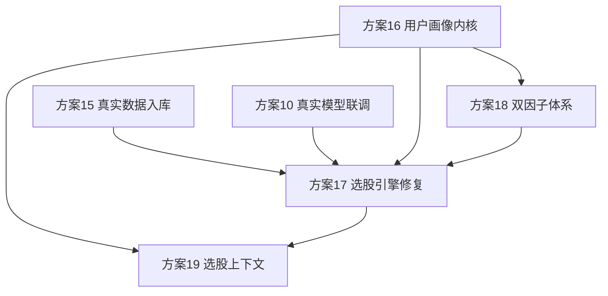

# 方案 14：选股能力与顾问层升级总纲（批次 6 锚点）

> 优先级：P0（产品核心能力）｜ 批次 6 ｜ 前置阅读：`00-总体规划与执行约定.md`
> 本文是批次 6 的总纲，统辖方案 15~19。所有执行约定（venv、TDD、GitNexus 政策、五条红线、提交规范）继承 `00`，本文不重复。

## 1. 缘起：一个"垃圾答案"倒推出的系统性缺陷

用户在聊天里问"有哪些适合买入"，系统答"全部 200 条都是观察，没有买入"，且数据是 2026-06-04 沙箱数据。这个答案不是模型不行，是**当前设计决定了它只能这么答**。逐层倒推（均有代码证据），暴露出从数据到顾问的五层缺失。

### 1.1 选股引擎层（4 个病灶）

| 病灶 | 代码证据 | 后果 |
| --- | --- | --- |
| 评分标度与动作阈值量纲不匹配 | `recommendations/service.py:434` 要求 `total_score>=75` 才 buy；`scoring/service.py:185` 评分是"偏离中位数"的加权平均，中庸股≈50 | 最高分 62 → 永远 watch，买入闸门形同虚设 |
| 缺失数据双重扣分 | `scoring/service.py:187-193` 缺失同时砸 `total_score` 和 `confidence` | 真实残缺数据必然打不过理想数据，全被压成 watch |
| 聊天与 Workflow 双脑割裂 | `chat.py:148-153` 的 `_answer_model_chat` 无 `run_workflow` 调用，`task_kind` 只是 prompt 提示 | 圆桌真实模型/风险反驳/证据链（方案 04）在聊天路径里完全没被触达 |
| Agent 取数复述、非目标导向 | 聊天循环 = `get_latest → 复述`，`recommendation.get_latest` 上限 20（`chat.py`） | 不重排、不深挖、不把"观察"翻译成"还差什么才能买" |

### 1.2 圆桌角色与提示词（2 个缺陷）

| 缺陷 | 代码证据 | 后果 |
| --- | --- | --- |
| 圆桌丢了 2 个分析师 | `roundtable_prompts.py` 只有 5 角色，缺"市场事件分析师"（新闻/消息）和"资金流/衍生品分析师"；`docs/项目计划.md` §9.3 要求 6 类 | 新闻/消息无人解读（评分层算了 `event` 因子却没人讲） |
| 质疑数据是被动标注 | `chat.py:665` 只要求"看着像沙箱就标注"，无维度覆盖自检 | 模型不主动质疑"是否缺消息面/资金流" |

### 1.3 选股上下文（4 个缺口，均以代码"零命中"坐实）

| 缺口 | 现状 | 后果 |
| --- | --- | --- |
| 为谁选 | `orm.py` 无 `user_profile`/`risk_preference`，只有静态 `balanced_growth` | "适合买入"没有主语，稳健者和赌徒拿到同一份清单 |
| 什么环境选 | 无大盘环境层（`akshare_capabilities.py` 里"大盘过滤"只是标签） | 熊市照样逐股打高分推买入 |
| 选了能不能买 | `recommendations/`、`screening/` 零涨停/停牌校验 | 推一字板龙头=纸上谈兵 |
| 选错会不会改 | `assistant_memories` 不回流评分/排序 | 复盘只写不读，不会学习 |

### 1.4 两个最根本的洞

1. **没有真实数据语料**：推荐跑在沙箱数据上，`market_bars` 等是冒烟级量级。采集管道（Collector）大多已建，但**水没大规模放进来**。上面所有改造都是在没有真实食材的厨房里调菜谱。
2. **没有顾问人格层**：项目计划 §9.1 写的上层 `PersonalFinanceAgent`（懂你、引导、主动建议、会学）从未落地，当前只有一个无状态查数机器人。

## 2. 根本判断

> 症状是"不会选股"，根因是**五层缺失**：真实数据底座、个性化画像、选股引擎校准、双因子体系、选股上下文。补任何单层都不解决问题——必须按依赖顺序整体补齐。

## 3. 五层架构与方案映射

```text
┌─────────────────────────────────────────────┐
│ 方案16 顾问人格层  用户画像/引导/主动建议/习惯学习      │ ← 懂你、会学
├─────────────────────────────────────────────┤
│ 方案19 选股上下文  大盘环境/可买入性/记忆回流          │ ← 选得对、买得进
├─────────────────────────────────────────────┤
│ 方案18 双因子体系  价值趋势 + 题材龙头（按画像切换/融合）   │ ← 选得准
├─────────────────────────────────────────────┤
│ 方案17 选股引擎    评分校准/双脑合并/目标导向/数据闸门     │ ← 第一次真会说"买"
├─────────────────────────────────────────────┤
│ 方案15 真实数据    全市场行情/新闻/资金流/板块 规模化入库   │ ← 地基：真实食材
└─────────────────────────────────────────────┘
            方案10 真实模型联调（贯穿全程的另一地基）
```

| 方案 | 主题 | 角色 |
| --- | --- | --- |
| `15-真实数据规模化入库.md` | 把真实 A 股数据大规模灌进来 | 地基（与方案 10 并列） |
| `16-用户投资画像与个性化内核.md` | 可审计画像实体 + 暴露工具 + Hermes 引导协议 | 顾问内核（必须最先定 schema） |
| `17-选股引擎修复与双脑合并.md` | 评分按画像校准、聊天接 Workflow、目标导向、数据闸门 | 引擎修复 |
| `18-双因子体系与板块龙头.md` | 价值/趋势 + 题材/龙头两套因子，画像选择/融合 | 选股准度 |
| `19-选股上下文层与记忆回流.md` | 大盘环境闸门、可买入性校验、复盘记忆回流排序 | 选股上下文 |

## 4. 与 Hermes 的边界（关键，避免双脑打架）

项目飘着三个 Agent：**Hermes**（你对话的、有通用记忆的私人助手，外部）、**finance-agent CLI `chat`**（产出垃圾答案的内置浅层循环）、**finance-agent 内部 Agent Loop**（触发驱动的自主唤醒）。**不能建两个顾问大脑。** 切法：

> **Hermes 是嘴和耳，finance-agent 是脑和账本。**

| 能力 | 归属 |
| --- | --- |
| 对话、引导提问、自然语言叙述 | Hermes |
| 通用习惯（沟通风格、任务偏好） | Hermes Memory |
| **投资画像存储**（风险偏好/风格/择时习惯） | **finance-agent**（项目 §9.2 已把"风险偏好"划进 Finance Memory） |
| 画像驱动评分/因子体系/择时 | finance-agent |
| 主动建议的**判断**（该价值还是题材） | finance-agent（可审计） |
| 主动建议的**表达** | Hermes |
| 反馈/复盘 → 更新画像 | finance-agent（审计闭环） |
| 具体买卖标的 + 证据链 | finance-agent（红线：事实只来自入库） |

**投资画像必须在 finance-agent 的三条硬理由**：① 可审计（买入建议要能追溯"按什么画像推"）；② 它是确定性引擎的输入参数，要和引擎在一起；③ **自主唤醒入口**（盘中急跌、无人对话）也要按画像区别对待，画像在 Hermes 里自主 loop 就用不上。

**finance-agent CLI `chat` 定位降级**：开发/本地 fallback 瘦客户端，不是竞争性顾问大脑。生产顾问是 Hermes。资源投在"让 finance-agent 工具和判断足够好"，不投在让 CLI chat 会聊天。

> **参考实现（Vibe-Trading，HKUDS，MIT，见项目计划 §13.3）**：批次 6 的重点借鉴对象。其 Agent Harness（技能按需加载、5 层上下文压缩、跨会话持久记忆、自演化技能）、Trade Journal Analyzer + Shadow Account（行为画像与复盘）、sector-rotation/Alpha Zoo/swarm 圆桌预设，分别对口本批次方案 16/18/04。**借鉴边界**：只取其 Agent/记忆/画像/技能/数据工具范式，**不引入**其"LLM 生成策略代码并自主下单"的哲学——那与本项目红线（不自动交易、LLM 不覆盖确定性数据）冲突。各方案的具体借鉴点见项目计划 §13.3。

## 5. 红线原则（顾问的嘴主观、选股的手有据）

"Agent 给主观建议"和 `00` 的五条红线**不冲突**，守住这条线即可：

- ✅ **主观建议放开**：风格、择时、仓位姿态、取舍——顾问该有观点。
- ❌ **客观事实与确定性数值不可动**：不编价格、不改 `total_score`/信号方向/风险标记、不编造入库外事实。
- ⚖️ **具体买卖标的必须挂证据链**：可以说"你适合做价值"，但"建议买这只"仍要走评分+证据+风险反驳。

一句话：**顾问的"嘴"可以主观，选股的"手"必须有据。** 此原则写进每个涉及模型输出的方案，并加防回归测试。

## 6. 依赖顺序与并行关系



**强约束**：

1. **方案 16 画像 schema 必须最先定**——17/18/19 都要读画像，先把 `UserInvestmentProfile` 结构和工具接口固化，否则各方案各写各的画像就散了。
2. **方案 18 的板块/龙头因子会改评分构成**，必须在方案 17 的评分校准**之前或同步**，否则校准了又被新因子打乱、得校准两次。
3. **方案 17 的评分校准必须在真实数据上做**（依赖方案 15）——不能在沙箱数据上调阈值，否则又是拍脑袋。

**建议执行顺序**：15（数据，可立即开工、耗时最长，先起）→ 16（画像 schema）→ 18（双因子）→ 17（引擎校准，吃 15 的真实数据 + 18 的新因子）→ 19（上下文收尾）。10 贯穿。

## 7. 批次验收标准（批次 6 整体完成的定义）

- 在**真实数据**上，对"有哪些适合买入"能给出：带主语（按画像）、有排序、可买入（非一字板）、有证据、有风险反驳、有大盘环境说明、有确认边界的**可执行短名单**——即总纲 §1 反推出的"好答案规格"。
- 同一标的在价值/题材两套体系下的不同结论能并陈而非互相掩盖。
- 用户拒绝某建议后，画像置信度更新，下次同类推荐排序可见调整。
- 拔掉模型/数据时全链路 fallback 不崩，且如实标注降级。
- 全量后端 pytest 全绿；五条红线 + 本文 §5 原则有防回归测试。

## 8. 进度总览

| 方案 | 状态 | 最近更新 |
| --- | --- | --- |
| 15 真实数据规模化入库 | 未开始 | - |
| 16 用户投资画像与个性化内核 | 已完成 | 2026-06-30：`UserInvestmentProfile` 实体、仓储、迁移、`profile.get/upsert`、`advice.suggest_style`、Hermes 引导协议和受控写工具边界已落地；15 个相关 pytest 通过 |
| 17 选股引擎修复与双脑合并 | 代码完成-待真实数据校准/联调 | 2026-06-30：缺失惩罚拆为 `data_confidence`、推荐动作改为相对分位+画像阈值、聊天选股接入 Workflow、数据真实性闸门已落地；T3/T7 等真实数据和真实模型联调项按跳过策略后置 |
| 18 双因子体系与板块龙头 | 代码完成-待真实数据校准 | 2026-06-30：确定性板块强度、龙头识别、题材动量策略和圆桌事件/资金流角色已落地；真实数据分布校准留到方案 17-T3/方案 15 后 |
| 19 选股上下文层与记忆回流 | 未开始 | - |

> 本表与 `00` 总览表同步维护。批次 6 是"让系统真的会选股"的核心攻坚，建议在批次 5（方案 10 真实联调）具备真实数据后启动，或与方案 15 数据放量并行起步。
