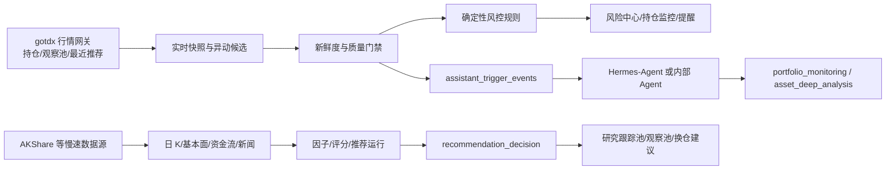
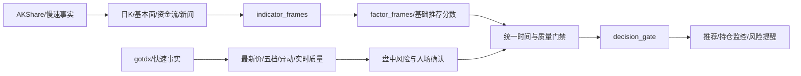
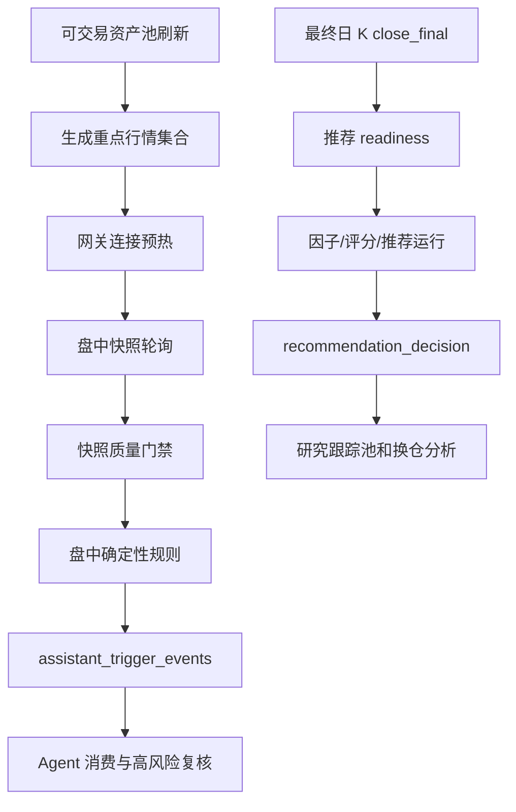

# A 股实时行情与推荐持仓监控一体化开发方案

> 文档状态：开发基线
>
> 更新时间：2026-07-20
>
> 适用范围：`finance-agent`、Hermes-Agent、A 股行情网关和 Agent Office

> 最终系统原则：确定性金融数据与风险系统 + Hermes 深度研究 Agent + 可拒绝的决策闸门。

> 任何数据不完整、过期、来源冲突、模型不确定或风险门禁不通过时，系统必须选择“暂不可用、等待补齐或人工复核”，不能强行生成买卖结论。

## 1. 结论摘要

本项目应当引入低延迟 A 股行情采集，但不应把它做成全市场交易所级行情系统，也不应立即替换当前 AKShare 全市场采集链路。

最终采用“双速数据链路”：



核心决策如下：

| 决策项 | 结论 |
| --- | --- |
| 是否引入实时行情 | 是，优先服务持仓监控、观察池和最近推荐标的 |
| 是否全市场秒级轮询 | 否，成本高且没有必要；全市场使用服务端异动接口做候选发现 |
| 是否替换 AKShare | 暂不替换；两者职责不同 |
| 是否达到交易所级实时 | 不能承诺；`gotdx` 是低延迟轮询，不是交易所推送 |
| 是否让 Hermes 直接抓行情 | 否；Hermes 通过 `finance-agent` 的事实工具和 Workflow 工作 |
| 是否自动下单 | 否；系统只产生信号、提醒、复核意见和订单草案 |
| 是否保证盈利 | 否；系统只能提高数据及时性和决策可审计性，不能保证收益 |

## 2. 当前系统基线

### 2.1 已有数据链路

当前项目已经具备以下能力：

- `realtime_quote_snapshots`：保存 A 股实时行情快照；
- `market_bars`：保存日 K 和其他标准行情；
- `ashare.bars.1d.close_final`：收盘后最终日 K 任务，当前保持 15:50、17:30 两次；
- `ashare.realtime_quotes`：A 股实时快照任务；
- `analytics.triggers.evaluate.intraday`：读取入库快照并生成盘中触发事件；
- `TriggerService`：写入 `assistant_trigger_events`，不直接运行 Workflow；
- `portfolio_monitoring`：基于持仓、信号、风险和记忆生成持有、减仓、观察等结构化建议；
- `recommendation_decision`：在推荐运行完成后判断入池、买入、卖出、换仓或回避；
- Hermes-Agent / 内部金融 Agent：消费触发事件，按需调用金融工具和 Workflow。

### 2.2 已完成的调度收敛

A 股盘中任务已经采用交易时段窗口：

| 任务 | 盘中 | 收盘后 |
| --- | --- | --- |
| 实时行情、资金流、风险情绪 | 09:30-11:30、13:00-15:00 | 15:10、17:30 各补跑一次 |
| 盘中触发评估 | 只在交易窗口 | 收盘后停止 |
| 最终日 K | 不适用 | 15:50、17:30 |
| 新闻公告 | 按原有 `interval` 运行 | 不受盘中窗口限制 |

本方案不改变上述收盘后只补跑 1～2 次的约束。实时网关的高速轮询也必须在 15:00 后停止。

### 2.3 三个业务通道的关系

```text
可交易资产池
    ├── 用户观察池：用户主动关注的标的
    ├── 系统研究跟踪池：推荐结果经过决策后进入的跟踪范围
    ├── 事件重点池：异动、新闻或风险事件触发的临时重点范围
    └── 当前持仓：最高优先级的实际风险范围

持仓 + 实时行情 + 信号/风险
    -> 持仓监控
    -> 风险中心
    -> 必要时唤醒 Hermes / portfolio_monitoring

收盘日 K + 基本面 + 资金流 + 新闻 + 因子评分
    -> 推荐运行
    -> recommendation_decision
    -> 研究跟踪池/换仓建议
```

实时行情是持仓监控和盘中风险中心的事实输入，但不是推荐评分的唯一输入。推荐链路不能因为一条瞬时盘口变化而直接重算全市场推荐。

## 3. 目标与非目标

### 3.1 目标

1. 持仓价格、盈亏和盘口变化能够在数秒级进入系统。
2. 及时发现止损、快速回撤、流动性下降和明显异动。
3. 风险中心能明确区分“行情风险”和“行情源不可用”。
4. 观察池和最近推荐可以获得与持仓相同的低延迟监控能力。
5. Hermes 能在触发后联网检索、执行 Python 分析脚本，并引用行情、基本面、新闻和历史决策证据。
6. 所有信号、质量状态、Agent 复核和最终建议都可审计、可复盘。

### 3.2 非目标

- 不承诺交易所级 Tick 完整性、零丢失或固定 SLA。
- 不把通达信行情协议当成自动交易通道。
- 不在本阶段建设全市场逐秒轮询系统。
- 不让 Hermes、Workflow 或模型直接请求 AKShare、通达信或网页行情接口。
- 不把模型输出直接转换为自动下单指令。
- 不用实时行情替代日 K、基本面、资金流、新闻和回测数据。

## 4. 行情源分工

### 4.1 数据源职责

| 数据源 | 主要用途 | 频率 | 是否进入高速风控 |
| --- | --- | --- | --- |
| `gotdx` | 重点标的快照、五档、分时、分笔、异动候选 | 3～5 秒轮询 | 是，作为主实时源，必须经过质量门禁 |
| AKShare/东方财富 | 全市场快照、资产池、估值当前截面，并作为 gotdx 的慢速事实校验源 | 盘中低频和收盘补采；实际延迟以返回时间戳为准，当前按约 5 分钟级规划 | 与 gotdx 并行评估价格、涨跌幅和成交量；不能替代五档盘口，也不能把延迟数据直接当成当前成交价 |
| Eastmoney/Tencent K 线 | 日 K、分钟 K 降级和历史补采 | 按数据生命周期 | 否，主要服务分析 |
| 新闻/公告 Provider | 新闻、公告、正文、实体和情绪 | 分钟级或事件级 | 否，作为复核证据 |
| Hermes 联网工具 | 外部事实核验、新闻补充、脚本分析 | 触发后按需 | 不直接作为行情事实源 |

### 4.2 许可证边界

- 直接依赖 MIT 许可证的 `github.com/bensema/gotdx`。
- 不复制 `go-stock` 的 GPLv3 应用业务代码、Wails/Vue、SQLite 或 GORM 层。
- 只借鉴 `go-stock` 的连接管理、市场路由、重连和数据转换思路。
- 生产部署前记录通达信节点、协议和第三方服务的运行风险。

### 4.3 双速数据融合与降级策略

`AKShare` 和 `gotdx` 不是同一种数据能力。前者主要回答“标的的历史、基本面和当前截面是否支持推荐”，后者主要回答“此刻的价格、盘口和流动性是否支持持仓或入场”。两者必须经过统一资产、时间和质量门禁后再汇合，不能直接平均价格或拼接成一个未经验证的综合分数。

#### 4.3.1 数据融合分层



各层职责如下：

| 层次 | 输入 | 输出 | 主要用途 |
| --- | --- | --- | --- |
| 慢速事实层 | AKShare、公告、财报、资金流、历史 K 线 | `market_bars`、基本面、事件事实 | 生成技术指标、因子和基础推荐分数 |
| 快速事实层 | gotdx 快照、五档、分时和异动 | `realtime_quote_snapshots` | 更新最新价、浮盈亏、回撤、流动性和盘中风险 |
| 快速特征层 | gotdx 多次有效快照 | 盘口价差、买卖盘失衡、量能加速、快速回撤等 | 入场确认和风险覆盖；不能伪造 Tick 序号 |
| 融合门禁层 | 慢速评分、快速状态、来源质量和时间边界 | `decision_gate_id`、动作权限和拒绝原因 | 决定 `approved`、`pending_review` 或 `data_unavailable` |

#### 4.3.2 AKShare 时间与质量规则

AKShare 的接口延迟不能固定假设为 5 分钟。系统必须使用 Provider 返回的业务时间、抓取时间、接收时间和连续性判断新鲜度；没有可信时间戳时，不能因为请求刚刚返回就标记为实时可用。

两个 Provider 在同一评估批次并行执行，各自独立判定质量：

1. gotdx 有效时提供低延迟价格、五档、盘口和异动特征。
2. AKShare 有效时提供带业务时间戳的价格、涨跌幅和成交量校验；不能假设固定为 5 分钟，必须使用返回时间戳计算 `freshness_ms`。
3. 任一 Provider 失败、缺标的或字段不足时，只降低该 Provider 的能力，不跳过另一个 Provider；结果写入独立 `source` 和错误信息。
4. AKShare 超过配置的新鲜度窗口、没有可靠时间戳或与 gotdx 冲突时，标记为 `stale`、`invalid_server_time` 或 `conflict`；只能用于数据质量提示和人工复核，不能直接产生确定性买卖动作。

降级数据应保留原始 `source`，并在快照元数据中记录：

```json
{
  "source": "akshare:stock_zh_a_spot",
  "provenance_mode": "fallback",
  "fallback_of": "gotdx:tdx_main",
  "source_timestamp": "2026-07-20T10:25:00+08:00",
  "received_at": "2026-07-20T10:29:10+08:00",
  "freshness_ms": 250000
}
```

来源角色与质量状态分离。建议权限如下：

下表是决策层的运行模式，不新增或替换 `quality_status` 枚举；底层仍保存 `available`、`stale`、`source_conflict` 等质量状态。

| 数据状态 | 允许的用途 | 禁止的用途 |
| --- | --- | --- |
| `realtime_microstructure`：gotdx 有效 | 持仓监控、盘口判断、盘中确定性规则 | 仍不得绕过决策闸门 |
| `reference_snapshot`：AKShare 时间戳有效 | 页面价格、持仓估值、跨源校验、风险提醒、人工复核 | 不直接确认买入、卖出或换仓，不替代五档盘口 |
| `stale_or_unavailable`：两者均过期或冲突 | 数据质量告警、等待补齐 | 不使用旧价格生成确定性动作 |

#### 4.3.3 两条业务链的融合方式

推荐链不能因一条瞬时盘口变化而重算全市场推荐。推荐基础分数仍来自收盘日 K、基本面、资金流、新闻和可回测因子；gotdx 只用于：

- 确认推荐是否仍满足入场条件；
- 缩短或终止推荐有效期；
- 触发盘中风险复核；
- 在数据不可用、流动性恶化或价格快速反转时否决动作。

持仓监控和风险中心同时读取两源结果：gotdx 提供低延迟盘中状态，AKShare 提供慢速价格和成交量校验。若 gotdx 缺失，只能使用 AKShare 输出估值、数据风险提醒或等待复核，不能把延迟行情直接当成当前卖出价格。

统一判断形式为：

```text
基础推荐分数（AKShare 等慢速数据）
    + 双源盘中评估（gotdx 微观结构 + AKShare 慢速校验）
    + 数据质量与时间门禁
    -> decision_gate
    -> buy / hold / review / sell / wait
```

实时快照、指标、因子和外部研究必须绑定同一个决策时点对应的 `data_snapshot_id`。在组合快照尚未完整实现前，不得把不同时间的 AKShare 和 gotdx 数据拼成一个“实时结论”。

## 5. 行情网关设计

### 5.1 网关边界

行情网关是独立的 Go 只读服务，不直接写推荐、持仓或决策表。它负责：

- 管理通达信主行情连接；
- 自动选择可用节点并缓存节点；
- 请求重点标的快照和服务端异动列表；
- 转换为平台统一格式；
- 返回服务端时间、接收时间、延迟和质量状态；
- 断线重连、有限重试和节点切换；
- 提供健康检查和运行指标。

网关 PoC 当前位于 `prototypes/gotdx-gateway/`，后续生产化时可继续独立部署，不把 Go 依赖嵌入 Python 进程。

### 5.2 HTTP 接口

| 方法 | 路径 | 用途 |
| --- | --- | --- |
| `GET` | `/healthz` | 检查网关进程和数据源连接能力 |
| `POST` | `/quotes` | 批量获取重点 A 股快照和五档盘口 |
| `POST` | `/unusual` | 获取通达信服务端异动候选 |

请求示例：

```json
{
  "symbols": ["600519.SH", "000001.SZ"]
}
```

网关不得接收全市场无限制请求。第一阶段单批上限建议为 100 个标的，实际轮询集合由 `finance-agent` 计算。

### 5.3 连接策略

1. 进程启动后不立即执行全市场请求。
2. 交易窗口开始前预热连接和节点选择。
3. 使用持久连接服务重点标的批量请求。
4. 请求失败时断开旧连接，重新选择节点，最多重试一次。
5. 连续失败进入熔断，短暂冷却后再恢复。
6. 记录节点、请求耗时、返回条数、重试次数和错误分类。
7. HTTP 写超时必须覆盖首次节点测速，不能使用过短的普通接口超时。

实测中，冷启动请求约 4 秒，连接复用后的请求约 88 毫秒。因此生产调度必须预热，并单独统计冷启动与热请求延迟。

## 6. 统一行情数据契约

### 6.1 事实表落点

盘中临时行情使用覆盖式 `intraday_quote_latest`，不按每个采样时间点累积历史；收盘最终日 K 完成后清理临时行。决策所需的不可变快照元数据仍单独保存。

```text
source = gotdx:tdx_main
```

gotdx 快照使用 `source=gotdx:tdx_main`；AKShare 校验快照保留自身 Provider 来源，例如
`source=akshare:stock_zh_a_spot`，两个来源按 `asset_id + source` 独立覆盖，不互相覆盖；质量和时间字段用于后续冲突判定。

原始响应和质量信息写入 `payload`。连续运行验收通过后，再考虑把高频查询字段提升为独立列或 TimescaleDB hypertable。

### 6.2 最小字段

| 字段 | 说明 |
| --- | --- |
| `asset_id`、`symbol`、`market` | 平台资产身份 |
| `last_price`、`prev_close` | 最新价和昨收 |
| `open`、`high`、`low` | 当日价格范围 |
| `volume`、`amount` | 成交量和成交额 |
| `bid_levels`、`ask_levels` | 买卖五档 |
| `server_time` | 数据源服务端时间 |
| `server_timestamp` | 结合交易日推断的服务端时间 |
| `received_at` | 网关收到响应的时间 |
| `freshness_ms` | 本机接收时间与服务端时间差 |
| `provider_latency_ms` | 网关请求耗时 |
| `node` | 实际使用的行情节点 |
| `source_timestamp` | Provider 返回的业务时间，用于判断真实新鲜度 |
| `provenance_mode`、`fallback_of` | 当前来源角色及其替代的主来源 |
| `quality_status` | 数据质量状态 |
| `sequence` | 若数据源未来提供序号则保存，否则为 `null` |
| `raw_record_id` | 原始报文审计引用 |

### 6.3 质量状态

| 状态 | 含义 | 是否允许触发卖出规则 |
| --- | --- | --- |
| `available` | 交易窗口内，服务端时间可解析且延迟在阈值内 | 允许 |
| `stale` | 服务端时间落后超过阈值 | 不允许，生成数据质量告警 |
| `after_hours_snapshot` | 收盘、午休、周末或节假日快照 | 不允许 |
| `clock_skew` | 服务端时间明显领先本机 | 不允许 |
| `invalid_server_time` | 服务端时间为空或不可解析 | 不允许 |
| `provider_error` | 请求失败或返回为空 | 不允许 |
| `source_conflict` | 不同来源价格或时间冲突 | 不允许，等待复核 |

`gotdx` 的服务端时间只有时分秒，不能单独确定交易日期。必须结合交易日策略和本地时间计算日期；无法确认时，必须标记为 `after_hours_snapshot` 或 `stale`。

### 6.4 幂等和缺口

快照建议使用以下逻辑键：

```text
(asset_id, as_of, source)
```

如果数据源没有事件序号，不能假设每次轮询都代表一个独立 Tick。应记录：

- 同一服务端时间的重复次数；
- 本地接收时间；
- 节点切换前后的最后快照；
- 连续缺口数量；
- 价格回退或时间倒退次数。

重复快照可以覆盖或幂等写入，但不能伪造序号，也不能把轮询次数当成交笔数。

## 7. 重点标的选择和调度

### 7.1 高速轮询集合

高速集合是以下集合的并集：

1. 当前持仓；
2. 用户观察池；
3. 最近一次仍有效的推荐标的；
4. 最近异动事件进入的事件重点池。

集合必须经过可交易资产池过滤，排除停牌、退市风险、不可交易市场和无有效代码映射的资产。

### 7.2 轮询频率

| 场景 | 建议频率 | 说明 |
| --- | --- | --- |
| 持仓标的 | 3 秒左右 | 优先级最高，批量请求 |
| 观察池和最近推荐 | 5 秒左右 | 控制请求量 |
| 全市场异动候选 | 15～30 秒 | 使用 `StockUnusual` 或 `MACMarketMonitor` |
| 收盘后 | 停止高速轮询 | 仍沿用 15:10、17:30 补采 |
| 非交易日 | 不轮询 | 仅允许手工诊断或历史查询 |

3～5 秒是低延迟轮询的工程折中，不代表交易所级延迟。实际频率应由节点稳定性、请求量、持仓数量和连续运行指标动态校准。

### 7.3 调度依赖



## 8. 推荐、风险中心和持仓监控的依赖关系

### 8.1 推荐链路

推荐不依赖每一条实时快照。推荐运行必须先满足：

1. 可交易资产池已经生成；
2. 历史日 K 覆盖达到最低窗口；
3. 最近收盘最终日 K 成功；
4. 因子、评分、资金流、基本面和新闻数据通过各自 freshness 规则；
5. 市场环境门禁通过或明确记录为受限；
6. 交易性门禁、风险门禁和回避池检查通过；
7. 推荐结果写入 `recommendation_runs`、推荐项和证据。

推荐运行完成后，才触发 `recommendation_run_ready`，由 `recommendation_decision` 判断是否入研究跟踪池、买入、回避、卖出或换仓。

### 8.2 持仓监控链路

持仓监控优先依赖：

- 当前持仓和成本价；
- 最新可用实时快照；
- 已入库信号和风险；
- 最近推荐和用户投资偏好；
- 数据质量状态。

如果 gotdx 不可用但 AKShare 快照仍在有效时间窗口内，持仓监控可以输出估值和风险复核提醒，但不能直接确认买入、卖出或换仓；如果两者都没有有效快照，则输出“行情不可用、等待复核”，不能把旧价格当成当前价格，更不能直接输出确定性卖出动作。

### 8.3 风险中心链路

风险中心聚合三类结果：

| 风险类型 | 事实来源 | 处理方式 |
| --- | --- | --- |
| 行情风险 | 最新价、跌幅、盘口、成交量 | 确定性规则快速触发 |
| 业务和基本面风险 | 财务、公告、新闻、估值 | 慢速任务或 Agent 复核 |
| 数据风险 | stale、缺口、节点失败、来源冲突 | 阻断交易建议并告警 |

风险中心必须优先展示数据风险，否则用户可能把“没有行情”误解为“没有风险”。

## 9. Hermes-Agent 和 finance-agent 的职责

### 9.1 finance-agent 负责

- 行情、K 线、基本面、资金流、新闻和风险事实的标准化；
- 数据质量、freshness、来源和审计；
- 触发事件、去重、冷却和 Agent 唤醒；
- `portfolio_monitoring`、`recommendation_decision`、`asset_deep_analysis` 等金融 Workflow；
- 决策日志、提醒、Finance Memory 和复盘任务落库；
- 只读 CLI、MCP 和 API 工具边界。

### 9.2 Hermes-Agent 负责

- 长期运行、自由 loop、任务编排和用户对话；
- 读取 `assistant_trigger_events`；
- 按需调用 `finance-agent` 的只读事实工具和 Workflow；
- 在需要复核时联网查询、执行 Python 脚本和多源交叉分析；
- 组织证据、提出风险反驳、形成可解释建议。

Hermes 不直接把网页结果、模型记忆或临时脚本输出写成行情事实。外部检索结果必须包含来源、抓取时间、标的、事件时间和可信度，并与平台内行情进行交叉核验。

### 9.3 Agent 决策约束

每条建议至少引用：

- 行情快照或 K 线 ID；
- 数据质量状态；
- 信号或因子 ID；
- 风险 ID；
- 推荐运行或持仓 ID；
- 外部检索证据（如使用）；
- 规则版本和模型生成标识。

模型不能绕过 `quality_status`。当实时行情为 `stale`、`after_hours_snapshot` 或 `provider_error` 时，最多输出“等待数据恢复或人工复核”。

## 10. 确定性风控规则

第一阶段只实现可测试、可解释的规则：

- 持仓跌破用户设定止损线；
- 从持仓高点回撤超过阈值；
- 最新价快速下跌且成交量显著放大；
- 买一卖一价差或盘口深度恶化；
- 连续多个轮询周期没有有效报价；
- 服务端时间落后或数据源发生冲突；
- 触发异动事件且标的属于持仓或用户观察池。

规则输出使用 `market_data_signal`，不直接等价于 `agent_advice`：

```text
market_data_signal
    -> 风险中心展示
    -> assistant_trigger_events
    -> Hermes / portfolio_monitoring 复核
    -> hold / watch / reduce / exit / review
```

高风险动作必须经过高风险复核策略，不自动下单。

## 11. 可靠性和降级设计

### 11.1 关键指标

网关和采集器至少记录：

- 请求总数、成功数、失败数；
- P50/P95/P99 延迟；
- 冷启动延迟和热请求延迟；
- 节点选择、节点切换和重连次数；
- 服务端时间可解析率；
- `available`、`stale`、`after_hours_snapshot` 占比；
- 快照缺口和重复快照数量；
- 写入耗时和数据库失败数；
- 触发事件创建、抑制和派发数量。

### 11.2 降级顺序

```text
gotdx 快照正常
    -> 使用实时风控规则

gotdx 失败但 AKShare/腾讯快照新鲜
    -> 标记 source=fallback，并降低信号等级

所有行情源过期或冲突
    -> 停止确定性卖出建议
    -> 展示数据不可用
    -> 只允许 Hermes 做信息复核，不给出伪实时结论
```

降级数据不能覆盖或伪装成 `gotdx:tdx_main`，每次来源切换都必须写入质量事件。

### 11.3 调度资源隔离

- 高速网关进程与全市场 AKShare 任务隔离；
- 继续使用现有 `realtime` 资源池，避免被基本面、K 线和新闻长任务挤占；
- 同一标的请求合并，禁止持仓监控、观察池刷新和页面请求分别打满数据源；
- Redis 可用于运行态、事件流和指标，PostgreSQL/TimescaleDB 保存可审计事实；
- 复用现有 PostgreSQL + Redis，不新增 Kafka、RabbitMQ 或 NATS；PostgreSQL 是事实和任务最终源，Redis Streams 负责低延迟传输，消费使用 `XACK`，异常使用 `XPENDING`/`XAUTOCLAIM` 恢复；
- 网关只绑定本机或受控内网地址，不暴露未认证写接口。

## 12. 分阶段开发计划

### 阶段 0：PoC 和文档（已完成）

- 完成 `go-stock` / `gotdx` 源码和许可证调研；
- 完成 Go 只读网关 PoC；
- 完成 `/healthz`、`/quotes`、`/unusual`；
- 完成市场代码解析和新鲜度门禁单测；
- 完成真实节点连接和五档盘口冒烟；
- 确认冷启动和热请求延迟差异。

### 阶段 1：连续运行稳定性验证

- 仅运行持仓、观察池和最近推荐集合；
- 覆盖至少 5 个交易日；
- 记录全量指标，不写入正式风控表或只写隔离 source；
- 验证断线、节点切换、午休、收盘和服务重启；
- 验收通过后才允许进入阶段 2。

### 阶段 2：写入统一快照和质量事件

- 增加网关到 `realtime_quote_snapshots` 的适配器；
- 使用 `gotdx:tdx_main` source；
- 写入 `server_time`、`received_at`、`freshness_ms`、`quality_status` 和节点信息；
- 增加快照缺口、时间倒退、来源冲突测试；
- 不改变推荐评分和日 K 生命周期。

### 阶段 3：接入盘中风险和持仓监控

- 让 `TriggerService` 读取通过质量门禁的实时快照；
- 接入止损、回撤、放量、盘口和数据不可用规则；
- 通过 `assistant_trigger_events` 唤醒 Hermes 或内部 Agent；
- 风险中心展示行情风险和数据风险；
- 完成持仓监控端到端冒烟和高风险复核。

### 阶段 4：接入异动候选和观察池

- 使用 `StockUnusual` 或 `MACMarketMonitor` 获取全市场候选；
- 按标的、事件类型、服务端时间和摘要去重；
- 候选只进入事件重点池，不直接产生交易建议；
- 对候选标的追加盘口、分时和新闻复核；
- 验证重复事件、节点切换和事件缺口。

### 阶段 5：Hermes 综合复核

- Hermes 读取已入库行情、风险、推荐、持仓和记忆；
- 需要时联网查询和执行 Python 分析；
- 强制输出证据、时间、来源、数据质量和不确定性；
- 形成卖出、减仓、继续持有、换仓候选或等待复核建议；
- 继续保持人工确认和订单草案边界，不自动执行交易。

## 13. 测试和验收标准

### 13.1 单元测试

- 沪深北代码和市场映射；
- 空代码、非法市场和重复代码拒绝；
- 服务端时间解析；
- 午休、收盘、周末和节假日质量状态；
- stale、clock skew、provider error 的门禁；
- 五档盘口字段转换；
- 事件去重和冷却；
- 断线重连和有限重试。

### 13.2 集成测试

- 网关健康检查；
- 重点标的批量快照；
- `realtime_quote_snapshots` 幂等写入；
- Redis 运行态和 PostgreSQL 事实写入；
- 触发事件生成和 Hermes 派发；
- 风险中心和持仓监控读取同一份快照；
- 推荐链路不因高速轮询重复触发全量计算。

### 13.3 生产准入指标

连续 5 个交易日满足以下条件后，才允许将 gotdx 作为持仓风控的低延迟微观结构确认源：

| 指标 | 门槛 |
| --- | --- |
| 交易窗口请求成功率 | >= 99% |
| 重点标的端到端延迟 | P95 <= 3 秒 |
| 服务端时间可解析率 | >= 99% |
| 断线恢复 | 3 个轮询周期内 |
| 重复卖出事件 | 0 |
| stale 数据触发确定性卖出 | 0 |
| 节点切换后数据恢复 | 100% 有日志和质量状态 |
| 进程重启后状态恢复 | 不丢失重点标的集合和告警状态 |

未达到门槛时，系统继续使用当前慢速链路，并将高速行情显示为实验性数据。

## 14. 运维和安全

- 网关默认绑定 `127.0.0.1`，生产环境通过受控服务间网络访问；
- `/quotes` 和 `/unusual` 为只读接口，不提供下单、撤单或账户操作；
- 不在日志中写入用户账户、交易凭证或敏感 Token；
- 运行日志必须包含请求 ID、source、symbol、节点、延迟和质量状态；
- 网关异常不能阻塞日 K、推荐和 Hermes 主服务启动；
- 需要明确服务停止、配置热加载和节点池更新流程；
- 不注册未经确认的 Windows 计划任务，不执行整机重启，不把未认证接口暴露到局域网。

## 15. 最终使用边界

本系统的合理能力边界是：

```text
推荐：基于收盘数据和多源证据寻找中短期候选
持仓监控：基于低延迟快照及时发现风险并提醒
卖出建议：规则信号 + 数据质量 + Hermes/Workflow 复核
换仓建议：推荐结果 + 当前持仓 + 风险 + 交易性 + 联网证据
自动交易：不在本项目范围内
盈利保证：不存在
```

因此，实时行情采集值得引入，但它是“持仓和盘中风控增强层”，不是整个推荐系统的替代品。只有把行情新鲜度、调度窗口、数据质量、触发事件、Agent 复核和审计链路一起建设，才能真正改善“风险中心和推荐决策更新不及时”的问题。

## 16. 最终目标增强约束

本节是对本方案的最高优先级约束。后续实现、评审和验收都必须以本节为准；如果某项实时功能与本节冲突，应放弃该功能，而不是放宽数据和风险边界。

### 16.1 三层系统边界

```text
确定性金融系统
    负责：事实、计算、状态、风险、任务、闸门、审计和可写业务结果

Hermes 深度研究 Agent
    负责：联网检索、Python 分析、证据交叉验证、解释和研究报告

决策闸门
    负责：检查数据、风险、交易性、模型和人工确认条件，允许拒绝
```

Hermes 不是行情事实源，不是持仓数据库，不是交易执行器，也不是推荐主排序器。实时行情不能因为接入 Hermes 就变成交易所级行情；联网能力不能因为结果丰富就绕过数据质量门禁。

### 16.2 不可变数据快照

所有推荐、持仓监控和 Hermes 复核都必须绑定同一个不可变 `data_snapshot_id`。快照至少包含：

- 统一资产 ID，例如 `ashare:600519`；
- 交易日、交易时段和时区；
- 行情、财报、公告、新闻和交易记录的时间戳；
- Provider、来源 URL、抓取时间和版本；
- 复权规则、除权除息和停牌状态；
- 完整率、freshness、异常和冲突状态；
- 计算版本、规则版本和原始记录引用。

同一决策不得混用不同时间的行情、因子和新闻。若需要追加外部研究，只能生成新的研究证据版本，不能偷偷修改原始金融事实。

### 16.3 持久化任务中心

内存定时器只能作为进程唤醒手段，不能作为任务事实源。核心任务记录必须持久化到 PostgreSQL，至少包含：

| 字段 | 说明 |
| --- | --- |
| `job_id` | 稳定的任务定义 ID |
| `run_id` | 单次运行 ID |
| `dependency_ids` | 依赖任务或数据快照 |
| `data_snapshot_id` | 本次运行绑定的数据快照 |
| `status` | `pending`、`leased`、`running`、`succeeded`、`failed`、`retry_wait`、`cancelled`、`expired` |
| `attempt` | 当前尝试次数 |
| `lease_until` | 租约到期时间 |
| `started_at`、`finished_at` | 运行时间 |
| `error` | 可审计错误摘要 |

任务中心必须具备以下机制：

- PostgreSQL 事务写入业务结果和 Outbox 事件；
- Redis Streams 负责低延迟事件传输，Consumer Group 消费后 `XACK`；
- 消费者异常时通过 `XPENDING`/`XAUTOCLAIM` 重新领取；
- 使用租约和 `SKIP LOCKED` 避免重复执行；
- 使用幂等键避免重复写入；
- 使用 `all_of`、`any_of` 和 `barrier` 表达依赖；
- 任务超时自动释放租约；
- 失败按指数退避重试并限制最大尝试次数；
- 同一业务任务只保留一个未执行实例，避免周期任务积压；
- 事件发不出去时，Outbox 可以补发，不能依赖 Redis 单份消息保证一致性。

现有 `BaseDataScheduler` 继续负责收盘任务、低频维护和调度窗口；实时行情网关负责盘中长连接和快照轮询；二者都必须把运行结果写入统一任务状态和审计链路。

这里要区分“当前能力”和“目标能力”：现有调度器已经完成交易时段窗口、收盘补采和任务状态控制，但持久化任务租约、Outbox 补发、依赖 barrier 和 Redis Streams 消费恢复仍属于 M1 的建设范围。在 M1 完成前，不能把当前调度器宣称为完整的事件驱动任务中心，也不能让实时网关绕过现有任务审计单独形成一套隐藏队列。

### 16.4 三条执行链的硬隔离

#### 快速链

```text
实时行情
    -> 持仓估值
    -> 止损/回撤/信号反转/流动性规则
    -> 风险事件
    -> 本地规则提醒
```

快速链不能等待 Hermes、网页搜索或 Python。即使外网、模型和 Hermes 全部不可用，基础风险提醒也必须继续工作。

#### 推荐链

```text
收盘最终日 K
    -> 技术筛选
    -> 因子和评分
    -> 候选池合并
    -> 推荐生成
    -> Hermes 深度复核
    -> 可拒绝决策闸门
    -> 推荐/观察/回避/换仓建议
```

推荐主排序必须来自可回测的量化规则或模型。Hermes 只能做证据补充、风险反驳和候选解释，不能凭语言流畅度改变基础排序。

#### 研究链

```text
推荐或风险事件
    -> 构造证据包
    -> Hermes 联网检索
    -> Python 计算
    -> 多源交叉验证
    -> 研究结论
    -> 回写证据、结论和审计
```

研究链允许失败、超时和降级，不能阻塞快速链，也不能阻塞基础风险事件入库。

### 16.5 可拒绝的决策闸门

决策闸门必须是独立、可测试、可审计的业务组件，不能只是 Prompt 中的一句要求。统一输出：

| 结果 | 含义 |
| --- | --- |
| `approved` | 数据、风险、交易性和研究条件均满足 |
| `rejected` | 明确违反风险或交易规则，不允许建议该动作 |
| `pending_review` | 信息不足或冲突，需要 Hermes/人工复核 |
| `data_unavailable` | 数据过期、缺失、来源冲突或 Provider 不可用 |
| `expired` | 建议超过有效期，必须重新计算 |

闸门的输入输出应固定为可序列化的决策对象：

```json
{
  "decision_gate_id": "gate:recommendation:20260720:600519",
  "action": "buy",
  "status": "pending_review",
  "data_snapshot_id": "snapshot:20260720:153000:abc",
  "required_evidence_ids": ["evidence:quote:1", "evidence:risk:2"],
  "rejection_reasons": [],
  "risk_level": "high",
  "human_approval_required": true,
  "rule_version": "decision-gate-v1"
}
```

任何下游界面、Hermes 或订单草案都只能消费闸门结果，不能根据原始模型文本自行推断 `approved`。`rejected`、`data_unavailable` 和 `expired` 必须阻止对应动作；`pending_review` 只能生成复核任务，不能生成可执行动作。

闸门至少检查：

1. `data_snapshot_id` 是否完整且一致；
2. 行情和关键数据是否通过 freshness；
3. 资产是否属于可交易资产池；
4. 交易时段、停牌、涨跌停和流动性是否允许；
5. 市场状态、行业暴露和组合风险是否允许；
6. 推荐、信号、因子和证据是否存在冲突；
7. Hermes 是否提供了可验证来源和不确定性说明；
8. 高风险动作是否已经人工确认。

没有足够历史数据、指标覆盖不足、因子冲突或模型不确定时，必须返回：

```text
暂不可用
等待数据补齐
需要人工复核
```

不能为了满足“必须给出买卖结论”而降低闸门。

### 16.6 Hermes 工具和沙箱边界

`finance-agent` 通过 MCP/API 暴露受控工具，工具名建议固定为：

```text
finance.market.get_snapshot
finance.portfolio.get_snapshot
finance.recommendation.get_latest
finance.watchlist.get_active
finance.risk.get_context
finance.signal.get_asset_context
finance.workflow.create_review
finance.review.save_evidence
finance.review.save_conclusion
```

Hermes 不允许直接访问：

- PostgreSQL、Redis 或任意数据库连接；
- 任意 SQL；
- 任意 shell；
- 任意交易接口；
- 持仓原始写操作；
- 未经审计的 Provider 凭证。

Python 分析必须在沙箱中运行：

- 只读输入 `data_snapshot_id` 对应的数据；
- 禁止读取密钥和用户凭证；
- Hermes 的网页搜索和浏览器外网访问可以开启；Python 沙箱的外网访问按任务授权，默认关闭，避免脚本把未经审计的数据写回事实层；
- 限制 CPU、内存、执行时长和输出大小；
- 输出 JSON、表格或图表；
- 保存代码哈希、依赖版本、输入快照和执行日志。

外网允许访问，但必须保存 URL、来源、发布时间、抓取时间、证据哈希和失败记录。外网研究只能增强分析，不能阻塞实时止损链。

Hermes 的 MCP 工具必须是最小权限工具。推荐使用只读事实工具读取数据，使用 `finance.review.save_evidence` 和 `finance.review.save_conclusion` 写入研究结果；写入持仓、资金、订单状态的接口不向 Hermes 暴露。工具层还必须校验调用方、`data_snapshot_id`、证据来源和研究任务 ID，不能只依赖 Prompt 约束。

### 16.7 推荐准确性和防止前视偏差

推荐质量必须通过数据和回测保证，而不是交给 Hermes 的主观判断。推荐系统至少包含：

- 多因子评分；
- 市场状态识别；
- 行业和风格过滤；
- 趋势、动量、波动、质量和估值因子；
- 交易成本和滑点模拟；
- Walk-forward 验证；
- 训练集、验证集和测试集按时间隔离；
- 禁止未来数据泄漏；
- 纸面交易和前向试运行；
- 推荐有效期和失效条件。

每个推荐必须输出：

```text
推荐标的、方向、预期持有周期、主要依据、反方风险、入场条件、
失效条件、止损条件、换仓候选、置信度、data_snapshot_id、数据时间。
```

实时行情可以更新风险状态和建议有效期，但不能单独制造一个未经回测的买入信号。

### 16.8 持仓状态机和换仓比较

持仓监控至少更新：最新价、成本价、浮盈亏、仓位权重、行业暴露、组合回撤、流动性、风险事件和最新信号。

持仓状态机统一为：

```text
normal -> watch -> reduce_pending -> sell_pending -> confirmed -> executed -> closed
                         \-> swap_pending -> confirmed
```

卖出和换仓建议必须同时比较：

- 当前持仓自身风险；
- 最新信号是否转空；
- 组合整体回撤；
- 候选股票相对强弱；
- 行业集中度；
- 交易成本和滑点；
- 新旧标的风险差异；
- 推荐和实时行情的有效期。

Hermes 负责解释和比较，最终动作由金融规则、决策闸门和人工确认控制。

### 16.9 业务稳定性指标

技术指标和业务指标分开验收：

| 指标 | 目标 |
| --- | --- |
| 实时行情到持仓估值 | 目标小于 5 秒；公开轮询源不承诺交易所级 |
| 行情到风险触发 | 目标小于 10 秒 |
| 收盘完成到推荐生成 | 小于 30 分钟 |
| 推荐生成到决策复核 | 小于 5 分钟 |
| 快速任务被后台任务阻塞 | 0 次 |
| 任务失败重复写入 | 0 次 |
| 建议缺少快照或证据 | 0 次 |
| Hermes 不可用时本地风险链 | 必须继续运行 |
| 高风险建议未人工确认 | 0 次 |
| 模型和研究结论可复盘 | 100% |

如果使用公开轮询源，只能把上述目标作为平台处理延迟目标，不能宣称数据源本身具有交易所级质量。真正的 Level 1/Level 2、逐笔成交和盘口质量，需要合法授权的交易所、券商 WebSocket 或 FIX 数据源。

### 16.10 以最终目标为导向的实施顺序

将此前的阶段计划统一映射为 M0～M6：

| 阶段 | 目标 | 关键产物 |
| --- | --- | --- |
| M0 | 安全和数据契约 | 统一资产 ID、快照、证据、质量和人工确认规则 |
| M1 | 持久化任务中心 | Outbox、租约、幂等、依赖 barrier、重试和队列监控 |
| M2 | 快速持仓链 | 行情、估值、回撤、止损、信号反转和风险提醒 |
| M3 | 稳定推荐链 | 筛选、评分、版本一致性、回测和推荐效果评估 |
| M4 | Hermes MCP | 联网搜索、Python 沙箱、Skills、Memory 和报告能力 |
| M5 | 深度复核闭环 | 证据、推荐决策、执行登记、结果和复盘关联 |
| M6 | 灰度运行 | 纸面运行、影子模式、人工确认和逐步扩大范围 |

高频行情网关只能作为 M2 的数据组件，不能跳过 M0、M1 直接接入 Hermes 或真实持仓动作。M6 之前，系统只允许辅助决策和订单草案，不允许自动交易。

### 16.11 准确性和稳定性的可验证定义

本系统不能保证某只股票上涨，也不能用单次推荐收益证明系统正确。最终验收需要同时满足以下四类指标：

| 维度 | 必须证明的内容 |
| --- | --- |
| 时间正确性 | 推荐、风险和研究只使用决策时点之前可见的数据 |
| 来源正确性 | 每个关键字段都有 Provider、抓取时间、版本和原始记录引用 |
| 计算可复现 | 同一个 `data_snapshot_id` 和规则版本可以重算相同结果 |
| 操作可恢复 | 任务失败可重试，事件可补发，重复消费不会重复写入或重复提醒 |

推荐效果还必须通过滚动回测、Walk-forward、纸面交易和前向试运行评估；持仓监控则必须通过模拟断线、行情过期、节点切换、涨跌停和组合回撤场景评估。只有四类正确性和对应场景均通过，才允许扩大资产范围或提高轮询频率。

## 17. 方案一致性检查清单

每次新增功能或修改链路前，必须回答：

- 是否仍由确定性金融系统保存事实和计算结果？
- Hermes 是否只做研究、解释和证据补充？
- 是否绑定不可变 `data_snapshot_id`？
- 数据过期、冲突或不完整时是否可以拒绝？
- 快速风险链是否能在 Hermes 不可用时独立工作？
- 是否复用了现有 PostgreSQL + Redis，而不是新增不必要中间件？
- 任务是否可持久化、租约、幂等、重试和恢复？
- 推荐是否具备回测、滑点和防前视验证？
- 持仓和换仓建议是否考虑组合风险、成本和人工确认？
- 是否留下来源、版本、计算过程和审计记录？

只要其中一项回答为“否”，该功能就不能进入生产决策链。

## 18. 开发进度跟踪表

本表是本方案的执行台账。状态判断以代码、测试、运行日志和真实验收证据为准，不以设计文档中的“已规划”代替完成。

状态枚举：

- `已完成`：实现、测试和必要的真实冒烟均通过；
- `部分完成`：已有基础能力，但未满足本方案的完整契约或验收条件；
- `进行中`：已经开始实现，尚未达到阶段验收；
- `未开始`：尚无可验收实现；
- `阻塞`：存在明确外部依赖或技术阻塞，需要记录原因。

| 编号 | 阶段 | 工作包 | 目标和关键产物 | 当前状态 | 下一步 | 验收证据 |
| --- | --- | --- | --- | --- | --- | --- |
| M0-01 | M0 数据契约 | 统一资产与交易状态 | 统一 `asset_id`、市场代码、交易日历、时区、停牌/涨跌停/除权状态 | 部分完成 | 将实时、日 K、财报、公告和新闻统一绑定资产和交易日 | `assets`、`asset_status_snapshots`、`market_calendars` 及对应测试 |
| M0-02 | M0 数据契约 | 不可变数据快照 | 实现 `data_snapshot_id`、Provider、抓取时间、版本、质量和原始记录引用 | 进行中 | 已完成契约、ORM、追加仓储和在线迁移；继续绑定收盘推荐输入快照 | 34 个定向测试通过；PostgreSQL 已验证 append-only 触发器；待跨推荐/风控回放验收 |
| M0-03 | M0 风险边界 | 可拒绝决策闸门 | 实现 `approved`、`rejected`、`pending_review`、`data_unavailable`、`expired` 及结构化拒绝原因 | 进行中 | 已完成 Gate DTO、确定性规则、审计表和工作流降级；继续接入高风险人工确认回写 | 11 个闸门测试、3 个工作流绑定测试、2 个接口上下文测试通过；待端到端审计回放 |
| M0-04 | M0 证据审计 | 证据统一格式 | 统一来源 URL、发布时间、抓取时间、哈希、数据快照和计算版本 | 部分完成 | 为外部研究和行情网关补齐证据字段 | 推荐和研究结论可追溯到原始记录 |
| M1-01 | M1 任务中心 | 持久化任务状态 | PostgreSQL 任务记录、租约、`SKIP LOCKED`、幂等键、重试和过期恢复 | 进行中 | 已完成队列表、仓储、门面、过期租约恢复和常驻调度器接入；补跨进程重启和连续运行验收 | 15 个队列/配置/触发/调度回归测试通过；PostgreSQL `20260720_0023` 真实事务冒烟通过；待跨进程恢复验证 |
| M1-02 | M1 任务中心 | Outbox 与事件传输 | 业务结果和 Outbox 同事务，Redis Streams Consumer Group、`XACK`、`XAUTOCLAIM` | 进行中 | 已完成 Outbox ORM/迁移、幂等追加、租约领取、发布/失败回写、Redis Streams 适配和独立发布器；接入更多业务结果事件并完成真实 Redis 补发演练 | Outbox 定向 6 个测试通过；数据库事实写入成功但事件发送失败时可自动补发；待真实 Redis/进程重启验证 |
| M1-03 | M1 任务中心 | 依赖表达 | 支持 `all_of`、`any_of`、`barrier`、`after_success` 和唯一未执行实例 | 进行中 | 已实现依赖模式解析、成功代次记录、未满足依赖暂缓和单代次唤醒；将默认配置中的多依赖任务显式标注并完成跨进程验证 | 依赖专项 5 个测试、调度配置/链路回归通过；依赖未满足时任务不启动，满足后只启动一次；待常驻进程重启演练 |
| M1-04 | M1 调度收敛 | A 股交易窗口 | 实时任务盘中运行，收盘后最多 15:10、17:30 补采，最终日 K 15:50、17:30 | 已完成 | 持续观察生产日志，防止配置重建恢复旧频率 | 调度单测、配置测试和收盘窗口运行日志 |
| M2-01 | M2 快速持仓链 | gotdx 行情网关 | 独立 Go 网关、节点选择、连接复用、重连、`/healthz`、`/quotes`、`/unusual` | PoC 已完成 | 连续 5 个交易日稳定性验证 | `prototypes/gotdx-gateway/` 单测、`go vet`、真实五档冒烟 |
| M2-02 | M2 快速持仓链 | 重点标的集合 | 持仓、观察池、最近推荐和事件重点池的并集，限制批量和轮询频率 | 未开始 | 从现有资产池和持仓服务生成网关订阅集合 | 集合变更、去重、停牌过滤和请求合并测试 |
| M2-03 | M2 快速持仓链 | 双源并行临时行情 | gotdx 与 AKShare 并行采集，分别记录时间/质量/来源，写入覆盖式 `intraday_quote_latest`，收盘最终日 K 后清理 | 进行中 | 已完成并行评估器、重点标的最多 100 个任务接入、覆盖式 ORM/仓储、收盘清理和 Provider 错误隔离；运行真实网关与 AKShare 连续交易日验证 | 双源/临时存储定向测试通过；Go `go test ./...`、`go vet ./...` 通过；Alembic 头为 `20260720_0025`；待真实五档、来源冲突和连续运行记录 |
| M2-04 | M2 快速持仓链 | 持仓估值与本地风控 | 最新价、成本、浮盈亏、回撤、止损、信号反转、流动性规则 | 部分完成 | 将现有持仓监控接入实时质量门禁和状态机 | Hermes 不可用时本地风险链仍能提醒 |
| M2-05 | M2 快速持仓链 | 风险中心 | 分开展示行情风险、业务风险和数据风险，生成质量降级事件 | 部分完成 | 补齐实时 source、freshness 和缺口展示 | 过期行情不触发卖出，数据不可用可见且可审计 |
| M2-06 | M2 触发链 | 事件中心 | 快照/异动 -> `assistant_trigger_events` -> 去重、冷却、Agent 派发 | 已完成基础版 | 在稳定实时源后启用 intraday 任务并调优阈值 | `TriggerService` 单测、冷却和 Agent 消费冒烟 |
| M3-01 | M3 推荐链 | 收盘推荐流水线 | 最终日 K -> 技术筛选 -> 因子 -> 评分 -> 候选池 -> 推荐运行 | 已完成基础版 | 绑定 `data_snapshot_id`，补连续截面验证 | 推荐 readiness、因子/评分和推荐回归测试 |
| M3-02 | M3 推荐链 | 推荐准确性 | 多因子、市场状态、行业风格、成本滑点、Walk-forward、防前视 | 部分完成 | 完成连续截面、纸面交易和前向观察 | 回测结果、前向结果和策略版本可复现 |
| M3-03 | M3 推荐链 | 推荐有效期 | 入场条件、失效条件、止损条件、持有周期、换仓候选和置信度 | 部分完成 | 将有效期接入决策闸门和持仓状态机 | 过期推荐自动转 `expired`，不继续触发动作 |
| M4-01 | M4 Hermes | MCP 最小权限工具 | 暴露行情、持仓、推荐、观察池、风险、信号和研究写入工具 | 已完成基础版 | 补 snapshot、证据和调用方校验 | Hermes 工具边界测试和 MCP 握手冒烟 |
| M4-02 | M4 Hermes | 外网研究 | 搜索公告、财报、行业和新闻，保存 URL、发布时间、抓取时间和哈希 | 部分完成 | 接入真实 Hermes 运行时和证据保存 | 外网不可用时可降级，研究不阻塞快速链 |
| M4-03 | M4 Hermes | Python 沙箱 | 只读快照输入、资源限制、可选网络、代码哈希和执行日志 | 未开始 | 确定执行器、隔离目录和网络策略 | 密钥不可见、超时可杀、输出可复现 |
| M5-01 | M5 深度复核 | 推荐决策 | 推荐运行完成后由 Agent 组织证据、风险反驳并经过决策闸门 | 部分完成 | 将 Gate 结果作为唯一下游动作入口 | `recommendation_run_ready` 到决策日志的端到端测试 |
| M5-02 | M5 深度复核 | 持仓与换仓复核 | 比较持仓风险、信号、组合回撤、行业暴露、交易成本和候选相对强弱 | 部分完成 | 接入持仓状态机和候选比较报告 | `hold`、`reduce`、`sell`、`swap` 和人工复核场景 |
| M5-03 | M5 审计复盘 | 研究和决策回写 | 证据、结论、Workflow、用户确认、执行登记、结果和 Finance Memory 关联 | 部分完成 | 统一 `decision_gate_id`、快照和证据引用 | 任意建议可从结果反查到输入和计算过程 |
| M6-01 | M6 灰度 | 影子模式 | 实时信号和推荐只记录不影响用户动作，比较规则与 Agent 结果 | 未开始 | 在测试账户/纸面组合运行 | 连续运行期间无重复动作和不可解释建议 |
| M6-02 | M6 灰度 | 人工确认 | 高风险卖出、换仓和订单草案必须人工确认 | 部分完成 | 将 Gate、前端确认和执行登记串联 | 未确认动作无法进入执行状态 |
| M6-03 | M6 灰度 | 生产准入 | 连续 5 个交易日满足延迟、成功率、恢复、可追溯和零重复动作指标 | 未开始 | 完成准入评审后逐步扩大标的范围 | 准入报告、运行日志和回放结果 |

### 18.1 当前里程碑判断

截至 2026-07-20，项目处于“基础推荐/持仓 Workflow 已有、调度收敛已完成、快照/闸门/任务租约/Outbox/统一依赖/双源并行临时行情已完成首批实现、生产连续运行验收未完成”的阶段。下一优先级是完成 `M1-01/M1-02` 的跨进程恢复与 Redis 补发演练，并完成 `M0-02`、`M0-03` 的跨链路回放和 `M2-03` 的真实来源冲突/连续运行验证；在此之前不启用自动交易。

### 18.2 进度更新规则

每次更新本表时必须同时记录：

1. 代码或文档路径；
2. 测试命令和通过数量；
3. 真实服务或数据库验证结果；
4. 未完成项和阻塞原因；
5. 是否改变了依赖、数据契约或安全边界。

没有测试、运行证据或明确阻塞原因时，不得把状态改为“已完成”。

### 18.3 本轮实证记录（2026-07-20）

| 验证项 | 结果 | 证据和边界 |
| --- | --- | --- |
| 快照、闸门、任务、gotdx 定向测试 | 通过 | 34 个基础测试 + 20 个工作流/链路测试通过；运行环境为 `.venv` Python |
| 既有存储和推荐回归 | 通过 | 存储/仓储 19 个测试、推荐与盘中触发 20 个测试通过 |
| Python 静态检查 | 通过 | `.venv\\Scripts\\ruff.exe check` 相关新增和修改文件通过 |
| 全量 Python 回归 | 通过 | `.venv\\Scripts\\python.exe -m pytest -q`：884 passed；`.venv\\Scripts\\ruff.exe check src tests scripts`：通过 |
| Go 网关质量检查 | 通过 | `go test ./...`、`go vet ./...` 均通过 |
| PostgreSQL 在线迁移 | 待真实环境验证 | Alembic 头已生成至 `20260720_0025`，新增 Outbox 和 `intraday_quote_latest` 迁移；本轮尚未在目标 PostgreSQL 执行升级 |
| 不可变触发器运行冒烟 | 通过 | 事务内 UPDATE 被 PostgreSQL 拒绝；任务 enqueue/claim/heartbeat/complete 事务冒烟通过并回滚 |
| Alembic 离线全量 SQL | 阻塞 | 既有 `20260612_0017` 的 JSONB `bulk_insert` 在当前 Alembic literal renderer 下失败，与本次 `0024/0025` 迁移无关；需先修复既有离线渲染问题再做全量 SQL 验证 |
| GitNexus 影响检测 | 阻塞 | 本地 LadybugDB 报 WAL/版本断言错误，`impact/context/detect-changes` 无法返回可信图谱结果；已保留原始错误，不把风险标记为低 |
| M1-01 常驻调度器队列接入 | 通过（未完成阶段验收） | 新增 `persistent_task_queue_scope` 事务上下文；启动时恢复过期租约，按 `job_name + idempotency_key` 精确领取，成功/失败独立事务回写；队列接入专项 4 个测试、队列/配置/触发回归 11 个测试、调度大回归 166 个测试通过，Ruff 通过；真实 PostgreSQL 版本 `20260720_0023`，队列和调度器一轮冒烟通过；尚未完成独立进程重启演练和连续交易日运行记录 |
| Outbox 与依赖表达定向验证 | 通过 | Outbox 幂等/领取/发布/Redis 字段 6 个测试、统一依赖模式 5 个测试通过；`M1-02` 迁移 `20260720_0024`、临时行情迁移 `20260720_0025` 已生成；真实 Redis 发布和跨进程补发尚未演练 |
| 双源并行临时行情定向验证 | 通过 | gotdx/AKShare 并行调用、来源绑定、跨源差异、覆盖式最新行、收盘清理和实时任务接入测试通过；临时表按 `asset_id + source` 覆盖，不保留盘中历史；真实 Provider 时间戳和冲突阈值尚未连续验收 |

### 18.4 当前未决事项与默认决策

### 18.5 本轮开发增量与剩余边界

本轮已落地以下可执行能力：

- 双源行情在同一批次并行采集，按资产计算相对价格差；默认相对差超过 1% 标记 `quality_status=conflict`，不静默选择来源。
- 双源结果先追加父级 `data_snapshots`，再把同一个 `data_snapshot_id` 写入 `intraday_quote_latest`；父级快照保存来源状态、指标、错误和原始行。
- 持仓、风险工具、控制台持仓视图和风险中心读取覆盖式最新行情；没有有效最新行情时保留原有等待/复核语义。
- 重点标的集合按持仓、活动观察池、近 7 日买入候选推荐和未处理触发事件并集生成，再用可交易资产池补齐，最多 100 个。
- 收盘最终日 K 任务成功后清理 A 股盘中临时行；日 K 和决策快照仍保留，不把盘中临时值当作历史事实。

本轮仍未宣称完成的内容：真实 gotdx/AKShare 连续交易日新鲜度和冲突率验收、Hermes 真实联网复核演练、Redis Outbox 补发演练以及 GitNexus 恢复后的 staged `detect_changes`。在这些证据完成前，系统不开放自动交易，冲突或过期行情只能展示、告警或进入人工复核。

以下事项不会阻塞当前 `M1-01` 的继续开发，但在进入对应工作包前必须定稿。统一在本表填写“我的备注”；涉及密钥、地址和频率的具体值，再同步到运行配置或环境变量。

| 需要在哪明确 | 能力和项目作用 | 当前是如何 | 建议是什么 | 我的备注 |
| --- | --- | --- | --- | --- |
| 方案 §16.3、§18.4；M1-02 Outbox/Redis Streams 设计 | 把数据库业务结果可靠转换为可重放事件，支持补发、消费确认和死信；作用是避免“数据写入成功但下游没收到”，稳定推荐、风险和 Agent 链路。 | 尚未实现 Outbox 和 Streams，事件命名、保留、重放、死信均未落地。 | PostgreSQL Outbox 作为事实源；Redis Streams 至少一次投递；消费者幂等；按事件类型分组 DLQ；默认保留 7 天。 | 按建议执行 |
| 方案 §16.3；M1-01/M1-02 任务事实层 | 记录任务状态、租约、重试和恢复，防止多进程重复执行或进程崩溃后任务丢失；作用是解决当前任务队列不稳定的根因。 | `M1-01` 已接入 PostgreSQL 队列；Redis 仍用于进度展示和限流，旧进度链尚未完全收口。 | PostgreSQL 唯一记录任务状态；Redis 不再作为任务事实源；完成跨进程重启验收后删除重复事实路径。 | 按建议执行 |
| 方案 §7.3、§8；M1-03 依赖表达 | 表达“先完成什么、后执行什么、哪些条件必须同时满足”；作用是保证推荐不会在最终日 K、质量检查或风险复核未完成时提前运行。 | 当前已有 `after_success` 和部分配置依赖，`all_of/any_of/barrier` 尚未统一接入。 | 先实现 `all_of + after_success`，再实现 `barrier/any_of`；推荐、最终日 K、风险复核统一使用依赖事件。 | 按建议执行 |
| 方案 §7.1、§7.2；M2-02 重点标的集合 | 动态计算需要低延迟监控的标的范围；作用是让持仓、观察池和推荐获得实时能力，同时控制行情请求量和系统延迟。 | 持仓、观察池、最近推荐、事件重点池并集尚未接入网关订阅。 | 默认并集去重后最多 100 个标的；持仓优先，过滤停牌/不可交易资产；持仓 3 秒、其余 5 秒左右。 | 按建议执行 |
| 方案 §5、§6、§4.3；M2-03 gotdx 与 AKShare 并行快照 | gotdx 提供重点标的的低延迟价格、五档和异动候选；AKShare 同批提供带时间戳的价格、涨跌幅和成交量校验；作用是保持持仓估值和风险提醒连续，并显式暴露跨源冲突。 | Go 网关 PoC、Python 适配器、覆盖式临时行情表和入库基础已完成；双源真实并行、冲突阈值和连续 5 个交易日尚未验收。 | 继续独立 Go 网关；AKShare 与 gotdx 并行采集、分别写入 `intraday_quote_latest`；gotdx 负责盘口特征，AKShare 负责慢速事实校验；来源冲突进入 `conflict/pending_review`，不直接放行买卖动作；仅本机或受控内网监听，不注册未确认的 Windows 计划任务。 | 按两个源并行评估执行，AKShare 不再被视为仅故障降级源。 |
| 方案 §4.3、§6.3；M2-03 双源健康状态机 | 同时采集两个独立 Provider，分别记录质量并计算跨源差异；作用是让 gotdx 的低延迟微观结构与 AKShare 的约 5 分钟级事实截面互相校验，不因单源切换而丢失判断依据。 | 原实现按“主源失败后降级”理解，现有 Provider 链是串行尝试，尚未统一并行采集、分别评估和冲突标记。 | gotdx 与 AKShare 在同一评估批次并行执行；两者分别写入 `source`、`provider_ts`、`captured_at`、`freshness_ms` 和质量状态；gotdx 负责五档/盘口特征，AKShare 负责慢速价格与成交量校验；任一源失败只降低该源能力，不跳过另一源，跨源冲突进入 `conflict/pending_review`。 | 两个源并行采集并分别计算，不再将 AKShare 仅作为故障降级；gotdx 提供低延迟微观结构，AKShare 提供约 5 分钟级事实校验。 |
| 方案 §4.3、§6.1；M0-02/M2-03/M5 组合快照 | 将行情、指标、因子、新闻和持仓状态绑定到同一可审计的时间截面；作用是保证推荐、风险中心和 Hermes 复核看到的是同一批事实，避免跨时点拼接。 | 各 Provider 当前可独立写入，已有 `data_snapshot_id` 基础字段，但父级组合快照、统一 `as_of` 和允许的时间偏差尚未固化。 | 每次推荐或风险运行先创建父级 `data_snapshot_id`，子数据必须记录 `provider_ts`、`received_at`、`freshness_ms` 和 `source`；推荐、风险、Hermes 和 `decision_gate_id` 只引用同一父级快照；禁止使用未来时间戳，跨源时间偏差超过阈值时进入 `pending_review`。 | 按建议执行 |
| 方案 §4.3、§6.2；M2-03 来源冲突处理 | 识别 gotdx、AKShare 和历史数据之间的价格、成交量或时间冲突；作用是防止错误行情直接触发卖出、换仓或推荐动作，并保留可复核证据。 | 已记录 `source` 和质量状态，但价格差、时间差、字段缺失和冲突后的统一处置规则尚未实现。 | 先统一复权、单位和交易日口径；默认价格相对差超过 0.5% 或超过 2 个最小变动单位、成交量差超过 10%、时间差超过 120 秒时标记 `quality_status=conflict`；保留双方原始值和比较结果，冲突数据只能展示或请求 Agent 复核，不得放行买卖动作；阈值以真实源对比结果校准。 | 按建议执行 |
| 方案 §7.2、§8；M2-04/M2-05 实时指标目录 | 统一盘口和盘中异动指标的定义、窗口和版本；作用是让风险中心与 Hermes 使用可重复的事实特征，而不是各自临时解释原始行情。 | 当前已有原始报价、五档和异动候选的采集方向，但价差、盘口失衡、深度、量能加速和快速回撤等公式及窗口尚未形成版本化目录。 | 首批固定中间价、买卖价差、买卖盘失衡、前 5 档深度、量能加速、快速回撤、涨跌停接近度和流动性缺口；每个指标记录公式版本、窗口、输入来源和质量状态；五档及盘口指标只能由 gotdx 等微观结构源计算，AKShare 不做等价替代。 | 按建议执行 |
| 方案 §8.2、§16.5；M2-04/M5-02 降级数据动作权限 | 以数据来源和新鲜度控制展示、估值、提醒、复核及交易建议的权限；作用是让“可见”与“可执行”分离，降低降级行情误导资金决策的风险。 | 已约定 AKShare 降级数据可用于展示、持仓估值和风险复核，但系统尚未用统一权限矩阵强制执行。 | 固化动作矩阵：时间戳有效且新鲜度合格时允许展示和估值；降级源可产生带“降级”标签的风险提醒和人工复核任务；推荐候选只能进入观察或待确认状态；买入、卖出、换仓最终动作必须同时具备近期 gotdx 快照、质量门禁通过和有效 `decision_gate_id`，否则返回 `wait/data_unavailable/pending_review`。 | 按建议执行 |
| 方案 §6.4、§12；M2-03 高频数据留存与清理 | 控制盘中临时行情的存储成本，同时保留收盘日 K 和必要的决策快照元数据；作用是避免实时采集长期运行后拖垮数据库，也避免把盘中临时值误当成历史事实。 | 原 `realtime_quote_snapshots` 按 `asset_id + as_of + source` 累积写入，会保留每次盘中采样；尚未有覆盖式临时表和收盘清理动作。 | 盘中 gotdx、AKShare 及临时盘中 K 线写入 `intraday_quote_latest`，按 `asset_id + source` 覆盖，只保留最新值；收盘最终日 K 成功后清空该表，日 K、决策引用和质量事件单独保留；不为盘中临时数据配置长期聚合留存。 | 盘中高频数据不留存，收盘最终日 K 完成后清理临时值。 |
| 方案 §16.8；M2-03/M2-05 双源运行验收 | 用量化指标判断双源链路是否稳定、及时且不会放大误报；作用是为后续生产准入提供证据，不改变本轮功能实现边界。 | 当前已有单元测试和一次性冒烟，但没有连续交易日的新鲜度、缺口、冲突和重复告警统计。 | 保留为独立验收清单：连续至少 5 个交易日记录两源成功率、P95 新鲜度、并行评估耗时、来源冲突率、数据缺口、告警重复率和人工复核误报率；本轮只补采集和记录能力，不以单次测试替代连续验收。 | 这是验收标准，不作为本轮开发内容。 |
| 方案 §16.6；M4-02/M4-03 Hermes 研究和 Python 沙箱 | 通过 Hermes 的 profile、skill 和 MCP 配置获得联网检索、脚本执行和金融工具编排能力；作用是增强解释和复核能力，同时让 finance-agent 只提供事实工具与审计入口。 | 外网研究为部分完成，Hermes 运行时配置尚未在本项目形成可验证的 profile/skill/MCP 绑定。 | 本轮不重复实现 Hermes 已具备的浏览和脚本能力；补齐 finance-agent MCP 工具清单、调用方身份、快照/证据引用协议，并在 Hermes profile/skill 中配置权限；仅保留事实写入边界和决策闸门，不额外构建一套重复沙箱。 | Hermes 侧使用现有 profile、skill 和 MCP 能力，本项目负责工具契约与证据绑定。 |
| 方案 §16.7；M3-02/M3-03 推荐指标 | 动态获取市场状态和交易约束，并以版本化参数计算推荐有效性；作用是避免要求用户手工维护易变化的基准、手续费和滑点，同时保证回测可复现。 | 推荐已有基础链路，但目标持有周期、基准、手续费、滑点、最大回撤和收益验收口径未定。 | 基准、交易日历、涨跌停和市场状态从当前事实数据动态获取；手续费、滑点和持有周期从运行 profile/策略版本读取，缺失时使用保守默认值并写入 `strategy_version`；每次回测和纸面组合保存完整参数，不以动态值覆盖历史结果。 | 不要求我手工填写，由系统按市场事实和策略 profile 动态获取并固化到运行记录。 |
| 方案 §16.2、§16.5；M0-02/M0-03/M5 端到端回放 | 用同一个不可变快照和决策闸门重建推荐、风险和 Hermes 复核；作用是保证结果可审计、可解释，数据过期或冲突时可以拒绝动作。 | 快照和闸门基础能力已完成，但推荐、风险、Hermes 尚未全部绑定同一个 `data_snapshot_id/decision_gate_id` 回放。 | 先完成跨链路审计回放，再开放高风险人工确认；缺快照、证据或过期时必须拒绝。 | 按建议执行 |
| 方案 §16.9、§16.10；M6 验收账户 | 在不影响真实资金的情况下观察信号、延迟、重复动作和错误恢复；作用是验证推荐、卖出信号和换仓建议的连续表现。 | 影子模式和纸面组合尚未开始，系统没有真实下单通道。 | 实现模拟盘/纸面组合：按信号登记虚拟成交、持仓、成本、浮盈亏、回撤和换仓结果；只记录建议和结果，不连接券商、不暴露下单接口、不启用自动交易。 | 按模拟盘/纸面组合执行，当前只做推荐和监控，不做 A 股自动交易。 |
| `docs/开发方案/GitNexus差异记录.md`；提交前影响检测 | 评估修改会影响哪些调用方和执行流程；作用是降低共享调度器、仓储和配置修改造成回归的风险。 | 索引显示 up-to-date，但 LadybugDB WAL 断言导致 `impact/context/detect-changes` 不可信。 | 不把图谱修复作为本轮开发前置条件；每次改动前仍尝试影响分析，提交前记录 `UNKNOWN` 结果和手工回归范围。 | 图谱重建不纳入本轮开发，保留错误证据即可。 |

建议按“切换阈值 → 组合快照 → 来源冲突 → 动作权限 → 指标目录与留存 → 连续运行验收”的顺序定稿；前三项完成前，不开放降级行情直接触发任何买入、卖出或换仓动作。
