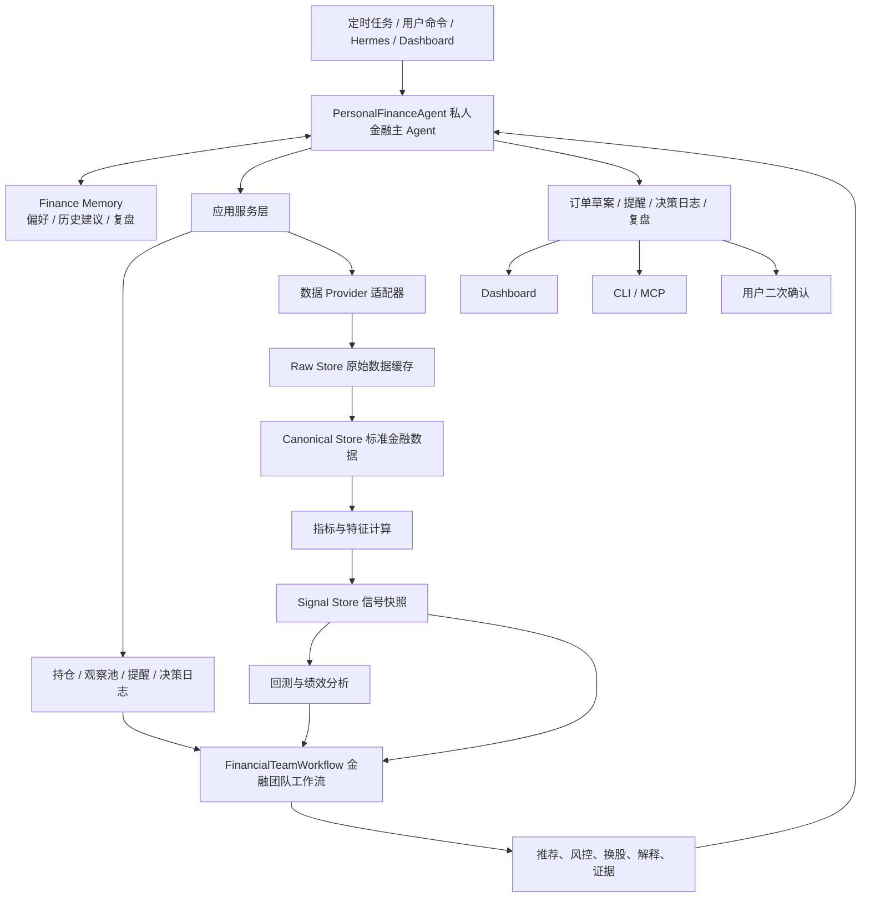

# 当前讨论记录、方案决策与实现路径

更新时间：2026-05-17
项目目录：`D:\Code\aiAgents\finance-agent`

本文用于记录目前围绕“私人金融助手、股票/数字货币事实分析 Agents、持仓监控和候选池管理”的讨论结论、产品定位、架构方案、UI/UX 方向和后续实施路径。它不是最终需求文档，而是当前阶段的项目决策日志，后续可以持续追加。

## 1. 项目定位

我们要构建的是一套面向金融小白的本地/私有化私人金融助手，优先覆盖：

- A 股。
- 数字货币现货。
- 数字货币合约，尤其是 Binance 相关数据、账户、持仓和风险。
- 用户持仓分析。
- 股票/币种推荐。
- 私人观察池和候选池管理。
- 实时/定时波动监控和风险提醒。
- 买入、卖出、加仓、减仓、换股、继续观察等操作建议。
- 长期记忆和复盘。
- 内部量化分析、信号生成、回测和风控复核。
- Dashboard 可视化。
- CLI 和 MCP 服务，供 Hermes 或其他自动化系统调用。

核心体验不是让用户自己看一堆指标，也不是每天手动跑一次推荐，而是让上层私人金融主 Agent 长期维护持仓、观察池、偏好和记忆；当持仓波动、候选标的启动、财报发布或风险阈值触发时，自动调度底层金融团队 Workflow，把复杂数据、指标、回测、新闻、风控和反方观点消化掉，然后给用户一个能理解、能追溯、能二次确认的结果。

第一版不做无人值守实盘自动交易。系统可以生成买入、加仓、持有、减仓、规避、观察等建议，也可以生成订单草案，但真实下单必须经过用户确认。

## 2. 用户画像与产品原则

当前用户画像：

- 金融小白，不希望自己理解大量专业公式。
- 需要 AI 主动解释“为什么推荐”和“风险在哪里”。
- 希望看到 AI 协作过程，而不是黑盒给结论。
- 希望界面有强交互和体验感，接近经营类游戏/沙盒办公室。
- 希望系统内部足够专业，但对外输出要简洁、可解释、可追溯。

产品原则：

- 专业计算交给成熟金融库，不手写 RSI、MACD、ATR、布林带、回测绩效等核心公式。
- LLM 不直接凭空打分，评分来自指标、规则、回测、风险或明确证据。
- 每条推荐必须有证据链、时间戳、数据状态和反方观点。
- 推荐和下单分离，订单草案不是订单。
- UI 上展示 Agent 的可审计协作摘要，不展示隐藏推理链。
- 当数据缺失、过期或不可靠时，必须明确告知，不静默补造数据。

## 3. 已调研和借鉴的项目

### 3.1 TradingAgents-CN

本地路径：`D:\Code\Python\ai\agents\TradingAgents-CN`

可借鉴内容：

- 底层固定金融团队 Workflow。
- LangGraph 编排思路。
- 分析报告 section 组织方式。
- A 股数据接入和缓存思路。
- 中文金融分析输出方式。

不建议直接搬用：

- 过重的业务实现。
- 存在许可证或来源不明风险的前端/业务代码。
- 与我们“金融小白 + 可视化沙盒办公室 + CLI/MCP”目标不完全一致的部分。

当前定位：TradingAgents-CN 更适合做底层金融团队 Workflow 参考，而不是上层私人金融主 Agent。它适合承担“专业讨论和报告生成”，不适合直接负责长期记忆、持仓监控、观察池管理和用户偏好调度。

### 3.2 NOFX

本地路径：`D:\Code\go\nofx`

可借鉴内容：

- 交易所账户状态组织。
- Binance futures 接口组织方式。
- 订单、持仓、账户健康状态。
- 本地密钥加密和账户配置思路。
- Dashboard 中交易账户管理的设计经验。

不建议直接搬用：

- AGPL-3.0 源码。
- 过宽的统一交易接口。
- 与第一版“先分析、再草案、后确认”目标不完全匹配的自动交易逻辑。

### 3.3 Qlib

Qlib 更像量化研究/机器学习平台，而不是一个轻量指标库。它适合后续做因子研究、模型训练、数据集管理和实验平台，不适合作为第一版核心主链路。

当前决策：

- 第一版不把 Qlib 放进推荐主链路。
- 后续可以作为“量化实验室”或离线研究模块接入。

### 3.4 ta、TA-Lib、bt、quantstats、vectorbt

当前组件决策：

- 技术指标主引擎：`ta-lib-python`，Python 导入名为 `talib`，第一版直接作为默认依赖。
- 数据整理和派生计算：`pandas/numpy`，负责窗口聚合、收益率、分位数、z-score、资金流/估值/衍生品派生因子。
- 技术指标备用方案：`ta` 暂不进入默认依赖，仅作为未来安装环境受限时的备用方案评估。
- 组合回测：`bt`。
- 绩效分析：`quantstats`。
- 暂缓引入：`vectorbt`。

原因：

- `TA-Lib` 是成熟技术分析库包装，适合作为第一版统一技术指标主引擎；`pandas/numpy` 负责非技术指标库类的序列加工和派生计算。
- `bt` 面向组合策略回测。
- `quantstats` 面向收益、夏普、最大回撤、收益报告等绩效分析。
- `vectorbt` 功能很强，但与指标、回测、参数实验和可视化都有重叠，复杂度和许可证因素都不适合第一版核心依赖。

### 3.5 Star-Office-UI

本地路径：`D:\Code\aiAgents\Star-Office-UI`

已借鉴内容：

- 像素办公室/小人动态体验。
- React 与游戏画布结合的体验方向。
- 办公室内 Agent 协作的视觉隐喻。

当前判断：

- 直接借用 Star-Office-UI 的风格和资产不适配金融办公室。
- 需要原创金融办公室背景、角色、动作和沙盒世界规则。
- Star-Office-UI 只能作为交互方式参考，不作为最终视觉基底。

### 3.6 Vibe-Trading / Hermes-agent

本地路径：`D:\Code\aiAgents\Vibe-Trading`

可借鉴内容：

- 高自由度主 Agent 的任务拆解、工具调用和运行审计。
- preset / swarm / 按需启动分析角色的设计思路。
- 让上层 Agent 根据触发场景决定调用哪些工具或工作流。

不建议照搬：

- 不把底层金融分析做成无限 loop。
- 不让自由 Agent 直接抓数据、改评分或绕过风控。
- 不把自动交易能力放在第一版主线。

当前定位：Vibe-Trading 和 Hermes-agent 更适合作为上层 `PersonalFinanceAgent` 的参考；TradingAgents-CN 更适合作为底层固定金融团队 Workflow 的参考。也就是说，上层自由调度，底层流程固定、可审计、可复盘。

记忆层也按这个思路分工：Hermes-agent 自带记忆用于通用 Agent 上下文，例如对话历史、任务偏好、工具使用习惯和长期摘要；本项目新增的记忆表用于金融业务上下文，例如投资假设、观察池变更原因、建议是否采纳、复盘结论和风险偏好变化。后者是对 Hermes 记忆的领域增强，不是替代。

当前模型分配已单独记录到 `docs/模型选型与职责分配.md`。第一版收敛为“双模型主方案”：DeepSeek V4 Pro 承担默认主 Agent 和大多数日常决策循环；GPT-5.5 Pro 只在卖出、换股、大仓位调整、强冲突信号、数据缺口和重大风险事件中做高风险最终复核。Qwen 等其他国产模型只作为成本敏感场景的可选补充，MiMo-V2.5-Pro 暂放在后续私有化和量化实验室评估位。所有模型调用都必须通过本项目工具层查询已入库事实数据，不能把外部抓取能力放进 Agent 或 Workflow。

## 4. 总体系统架构

系统采用轻量六边形架构，也就是核心领域模型和应用服务自主管理，第三方数据源、指标库、交易所、回测库、绩效库都放在 adapter 后面。



关键边界：

- `domain`：金融领域模型、协议、枚举，不依赖第三方金融库。
- `application`：业务编排，调用端口和领域对象。
- `ports`：定义数据、指标、回测、绩效、交易、LLM 的接口。
- `adapters`：封装 AKShare、ccxt、talib、bt、quantstats 等第三方能力；`ta` 仅作为后续备用方案评估，不进入第一版默认适配器。
- `agents`：分为上层 `PersonalFinanceAgent` 和底层 `FinancialTeamWorkflow`。主 Agent 管理触发、记忆、观察池和工作流调度；底层 Agent 只消费结构化数据，不直接抓行情，不直接下单。
- `dashboard`：展示结论、证据、风险、进度和 Agent 协作状态。
- `cli/mcp`：给 Hermes 和自动化系统调用。

## 5. 数据与计算执行流程

当前确认的执行流程是：

1. 数据层定时刷新。
2. 数据 Provider 拉取原始数据。
3. 原始响应进入 Raw Store，保留来源、参数、时间戳和原始响应。
4. 清洗为标准金融数据结构，例如 OHLCV、账户、持仓、财务、估值、新闻、合约数据。
5. 写入 Canonical Store，供系统内部统一读取。
6. 调用成熟库计算指标和特征。
7. 生成 `SignalSnapshot`。
8. 策略模板读取信号，做轻量回测。
9. `quantstats` 生成绩效指标。
10. 多 Agent 工作流读取结构化结果，生成推荐、风控、解释和证据链。
11. Dashboard 展示进展和结果。
12. CLI/MCP 输出结构化 `result.json` 和用户可读 `report.md`。

私人金融助手主链路：

```text
持仓 + 私人观察池 + 用户偏好/Finance Memory
 -> 实时/定时数据采集
 -> 因子/信号/风险更新
 -> 触发条件判断
 -> PersonalFinanceAgent 调度金融团队 Workflow
 -> 专业分析、风险反驳、换股比较
 -> 操作建议
 -> 用户确认/反馈
 -> 决策日志、Finance Memory 和复盘写入
```

金融计算层不能手写公式，应通过适配器调用成熟库：

- `TalibIndicatorAdapter`：主技术指标适配器。
- `pandas/numpy` 派生计算模块：负责收益率、分位数、z-score、资金流、估值、基本面和衍生品派生因子。
- `BtBacktestAdapter`：组合回测适配器。
- `QuantstatsPerformanceAdapter`：绩效分析适配器。
- `IndicatorRegistry`：统一注册技术指标，第一版固定注册 TA-Lib 主路径。

## 6. 信号层设计

信号层是第一版核心能力，不能拆成后续补丁。即使第一版不实现所有细节，也要从协议上一次设计完整。

信号类别：

- 技术信号：趋势、动量、均线、突破、RSI、MACD、布林带、ATR、波动率、最大回撤。
- A 股基本面信号：估值、财务质量、成长、现金流、负债、行业强弱、资金流。
- 数字货币合约信号：资金费率、未平仓量、多空比、成交异常、杠杆、强平/爆仓风险、衍生品拥挤度。
- 事件信号：新闻、公告、研报、社交舆情、监管事件、链上事件。
- 组合信号：持仓集中度、相关性、行业暴露、资产类别暴露、组合回撤、风险预算。

`SignalSnapshot` 必须包含：

- `signal_id`
- `symbol`
- `market`
- `horizon`
- `status`
- `score`
- `direction`
- `confidence`
- `inputs`
- `rule_version`
- `explanation`
- `as_of`
- `evidence_ids`

当前决策：

- 第一版评分采用透明规则权重。
- LLM 负责解释、综合、反方观点和建议生成。
- LLM 不直接生成底层分数。

## 7. Agent 角色设计

当前最新设计采用两层 Agent。

上层主 Agent：

- `PersonalFinanceAgent`：私人金融助理，负责持仓、私人观察池、用户偏好、长期记忆、触发条件、任务调度、建议汇总、决策日志和复盘写入。

上层主 Agent 的权限：

- 可以读取持仓、观察池、历史建议、用户反馈和长期记忆。
- 可以调用底层金融团队 Workflow。
- 可以创建提醒、复盘任务和订单草案请求。
- 可以新增、更新、暂停或移除观察项。
- 不能直接抓取行情、编造指标、修改评分或绕过用户确认下单。

底层金融团队 Workflow：

- 基本面/项目面分析师 Agent：解释 A 股财务、估值、行业位置，以及数字货币项目面、生态和公开指标。
- 技术面分析师 Agent：读取 TA-Lib 和 pandas/numpy 派生得到的趋势、动量、RSI、MACD、ATR、布林带、波动率和回撤信号。
- 资金流/衍生品分析师 Agent：解释 A 股主力资金、北向资金、成交额、换手率，以及数字货币资金费率、未平仓量、多空比例和合约拥挤度。
- 市场事件分析师 Agent：解释公告、新闻、板块热点、政策、监管、行业事件和数字货币重大事件。
- 风险反驳 Agent：专门提出反方观点，指出估值、财务、流动性、杠杆、事件、数据缺失和信号冲突风险。
- 组合/推荐决策 Agent：结合评分、信号、风险、持仓和用户偏好，生成推荐排序、持有/加仓/减仓/卖出候选/换股候选/观察建议。
- 报告生成 Agent：把结构化结论整理为中文报告，不重新发明事实数据。

典型 Workflow：

- `portfolio_monitoring`：持仓监控。
- `watchlist_management`：私人观察池管理。
- `asset_analysis`：单标的复核。
- `asset_recommendation`：A 股或数字货币推荐。
- `swap_decision`：当前持仓和候选标的换股比较。
- `daily_review`：每日盘后复盘。

前端沙盒办公室 Agent：

- 数据管家。
- 信号分析师。
- 风险官。
- 研究员。
- 草案员。
- 总协调员。

前端 Agent 不是后端 Agent 的完整推理展示，而是后端状态和任务进度的可视化投影。

## 8. 推荐、风控与订单草案协议

推荐动作枚举：

- `buy_candidate`：可考虑买入。
- `add`：可考虑加仓。
- `hold`：继续持有。
- `reduce`：可考虑减仓。
- `sell_candidate`：可考虑卖出，但仍需要用户确认。
- `swap_candidate`：可考虑换股或换币，用候选标的替换当前持仓。
- `avoid`：规避。
- `watch`：观察。

推荐必须包含：

- 动作建议。
- 仓位建议或仓位变化。
- 支持信号。
- 反方观点。
- 主要风险。
- 缺失或不可用数据。
- 数据来源和时间戳。
- 面向金融小白的解释。

私人观察池必须包含：

- 关注理由。
- 来源推荐或来源事件。
- 观察条件。
- 启动条件。
- 失效条件。
- 风险等级。
- 下次复核时间。
- 移除原因。

Finance Memory 必须包含：

- 用户风险偏好。
- 历史建议摘要。
- 用户是否采纳。
- 复盘教训。
- 观察池加入、升级、移除的原因。
- 个股或币种纳入私人观察池的 Agent 原因，以及持续关注标的每日为什么仍然保留观察。

Hermes Memory 可以辅助 `PersonalFinanceAgent` 理解用户习惯和上下文，但不能直接作为金融事实。Finance Memory 也不能替代事实数据库，行情、财务、风险、推荐和证据仍以 PostgreSQL + TimescaleDB 表为准。

Finance Memory 存储形式采用“结构化表 + 向量召回 + 关系边表”：

- 结构化表保存可审计事实：`decision_logs`、`assistant_memories`、`review_tasks`、`asset_theses`。
- 向量表保存语义召回索引：`memory_embeddings`，用于找相似历史场景和相似复盘教训。
- 图谱先用关系数据库边表：`financial_memory_edges`，用于表达 supports、contradicts、derived_from、reviewed_by 等关系。
- 观察池原因不新增表：`watchlist_item_events` 记录 `candidate_intake_reason` 和 `daily_watch_reason`，`assistant_memories` 记录 `candidate_intake_reason` 和 `watchlist_daily_reason` 摘要，`financial_memory_edges` 建立 `summarizes` 关系。
- 暂不引入独立图数据库，避免在论证阶段维护过多中间件。
- 后续如需要复杂路径推理、社区发现、图算法或跨资产传导关系，再从边表迁移到 Neo4j、Apache AGE、DozerDB 等专业图数据库。

高风险场景必须强提示：

- 合约高杠杆。
- 资金费率异常。
- 单一资产过度集中。
- 组合回撤过大。
- 数据严重缺失。
- 新闻或监管事件异常。

订单草案原则：

- `OrderDraft` 只是草案，不是真实订单。
- 草案必须经过风险 Agent 检查。
- 草案必须经过用户二次确认。
- 第一版可以先实现模拟交易或 testnet，实盘提交后置。

## 9. UI/UX 与原型方向

当前已有原型：

- 路径：`D:\Code\aiAgents\finance-agent\apps\agent-office`
- 技术：React + Vite + Phaser
- 本地地址：`http://localhost:5177/`

已确认方向：

- 页面不是传统金融 Dashboard，而是“金融 Agent 经营办公室”。
- 用户能看到 AI 小人之间的协作进展。
- UI 需要交互性和沉浸感，接近经营类游戏或轻量沙盒世界。
- Phaser 负责办公室世界、角色移动、动画、任务状态和交互热点。
- React 负责金融信息面板、证据链、持仓详情、推荐结果、订单草案确认。

当前原型问题：

- 现有画面仍然太简单。
- 直接借 Star-Office-UI 风格不好看，也不适配金融。
- 需要原创金融办公室背景和原创角色资产。
- 需要角色人格、外貌、动作、碰撞、路线规划、上下班状态和类沙盒世界规则。

## 10. 原创资产与沙盒世界方案

用户只有 AI 生图工具，因此资产路线应采用“AI 生成底图 + 工程切分 + Phaser 复用”的方式。

### 10.1 背景

背景适合用 AI 生成：

```text
1280x720 pixel art isometric fintech AI agent office,
trading terminals, data server racks, risk control room,
round-table analyst meeting area, approval gate,
dark professional palette, gold/cyan/red signal accents,
clean readable composition,
no text, no logos, no characters
```

生成后需要人工/工具处理：

- 去掉 AI 生成的乱码文字。
- 检查通道是否足够宽。
- 确认每个区域有清晰站位。
- 不把角色画进背景。
- 压缩为 `webp`。

### 10.2 角色

角色不能一次性让 AI 生成完整系统，需要分步：

1. 先生成每个 Agent 的角色设定图。
2. 基于设定图生成 `idle / walk / working / offDuty` 动作。
3. 每个动作 4-8 帧。
4. 用脚本裁切为 spritesheet。
5. Phaser 按帧播放。

角色资产建议：

- 角色尺寸：48x48 或 64x64。
- 格式：`spritesheet.webp + atlas.json` 或统一帧宽 spritesheet。
- 每个角色至少有 `idle / walk / working / offDuty`。

### 10.3 世界规则

Phaser 不应该只显示一张静态图，而要维护世界规则：

- `background`：固定背景。
- `foreground`：前景遮挡物，例如桌子、柜子、屏幕。
- `collision`：不可走区域。
- `walkable`：可走区域。
- `interactables`：可点击对象。
- `spawnPoints`：Agent 出生点。
- `workstations`：Agent 工位。
- `navPoints`：路径节点。

第一版可以先用 TypeScript 配置，不必马上引入 Tiled。

### 10.4 移动路线

先实现 waypoint 路线：

```text
数据刷新 -> 信号计算 -> 风控复核 -> 圆桌讨论 -> 审批确认
```

后续再升级为 navmesh 或网格 A*。

### 10.5 下班与未分析时段

世界需要表达系统未分析时段：

- `marketClosed`：A 股闭市，Agent 低频巡检。
- `cryptoWatch`：Crypto 持续值班。
- `offDuty`：大多数 Agent 离开工位。
- `nightAudit`：夜间批处理。
- `idleOffice`：没有任务，办公室待命。
- `incidentMode`：风险异常，风控 Agent 被唤醒。

## 11. 前后端技术路线

### 11.1 后端

建议技术栈：

- Python。
- FastAPI。
- LangGraph。
- Pydantic。
- SQLAlchemy。
- APScheduler。
- Typer。
- uv。

建议目录：

```text
src/finance_agent/
  domain/
  ports/
  application/
  data/
  indicators/
  signals/
  backtesting/
  performance/
  risk/
  recommendations/
  execution/
  agents/
  storage/
  reports/
  scheduler/
  cli/
  api/
```

### 11.2 前端

当前保留 React + Vite + Phaser：

- React：复杂金融面板、表单、抽屉、状态管理、证据链、订单确认。
- Phaser：办公室世界、角色动画、移动路径、碰撞、交互热点。
- ECharts：统计图、风险图、组合图、回撤图。
- TradingView Lightweight Charts：K 线图。
- lucide-react：常规 UI 图标。

### 11.3 Hermes 集成

第一版优先 CLI：

```bash
finance-agent portfolio analyze --input holdings.csv --profile balanced_growth
finance-agent asset brief --market ashare --symbol 600519
finance-agent asset brief --market crypto --symbol BTCUSDT --account spot
finance-agent recommend --market ashare --strategy swing --limit 10
finance-agent recommend --market crypto_spot --strategy swing --limit 10
finance-agent signals compute --market ashare --symbols watchlist
finance-agent signals compute --market crypto_spot --symbols watchlist
finance-agent backtest run --strategy momentum --market crypto
finance-agent exchange test --exchange binance --account futures
finance-agent account positions --exchange binance --account futures
finance-agent trade plan --from-recommendation <id>
finance-agent trade confirm --draft <order_id>
finance-agent dashboard serve
```

后续 MCP 服务基于同一套 application service 封装，不另起业务逻辑。

Hermes 集成时的记忆边界：

- Hermes-agent 自带记忆负责通用 Agent 记忆。
- finance-agent 暴露 Finance Memory 查询和写入能力，服务于金融建议、审计和复盘。
- Hermes 可以把通用记忆作为触发上下文传入，但金融建议必须落到 `decision_logs`、`assistant_memories`、`review_tasks` 和证据表。

## 12. 当前已存在文档

已有文档：

- `D:\Code\aiAgents\finance-agent\docs\项目计划.md`
- `D:\Code\aiAgents\finance-agent\docs\架构方案.md`
- `D:\Code\aiAgents\finance-agent\docs\领域协议.md`
- `D:\Code\aiAgents\finance-agent\docs\前端与体验设计\界面体验规范.md`
- `D:\Code\aiAgents\finance-agent\docs\前端与体验设计\界面体验调研记录.md`
- `D:\Code\aiAgents\finance-agent\docs\前端与体验设计\智能体办公室原创资产与沙盒方案.md`
- `D:\Code\aiAgents\finance-agent\docs\前端与体验设计\美术方向.md`
- `D:\Code\aiAgents\finance-agent\docs\前端与体验设计\资产生成提示词.md`

当前新文档：

- `D:\Code\aiAgents\finance-agent\docs\当前讨论与实施路径.md`

## 13. 分阶段实现路径

### 阶段 0：记录和定稿当前方向

目标：

- 收敛需求。
- 固化架构边界。
- 固化信号协议、推荐协议、订单草案协议。
- 固化 UI/UX 和沙盒办公室方向。

产物：

- 当前文档。
- 架构文档。
- 领域协议文档。
- 原创资产与沙盒体验方案。

状态：进行中。

### 阶段 1：前端沙盒办公室骨架重构

目标：

- 把当前原型从“动画页面”升级为“可配置世界”。
- 建立世界配置、Agent 配置、资产 manifest、路线规划和世界状态。

建议新增文件：

```text
apps/agent-office/src/game/worldConfig.ts
apps/agent-office/src/game/agentProfiles.ts
apps/agent-office/src/game/routePlanner.ts
apps/agent-office/src/game/worldState.ts
apps/agent-office/src/game/assetsManifest.ts
```

当前进展：

- 上述骨架文件已创建初版。
- `FinanceOfficeScene.ts` 已开始接入 `assetsManifest.ts`、`worldConfig.ts`、`routePlanner.ts` 和 `worldState.ts`。
- 当前角色移动已经从“直线 tween”过渡到“基础 waypoint 路径”。
- 顶部经营 HUD 已重新接回场景，并开始显示世界时段和审批状态。

第一版功能：

- Agent 有稳定角色档案。
- Agent 根据任务事件移动到指定区域。
- 支持 `idle / walk / working / offDuty`。
- 支持 `marketClosed / cryptoWatch / offDuty / incidentMode`。
- 点击 Agent 打开当前任务、证据和结论摘要。

### 阶段 2：原创资产生产链路

目标：

- 产出第一套原创金融办公室背景。
- 产出至少两个原创 Agent。
- 建立资产命名、版本、裁切和导入规范。
- 用 `美术方向.md` 约束画面方向。
- 用 `资产生成提示词.md` 直接指导 AI 生图和 spritesheet 生产。

最小切片：

- 1 张 1280x720 金融办公室背景。
- 2 个 Agent：数据管家、风险官。
- 每个 Agent 4 个动作：`idle / walk / working / offDuty`。
- 1 个任务卡效果。
- 1 个风险告警效果。

推荐新增文档：

```text
docs/前端与体验设计/美术方向.md
docs/前端与体验设计/资产生成提示词.md
```

状态：已创建初版。

### 阶段 3：后端领域模型与数据骨架

目标：

- 建立 Python 项目骨架。
- 建立 domain、ports、application、adapters。
- 实现模拟数据和本地文件输入。

第一批能力：

- 读取持仓 CSV。
- 标准化为 `AccountSnapshot` 和 `Position`。
- 拉取或模拟 OHLCV。
- 生成 `IndicatorFrame`。
- 生成 `SignalSnapshot`。
- 输出 `result.json` 和 `report.md`。

### 阶段 4：指标、信号、回测和绩效

目标：

- 接入 `talib`。
- 接入 `ta` 作为兜底。
- 接入 `bt` 做组合回测。
- 接入 `quantstats` 做绩效分析。

注意：

- 项目内部只暴露统一协议。
- 不把第三方库对象泄漏给 Agent 或前端。
- 所有计算结果要带 `library`、`library_version`、`input_window` 和 `as_of`。

### 阶段 5：私人金融主 Agent 与金融团队 Workflow

目标：

- 用上层 `PersonalFinanceAgent` 管理持仓、观察池、提醒、用户偏好、长期记忆和 Workflow 调度。
- 用 LangGraph 编排底层金融团队 Workflow：基本面/项目面、技术面、资金流/衍生品、事件、风险反驳、组合/推荐决策和报告生成。
- 生成结构化报告。
- Dashboard 能实时展示 Agent 进度。

后端优先落点：

- `agents/personal_assistant.py`
- `agents/tools.py`
- `agents/workflows/portfolio_monitoring.py`
- `agents/workflows/asset_recommendation.py`
- `agents/workflows/swap_decision.py`
- `agents/workflows/watchlist_management.py`
- `agents/workflows/daily_review.py`
- `agents/team/*.py`
- `application/workflow_service.py`
- `application/memory_service.py`
- `application/decision_log_service.py`
- `application/watchlist_service.py`

前端事件示例：

```json
{
  "type": "risk.reviewing",
  "agent": "risk",
  "targetZone": "riskRoom",
  "taskId": "task-20260513-001",
  "message": "正在复核 BTCUSDT 合约杠杆风险",
  "evidenceIds": ["ev-funding-rate", "ev-liquidation-distance"]
}
```

### 阶段 6：CLI 与 Hermes 集成

目标：

- 实现 Typer CLI。
- 每次命令输出 JSON 和 Markdown。
- Hermes 可以调用 CLI。
- 后续将同一套 application service 包装成 MCP tools。

优先命令：

- `portfolio analyze`
- `asset brief`
- `recommend`
- `signals compute`
- `backtest run`
- `trade plan`

### 阶段 7：MCP 服务

目标：

- 暴露给 Hermes 更稳定的工具接口。
- 支持分析持仓、获取推荐、查看信号、查看证据、生成订单草案。

MCP 不应重写业务逻辑，只调用 application service。

## 14. 下一步建议

下一步最适合做三件事：

1. 后端先补私人金融助手数据库迁移和服务层：持仓、观察池、提醒、决策日志、Finance Memory、向量索引、关系边表、复盘任务和 Workflow 审计。
2. 接上层 `PersonalFinanceAgent` 和底层金融团队 Workflow，先跑通 `asset_recommendation` 与 `portfolio_monitoring` 两条闭环。
3. 重构 `apps/agent-office/src/game`，把 Phaser 原型拆成世界配置、角色档案、路线规划、世界状态和资产 manifest，并让前端消费 `agent_workflow_events`。

这样做的好处是：后端先形成真实“持仓 + 观察池 + 推荐 + 记忆”的闭环，前端办公室再消费真实 Workflow 事件；即使原创资产还没有完全生成，前端也能先用占位资源验证沙盒世界规则。

## 15. 当前待确认问题

后续需要继续确认：

- 第一版资产优先做像素等距风，还是更精致的 2.5D 插画风。
- 用户持仓第一版从 CSV 导入，还是先接 Binance 账户只读 API。
- 是否需要独立后端服务先跑起来，还是前端继续用 mock 数据推进 UI/UX。
- Penpot 是否作为原型产物工具继续使用，还是只保留文档和前端可运行原型。
