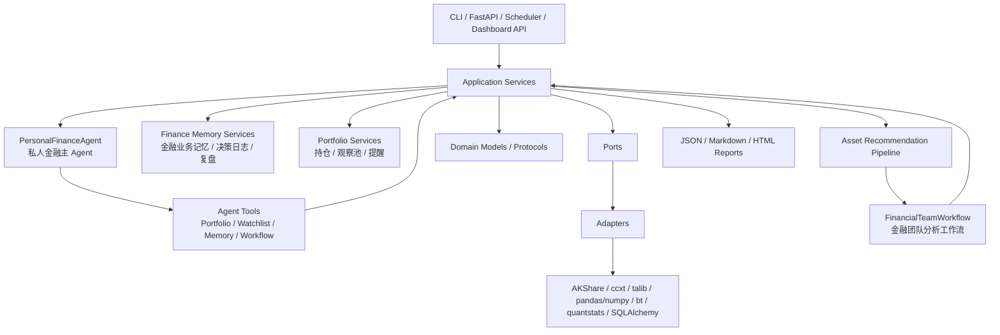
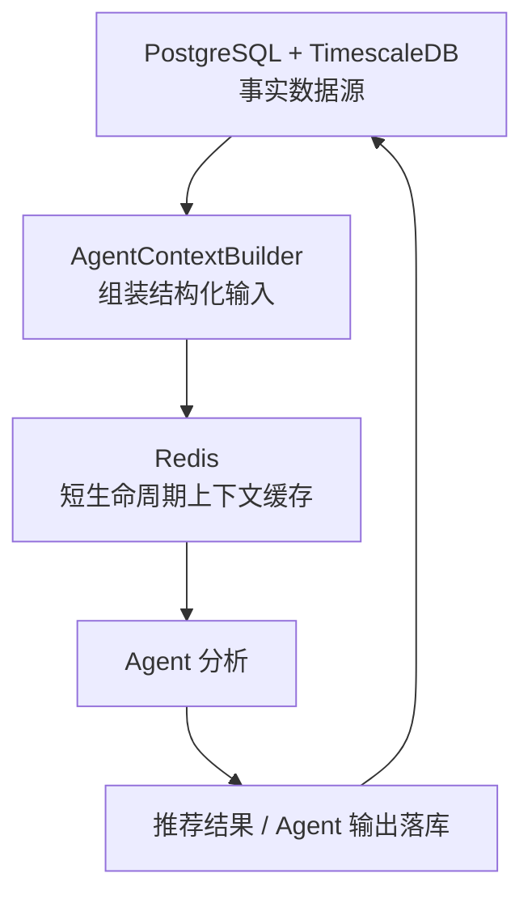
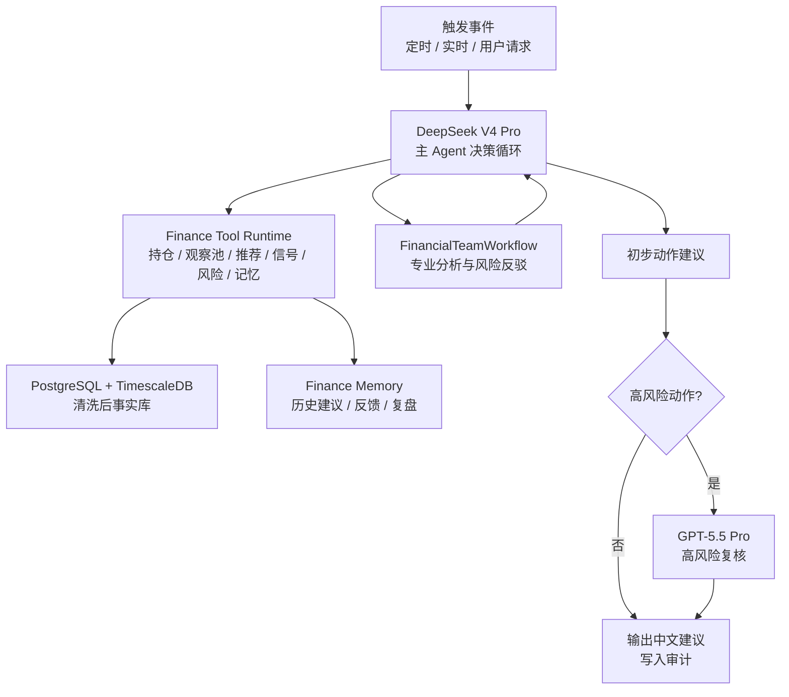

# 系统架构与模块化设计

本文档是工程实现蓝图，回答三个问题：

- 项目骨架怎么拆。
- 每个模块负责什么、不能碰什么。
- 第三方组件库在哪里调用、怎么调用、输出如何统一。

相关文档：

- `docs/项目计划.md`：总体计划和里程碑。
- `docs/领域协议.md`：金融领域模型、信号、推荐、风控、订单草案和证据协议。
- `docs/AKShare能力矩阵.md`：AKShare A 股数据能力与推荐链路映射。

## 1. 架构结论

本项目不纯手写，也不直接搬开源项目骨架。当前工程主线升级为 **私人金融助手 + AI 标的推荐引擎**：标的推荐仍是核心引擎，同时覆盖 A 股和数字货币；上层产品能力需要长期监控持仓、维护私人观察池、管理用户偏好与长期记忆，并给出买入、卖出、加仓、减仓、换股和继续观察建议。系统不是无人值守自动交易系统。

采用 **轻量六边形架构 / Ports and Adapters**：

- 核心领域模型自己设计。
- 应用服务自己编排。
- 金融计算使用成熟库。
- 候选池、数据源、指标库、回测库、绩效库都包在 adapter 后面。
- 上层 `PersonalFinanceAgent` 只通过 application service、工具端口和工作流端口行动。
- 底层金融团队 Workflow 只消费结构化事实、评分、信号、风险和证据。
- CLI、FastAPI、定时任务、Dashboard 都复用同一套 application service。

依赖方向必须保持单向：



规则：

- `domain` 不依赖任何三方金融库。
- `application` 可以调用 `ports` 和 `domain`，不能直接调用 AKShare、ccxt、talib、bt。
- `adapters` 负责三方库调用和字段归一化。
- `agents` 分为上层主 Agent 和底层金融团队 Workflow；主 Agent 负责任务调度、记忆、提醒和用户交互，底层 Workflow 负责专业分析、风险反驳和建议生成。
- `agents` 只消费结构化数据，不直接抓取行情，不直接计算因子，不直接打分。
- `memory` 是金融业务记忆与审计层，记录偏好、观察理由、决策日志、用户反馈和复盘结论，不替代 PostgreSQL + TimescaleDB 的事实源，也不替代 Hermes-agent 自带的通用记忆系统。
- `execution` 和订单草案属于后续扩展，不进入第一版标的推荐主链路。

私人金融助手主链路：

```text
Scheduler / CLI / API / Hermes
  -> PersonalFinanceAgent
  -> PortfolioService / WatchlistService / MemoryService / AlertService
  -> TriggerPolicy
  -> FinancialTeamWorkflow
  -> RecommendationService / AlertService / DecisionLogService
  -> MemoryService
  -> ReportWriter
```

标的推荐子链路：

```text
UniverseService
  -> RefreshService
  -> FactorService
  -> ScreeningService
  -> ScoringService
  -> BacktestService
  -> FinancialTeamWorkflow
  -> AssetRecommendationService
  -> ReportWriter
```

## 2. 组件选型

| 层 | 组件 | 角色 | 调用位置 |
| --- | --- | --- | --- |
| 包管理 | uv | Python 依赖和虚拟环境 | 项目根目录 |
| CLI | Typer | Hermes 第一集成入口 | `finance_agent/cli/` |
| API | FastAPI | Dashboard 和后续 MCP 服务基础 | `finance_agent/api/` |
| 配置 | pydantic-settings | 环境变量、密钥路径、数据源开关 | `finance_agent/config/` |
| 数据模型 | Pydantic | CLI/API/Agent 的结构化协议 | `finance_agent/domain/` |
| 数据库 | PostgreSQL + TimescaleDB | 业务数据和行情时序数据 | `finance_agent/storage/` |
| ORM | SQLAlchemy 2.x | 业务表 ORM 和查询封装 | `finance_agent/storage/` |
| 迁移 | Alembic | 数据库 schema 迁移 | `finance_agent/storage/migrations/` |
| 缓存 | Redis | 热数据、Agent 输入上下文、任务锁、Provider 熔断状态 | `finance_agent/cache/`、`finance_agent/ports/cache.py` |
| 调度 | APScheduler | 本地定时刷新 | `finance_agent/scheduler/` |
| 主 Agent | LangGraph / 工具调用层 | 持仓、观察池、Finance Memory、提醒、任务调度 | `finance_agent/agents/personal_assistant.py` |
| 金融团队 Workflow | LangGraph | 基本面、技术面、资金流/衍生品、事件、风险反驳、组合决策 | `finance_agent/agents/workflows/`、`finance_agent/agents/team/` |
| A 股数据 | AKShare + 腾讯 fallback + curl_cffi fallback | A 股行情、财务、估值、资金流、板块、公告新闻、风险事件 | `finance_agent/data/providers/akshare_provider.py` |
| 数字货币 | ccxt + Binance API | K 线、成交量、资金费率、未平仓量、多空比例 | `finance_agent/data/providers/ccxt_binance_provider.py`、`finance_agent/data/providers/binance_native_provider.py` |
| 技术指标 | ta-lib-python | 主指标引擎，导入名 `talib` | `finance_agent/indicators/talib_adapter.py` |
| 序列计算 | pandas/numpy | 数据整理、窗口聚合、收益率、分位数、z-score 和派生因子 | `finance_agent/factors/` |
| 回测 | bt | 组合回测 | `finance_agent/backtesting/bt_adapter.py` |
| 绩效 | quantstats | 收益、回撤、夏普、HTML 报告 | `finance_agent/performance/quantstats_adapter.py` |
| 前端 | React + Vite | Dashboard | `web/` |
| 前端 UI | Ant Design | 表格、表单、布局、标签、弹窗 | `web/src/components/` |
| 前端请求 | TanStack Query | 服务端状态缓存 | `web/src/api/` |
| 路由 | React Router | 页面路由 | `web/src/routes/` |
| 图表 | ECharts | 组合、风险、回撤、热力图 | `web/src/charts/` |
| K 线 | Lightweight Charts | K 线图 | `web/src/charts/KlineChart.tsx` |

### 2.1 Redis 的架构边界

Redis 是缓存和任务协调层，不是事实数据主存储。系统事实源仍然是 PostgreSQL + TimescaleDB。

Redis 适合保存：

- 最新行情快照，例如 `latest:ashare:000001`。
- Agent 输入上下文包，例如某个标的的行情窗口、财务摘要、资金流、事件和证据。
- 采集任务锁，避免多个任务同时刷新同一个数据源接口。
- Provider 健康状态和短期熔断状态，例如东财接口连续失败后短时间优先 fallback。
- 推荐运行中的临时队列和中间结果。

Redis 不保存唯一事实：

- 历史 K 线全量数据。
- 财务、估值、资金流、衍生品长期快照。
- `raw_records` 原始响应审计。
- Agent 最终分析结果。
- 推荐榜、观察池、回避池。
- 可审计证据链。

Agent 层读取数据的推荐路径：



实现约束：

- 业务代码依赖 `finance_agent/ports/cache.py`，不直接散落调用 Redis SDK。
- `AgentContextBuilder` 只缓存可重建输入包，缓存失效后必须能从数据库重建。
- 推荐运行落库时必须保存引用到的证据、风险、评分和 Agent 输出，不能只保存 Redis key。

## 3. 目录结构

```text
finance-agent/
  docs/
    项目计划.md
    领域协议.md
    架构方案.md
  pyproject.toml
  .env.example
  src/
    finance_agent/
      __init__.py
      bootstrap.py

      config/
        settings.py

      domain/
        enums.py
        assets.py
        accounts.py
        portfolios.py
        watchlists.py
        memories.py
        market.py
        universe.py
        factors.py
        indicators.py
        signals.py
        risk.py
        recommendations.py
        decisions.py
        alerts.py
        orders.py
        evidence.py
        reports.py

      ports/
        data.py
        universe.py
        indicators.py
        backtesting.py
        performance.py
        storage.py
        execution.py
        memory.py
        alerts.py
        llm.py

      application/
        universe_service.py
        factor_service.py
        screening_service.py
        scoring_service.py
        portfolio_service.py
        watchlist_service.py
        memory_service.py
        alert_service.py
        decision_log_service.py
        trigger_service.py
        workflow_service.py
        asset_service.py
        signal_service.py
        backtest_service.py
        asset_recommendation_service.py
        recommendation_service.py
        trade_service.py
        refresh_service.py

      data/
        router.py
        normalizers.py
        providers/
          akshare_provider.py
          ashare_market_provider.py
          ashare_fundamental_provider.py
          ashare_capital_flow_provider.py
          ashare_event_provider.py
          ccxt_binance_provider.py
          binance_native_provider.py

      indicators/
        registry.py
        talib_adapter.py

      factors/
        engine.py
        rules/
          fundamental_factors.py
          valuation_factors.py
          technical_factors.py
          capital_flow_factors.py
          event_factors.py

      screening/
        engine.py
        rules.py

      scoring/
        engine.py
        weighting.py

      signals/
        engine.py
        rules/
          technical_rules.py
          fundamental_rules.py
          capital_flow_rules.py
          event_rules.py

      backtesting/
        bt_adapter.py
        strategy_templates.py

      performance/
        quantstats_adapter.py

      risk/
        service.py
        rules.py

      recommendations/
        service.py
        policy.py
        asset_recommendation_service.py

      execution/
        order_draft_service.py
        validation.py
        binance_execution.py

      agents/
        personal_assistant.py
        tools.py
        memory.py
        state.py
        workflows/
          portfolio_monitoring.py
          watchlist_management.py
          asset_analysis.py
          asset_recommendation.py
          swap_decision.py
          daily_review.py
        team/
          fundamental_or_project_analyst.py
          technical_analyst.py
          flow_derivatives_analyst.py
          event_analyst.py
          risk_rebuttal.py
          portfolio_decision.py
          report_writer.py

      storage/
        db.py
        orm.py
        repositories.py
        migrations/

      reports/
        json_report.py
        markdown_report.py
        html_report.py

      scheduler/
        jobs.py
        runner.py

      cli/
        app.py
        commands/
          portfolio.py
          asset.py
          signals.py
          backtest.py
          recommend.py
          trade.py
          dashboard.py

      api/
        app.py
        dependencies.py
        routes/
          portfolio.py
          assets.py
          signals.py
          recommendations.py
          backtests.py
          orders.py
          system.py

  web/
    package.json
    src/
      api/
      routes/
      pages/
      components/
      charts/
      layouts/
      types/

  tests/
    unit/
    integration/
    contract/
```

## 4. 启动与依赖注入

所有入口都通过 `bootstrap.py` 创建容器，不在模块顶层创建真实数据源连接。

```python
# src/finance_agent/bootstrap.py
from finance_agent.config.settings import Settings
from finance_agent.storage.db import create_session_factory
from finance_agent.data.router import DataRouter
from finance_agent.application.portfolio_service import PortfolioService


class AppContainer:
    """应用依赖容器，CLI、API、Scheduler 共用。"""

    def __init__(self, settings: Settings):
        self.settings = settings
        self.session_factory = create_session_factory(settings.database_url)
        self.data_router = DataRouter.from_settings(settings)
        self.portfolio_service = PortfolioService(
            session_factory=self.session_factory,
            data_router=self.data_router,
        )


def build_container() -> AppContainer:
    settings = Settings()
    return AppContainer(settings)
```

这样做的好处：

- CLI 和 FastAPI 不会各自初始化一套逻辑。
- 测试可以替换 fake provider。
- 后续 MCP 也可以复用同一个 container。

## 5. 配置模块

使用 `pydantic-settings`。

```python
# src/finance_agent/config/settings.py
from pydantic import Field
from pydantic_settings import BaseSettings, SettingsConfigDict


class Settings(BaseSettings):
    """系统配置，支持 .env 和环境变量。"""

    model_config = SettingsConfigDict(
        env_file=".env",
        env_prefix="FINANCE_AGENT_",
        extra="ignore",
    )

    database_url: str = "sqlite:///./finance_agent.db"
    output_dir: str = "./outputs"

    akshare_enabled: bool = True
    binance_enabled: bool = False
    binance_api_key: str | None = None
    binance_api_secret: str | None = None

    trading_enabled: bool = False
    trading_mode: str = Field(default="simulation", pattern="^(simulation|testnet|live)$")
```

配置原则：

- `trading_enabled` 默认必须是 `False`。
- 密钥不写进文档和代码。
- live 实盘模式必须额外确认。

## 6. CLI / MCP 工具入口架构

当前实现采用 CLI + MCP 双入口：CLI 用标准库 `argparse` 保持本地调用轻量稳定；MCP 使用 Python MCP SDK，作为 Hermes-Agent 或其他长期 Agent 的正式工具入口。二者共用 `FinanceAgentInterface`，不各自实现业务逻辑。

```text
CLI / MCP
  -> FinanceAgentInterface
  -> FinanceAssistantService / FinanceToolRuntime
  -> LangGraph Workflow / PostgreSQL + TimescaleDB
```

CLI 入口：

```bash
finance-agent workflows list
finance-agent workflows run recommendation_decision \
  --owner-id owner:demo \
  --portfolio-id portfolio:demo \
  --watchlist-id watchlist:demo \
  --recommendation-run-id run:demo
finance-agent reports show <workflow_run_id> --markdown
finance-agent tools call factor.get_asset_factor_context --arguments "{\"asset_id\":\"asset:demo\"}"
```

MCP 入口：

```bash
finance-agent-mcp
python -m finance_agent.mcp_server
```

当前 MCP tools：

- `list_workflows`
- `run_workflow`
- `get_workflow_run`
- `get_report`
- `list_tools`
- `call_tool`

CLI / MCP 约束：

- 只调用 `FinanceAgentInterface`，不绕过服务层。
- 不直接调用 AKShare、Binance、ccxt 或网页。
- 不直接计算 TA 指标、因子、评分和信号。
- 不直接调用外部 LLM。
- 输出默认是结构化 JSON；报告可以额外输出 Markdown。

## 7. FastAPI 架构

FastAPI 只作为 Dashboard API。第一版不把它做成复杂微服务。

```python
# src/finance_agent/api/app.py
from fastapi import FastAPI

from finance_agent.api.routes import assets, factors, recommendations, signals, universe


def create_app() -> FastAPI:
    app = FastAPI(title="Hermes Finance Agent API")
    app.include_router(universe.router, prefix="/api/universe", tags=["universe"])
    app.include_router(assets.router, prefix="/api/assets", tags=["assets"])
    app.include_router(factors.router, prefix="/api/factors", tags=["factors"])
    app.include_router(signals.router, prefix="/api/signals", tags=["signals"])
    app.include_router(recommendations.router, prefix="/api/recommendations", tags=["recommendations"])
    return app
```

路由调用应用服务：

```python
# src/finance_agent/api/routes/recommendations.py
from fastapi import APIRouter, Depends

from finance_agent.api.dependencies import get_container

router = APIRouter()


@router.get("/assets")
def get_asset_recommendations(
    universe: str = "hs300",
    strategy: str = "balanced_growth",
    limit: int = 10,
    container=Depends(get_container),
):
    """返回 A 股/数字货币推荐榜。"""
    return container.asset_recommendation_service.recommend(universe, strategy, limit)
```

API 约束：

- 返回 Pydantic 模型或可序列化 DTO。
- 不返回 ORM 对象。
- 不在路由里写计算逻辑。
- 第一版不暴露订单确认接口。

## 8. 定时任务架构

第一版使用 APScheduler，本地进程内运行。后续需要分布式时再换 Celery。

```python
# src/finance_agent/scheduler/runner.py
from apscheduler.schedulers.background import BackgroundScheduler

from finance_agent.bootstrap import build_container


def start_scheduler() -> BackgroundScheduler:
    """启动本地定时刷新任务。"""
    container = build_container()
    scheduler = BackgroundScheduler(timezone="Asia/Shanghai")

    scheduler.add_job(
        container.refresh_service.refresh_daily_market_data,
        trigger="cron",
        hour=18,
        minute=30,
        id="refresh_ashare_daily",
        replace_existing=True,
    )

    scheduler.add_job(
        container.refresh_service.refresh_crypto_market_data,
        trigger="interval",
        minutes=30,
        id="refresh_crypto_30m",
        replace_existing=True,
    )

    scheduler.start()
    return scheduler
```

任务拆分：

- `refresh_ashare_daily`：A 股日线、指数、板块、财务、资金流。
- `refresh_crypto_30m`：币安 K 线、资金费率、未平仓量。
- `compute_signals_after_refresh`：刷新后计算指标和信号。
- `cleanup_expired_order_drafts`：清理过期订单草案。

## 9. 存储架构

全环境统一使用 PostgreSQL + TimescaleDB。业务实体使用普通 PostgreSQL 表，K 线和数字货币衍生品快照使用 TimescaleDB hypertable。开发、测试、演示和生产保持同一套数据库能力，不提供 SQLite 或普通 PostgreSQL 降级模式，避免本地绕过 hypertable、唯一约束和压缩策略。领域模型和 ORM 模型分开，避免数据库字段污染业务协议。

详细表结构、主键、索引和建表优先级见：`docs/数据库设计.md`。本节只说明存储层原则和示例。

```python
# src/finance_agent/storage/db.py
from sqlalchemy import create_engine
from sqlalchemy.orm import sessionmaker


def create_session_factory(database_url: str):
    engine = create_engine(database_url, pool_pre_ping=True)
    return sessionmaker(bind=engine, autoflush=False, autocommit=False)
```

```python
# src/finance_agent/storage/orm.py
from datetime import datetime
from sqlalchemy import DateTime, String, JSON
from sqlalchemy.orm import DeclarativeBase, Mapped, mapped_column


class Base(DeclarativeBase):
    pass


class SignalSnapshotORM(Base):
    """信号快照表，payload 保存协议原文，便于版本升级。"""

    __tablename__ = "signal_snapshots"

    id: Mapped[str] = mapped_column(String(128), primary_key=True)
    asset_id: Mapped[str] = mapped_column(String(64), index=True)
    horizon: Mapped[str] = mapped_column(String(32), index=True)
    status: Mapped[str] = mapped_column(String(32), index=True)
    as_of: Mapped[datetime] = mapped_column(DateTime(timezone=True), index=True)
    payload: Mapped[dict] = mapped_column(JSON)
```

第一版表设计：

| 表 | 用途 |
| --- | --- |
| `raw_records` | 原始数据响应 |
| `assets` | 资产主数据 |
| `market_bars` | 标准 OHLCV |
| `fundamental_snapshots` | A 股财务估值快照 |
| `account_snapshots` | 账户快照 |
| `positions` | 持仓快照 |
| `indicator_frames` | 指标计算结果 |
| `feature_frames` | 特征结果 |
| `signal_snapshots` | 信号快照 |
| `risk_findings` | 风险发现 |
| `recommendations` | 推荐建议 |
| `order_drafts` | 订单草案 |
| `evidence` | 证据 |
| `analysis_runs` | 每次分析运行记录 |

存储策略：

- 结构化检索字段单独建列。
- 复杂协议全文放 `payload JSON`。
- 每个 payload 记录 `schema_version`。
- `raw_records` 永远不覆盖，便于审计。

## 10. 数据 Provider 架构

### 10.1 Port 定义

```python
# src/finance_agent/ports/data.py
from typing import Protocol

from finance_agent.domain.market import MarketData
from finance_agent.domain.accounts import AccountSnapshot, Position


class MarketDataProvider(Protocol):
    """行情数据 Provider 接口。"""

    provider_name: str

    def fetch_ohlcv(self, symbol: str, timeframe: str, start: str | None, end: str | None) -> MarketData:
        ...


class AccountProvider(Protocol):
    """账户数据 Provider 接口。"""

    provider_name: str

    def fetch_account_snapshot(self) -> AccountSnapshot:
        ...

    def fetch_positions(self) -> list[Position]:
        ...
```

### 10.2 AKShare 调用

AKShare 只在 adapter 中调用。A 股能力不能只按 K 线处理，应按 `docs/AKShare能力矩阵.md` 拆成 Provider 族：行情、候选池、基本面/估值、资金流、板块、事件和风险。东方财富接口如果在当前网络环境下被断开，Provider 必须自动切到腾讯接口或 `curl_cffi` 兜底。

```python
# src/finance_agent/data/providers/akshare_provider.py
import akshare as ak

from finance_agent.domain.market import MarketData
from finance_agent.data.normalizers import normalize_ashare_hist


class AkshareProvider:
    provider_name = "akshare"

    def fetch_ohlcv(self, symbol: str, timeframe: str, start: str | None, end: str | None) -> MarketData:
        """获取 A 股历史行情，并转换成统一 MarketData。"""
        df = ak.stock_zh_a_hist(
            symbol=symbol,
            period=self._to_ak_period(timeframe),
            start_date=start or "20000101",
            end_date=end or "20991231",
            adjust="qfq",
        )
        return normalize_ashare_hist(symbol=symbol, timeframe=timeframe, df=df, source=self.provider_name)
```

归一化规则：

- 中文列名统一转为 `open/high/low/close/volume/amount`。
- 日期统一转为带时区的 ISO 时间。
- 前复权、后复权、未复权必须写入 metadata。
- AKShare 返回空表时，状态为 `unavailable`，不能假装可用。

### 10.3 ccxt / Binance 调用

ccxt 用于交易所统一接口，主要读取 markets、OHLCV、ticker 这类跨交易所通用数据。Binance 原生 Provider 只补充 U 本位合约专属公开行情，例如资金费率、标记价/指数价、未平仓量和多空账户比；它不包含账户、持仓或下单能力。

```python
# src/finance_agent/data/providers/ccxt_binance_provider.py
import ccxt
import pandas as pd

from finance_agent.domain.market import MarketData
from finance_agent.data.normalizers import normalize_crypto_ohlcv


class CcxtBinanceProvider:
    provider_name = "ccxt_binance"

    def __init__(self, api_key: str | None = None, api_secret: str | None = None, default_type: str = "spot"):
        self.exchange = ccxt.binance({
            "apiKey": api_key,
            "secret": api_secret,
            "enableRateLimit": True,
            "options": {"defaultType": default_type},
        })

    def fetch_ohlcv(self, symbol: str, timeframe: str, start: str | None, end: str | None) -> MarketData:
        """获取数字货币 K 线。"""
        since_ms = self._to_milliseconds(start) if start else None
        rows = self.exchange.fetch_ohlcv(symbol, timeframe=timeframe, since=since_ms, limit=1000)
        df = pd.DataFrame(rows, columns=["timestamp", "open", "high", "low", "close", "volume"])
        return normalize_crypto_ohlcv(symbol=symbol, timeframe=timeframe, df=df, source=self.provider_name)

    def fetch_balance(self) -> dict:
        """获取账户余额，原始结果只能在 adapter 内部处理。"""
        return self.exchange.fetch_balance()
```

当前项目里 `CcxtBinanceProvider` 只实现公开行情读取，不实现账户余额读取。衍生品补充数据使用单独的 Binance 原生 Provider：

```python
# src/finance_agent/data/providers/binance_native_provider.py
class BinanceNativeProvider:
    """读取 Binance U 本位合约专属公开行情。"""

    provider_name = "binance_native"

    def fetch_derivative_snapshot(self, symbol: str):
        """返回资金费率、未平仓量、多空比等衍生品快照。"""
        ...
```

交易调用只允许在 `execution` 中出现：

```python
# src/finance_agent/execution/binance_execution.py
class BinanceExecutionProvider:
    def submit_order_draft(self, draft):
        """提交已经二次确认的订单草案。"""
        if draft.validation.status not in {"ok", "warning", "blocked"}:
            raise ValueError("订单草案状态不允许提交")
        if not draft.confirmed_at:
            raise ValueError("订单草案未经过用户二次确认")

        return self.exchange.create_order(
            symbol=draft.symbol,
            type=draft.order_type,
            side=draft.side,
            amount=draft.quantity,
            price=draft.limit_price,
            params=self._build_params(draft),
        )
```

执行安全规则：

- Provider 可以读数据，不能下单。
- ExecutionProvider 可以下单，但只能接收 `confirmed` 的 `OrderDraft`。
- live 模式必须检查 `trading_enabled=True`。
- 所有交易响应必须写入审计日志。

## 11. 指标模块

### 11.1 Port 定义

```python
# src/finance_agent/ports/indicators.py
from typing import Protocol

from finance_agent.domain.market import MarketData
from finance_agent.domain.indicators import IndicatorFrame


class IndicatorAdapter(Protocol):
    """技术指标适配器。"""

    library_name: str

    def compute(self, market_data: MarketData, indicators: list[str]) -> IndicatorFrame:
        ...
```

### 11.2 ta-lib-python 调用

`ta-lib-python` 的 PyPI 包名是 `TA-Lib`，代码里导入 `talib`。

```python
# src/finance_agent/indicators/talib_adapter.py
import talib

from finance_agent.domain.indicators import IndicatorFrame


class TalibIndicatorAdapter:
    library_name = "talib"

    def compute(self, market_data, indicators: list[str]) -> IndicatorFrame:
        """使用 talib 计算主技术指标。"""
        close = market_data.to_series("close")
        high = market_data.to_series("high")
        low = market_data.to_series("low")

        values = {}
        if "rsi_14" in indicators:
            values["rsi_14"] = talib.RSI(close, timeperiod=14).iloc[-1]
        if "macd" in indicators:
            macd, signal, hist = talib.MACD(close, fastperiod=12, slowperiod=26, signalperiod=9)
            values["macd"] = macd.iloc[-1]
            values["macd_signal"] = signal.iloc[-1]
            values["macd_hist"] = hist.iloc[-1]
        if "atr_14" in indicators:
            values["atr_14"] = talib.ATR(high, low, close, timeperiod=14).iloc[-1]
        if "bbands_20" in indicators:
            upper, middle, lower = talib.BBANDS(close, timeperiod=20)
            values["bb_upper"] = upper.iloc[-1]
            values["bb_middle"] = middle.iloc[-1]
            values["bb_lower"] = lower.iloc[-1]

        return IndicatorFrame.from_values(
            market_data=market_data,
            library=self.library_name,
            values=values,
        )
```

注意事项：

- TA-Lib 初始 lookback 会产生 NaN，不能简单填 0。
- 输入数据有 NaN 时要先标记数据质量。
- 输出必须记录 `library`、`library_version`、`input_window`。
- K 线形态识别后续可通过 `talib.get_function_groups()["Pattern Recognition"]` 批量注册。

### 11.3 pandas/numpy 配合计算

`pandas/numpy` 不作为技术指标库替代 TA-Lib，而是负责 TA-Lib 前后的序列加工和非技术指标库类派生计算。

```python
import numpy as np
import pandas as pd


def compute_series_features(bars: pd.DataFrame) -> dict[str, float]:
    """计算收益率、窗口统计和标准化派生特征。"""
    close = bars["close"].astype(float)
    amount = bars["amount"].astype(float)
    returns = close.pct_change()

    return {
        "return_20d": close.iloc[-1] / close.iloc[-21] - 1,
        "volatility_20d": returns.tail(20).std() * np.sqrt(252),
        "max_drawdown_20d": close.tail(20).div(close.tail(20).cummax()).sub(1).min(),
        "amount_zscore_20d": (amount.iloc[-1] - amount.tail(20).mean()) / amount.tail(20).std(),
    }
```

说明：

- RSI、MACD、ATR、布林带、K 线形态等技术指标统一走 `talib`。
- 收益率、分位数、z-score、资金流连续性、估值分位、衍生品拥挤度等派生因子走 `pandas/numpy`。
- `ta` 暂不作为第一版默认依赖，仅作为未来备用方案评估。

运行规则：

- 默认先调用 `TalibIndicatorAdapter`。
- 如果导入失败或环境不支持，指标服务返回 `unavailable` 或阻断因子计算任务，并记录缺失原因。
- 不在第一版默认路径中切换到 `ta`，避免 A 股和数字货币技术指标口径不一致。

## 12. 信号模块

信号模块只读 `IndicatorFrame`、`FeatureFrame`、`Position`、`RiskFinding`，不直接调用第三方库。

```python
# src/finance_agent/signals/engine.py
class SignalEngine:
    """把指标、特征和组合信息转换成信号快照。"""

    def __init__(self, rules):
        self.rules = rules

    def compute_asset_signal(self, context):
        groups = []
        for rule in self.rules:
            groups.append(rule.evaluate(context))
        return self._merge_groups(context.asset, groups)
```

规则模块：

- `technical_rules.py`：趋势、动量、突破、波动。
- `fundamental_rules.py`：估值、财务质量、成长。
- `derivatives_rules.py`：资金费率、未平仓量、多空比。
- `portfolio_rules.py`：仓位、相关性、集中度。

合并规则：

- 分组先各自打分。
- 按市场和周期选择权重。
- 缺失分组不参与强行平均，状态降级为 `partial`。
- 严重缺失写入 `missing_data`。

## 13. 回测模块

bt 只在 `backtesting/bt_adapter.py` 中调用。

```python
# src/finance_agent/backtesting/bt_adapter.py
import bt


class BtBacktestAdapter:
    """组合回测适配器。"""

    def run_momentum_template(self, prices, rebalance="monthly"):
        """运行动量策略模板，prices 是宽表 close price DataFrame。"""
        run_algo = bt.algos.RunMonthly() if rebalance == "monthly" else bt.algos.RunWeekly()

        strategy = bt.Strategy(
            "momentum_v1",
            [
                run_algo,
                bt.algos.SelectAll(),
                bt.algos.WeighEqually(),
                bt.algos.Rebalance(),
            ],
        )
        backtest = bt.Backtest(strategy, prices)
        result = bt.run(backtest)
        return self._to_backtest_result(result)
```

输入要求：

- `prices` 必须是 pandas DataFrame。
- index 是交易日期。
- columns 是资产代码。
- values 是复权收盘价或统一 close。

输出统一为 `BacktestResult`：

- 净值曲线。
- 回撤曲线。
- 总收益。
- 年化收益。
- 最大回撤。
- 换手率。
- 策略参数。
- 数据版本。
- 信号版本。

## 14. 绩效模块

quantstats 只在 `performance/quantstats_adapter.py` 中调用。

```python
# src/finance_agent/performance/quantstats_adapter.py
from pathlib import Path
import quantstats as qs


class QuantStatsAdapter:
    """收益序列绩效分析适配器。"""

    def analyze(self, returns, benchmark=None, output_html: Path | None = None):
        """输入收益率序列，输出统一绩效报告。"""
        stats = {
            "sharpe": qs.stats.sharpe(returns),
            "sortino": qs.stats.sortino(returns),
            "cagr": qs.stats.cagr(returns),
            "max_drawdown": qs.stats.max_drawdown(returns),
            "volatility": qs.stats.volatility(returns),
            "win_rate": qs.stats.win_rate(returns),
        }

        if output_html:
            qs.reports.html(returns, benchmark=benchmark, output=str(output_html))

        return self._to_performance_report(stats, output_html)
```

注意：

- quantstats 的胜率是周期收益维度，不是逐笔交易胜率。
- HTML 报告只作为附件，不作为系统主协议。
- 主协议仍是 `PerformanceReport`。

## 15. Agent 架构

Agent 层采用两层架构：

- 上层 `PersonalFinanceAgent`：高自由度私人金融主 Agent，负责持仓、观察池、长期记忆、提醒、任务调度、用户反馈和复盘写入。
- 底层 `FinancialTeamWorkflow`：固定金融团队工作流，负责专业分析、风险反驳、换股比较、推荐排序和中文报告。

模型分配采用可配置路由，不写死在业务服务中。当前默认方案见 `docs/模型选型与职责分配.md`：DeepSeek V4 Pro 作为默认主 Agent，负责大多数日常决策循环；GPT-5.5 Pro 只在卖出、换股、大仓位调整、强冲突信号、数据缺口和重大风险事件中做高风险最终复核。其他国产模型只作为成本敏感场景的可选补充或后续实验位，不进入第一版核心依赖。所有模型只能通过工具层读取 PostgreSQL + TimescaleDB 和 Finance Memory 中的清洗后事实，不能直接访问外部数据源。



LangGraph 负责编排，不负责替代确定性计算。数据、因子、初筛、评分、信号和回测都在进入底层 Workflow 前完成。

### 15.1 上层 PersonalFinanceAgent

```python
# src/finance_agent/agents/personal_assistant.py
class PersonalFinanceAgent:
    """私人金融主 Agent，负责任务调度、记忆和用户交互，不直接计算金融指标。"""

    def __init__(self, tools, memory_service, workflow_service, decision_log_service):
        self.tools = tools
        self.memory_service = memory_service
        self.workflow_service = workflow_service
        self.decision_log_service = decision_log_service

    def handle_trigger(self, trigger):
        context = self.tools.build_user_context(trigger.user_id)
        workflow_name = self.tools.select_workflow(trigger, context)
        result = self.workflow_service.run(workflow_name, trigger=trigger, context=context)
        self.decision_log_service.record_suggestion(result)
        self.memory_service.remember_decision(result)
        return result
```

主 Agent 工具边界：

- `PortfolioTool`：读取组合、持仓、成本、盈亏和仓位。
- `WatchlistTool`：新增、更新、移除观察项，检查启动条件和失效条件。
- `RecommendationTool`：调用 A 股或数字货币推荐链路。
- `WorkflowTool`：调用持仓体检、单资产复核、换股比较、每日复盘等底层 Workflow。
- `MemoryTool`：读写偏好、历史建议、用户反馈和复盘记忆。
- `AlertTool`：创建提醒和监控触发记录。

记忆工具必须区分两类来源：

- `HermesMemoryContext`：来自 Hermes-agent 自带记忆系统，适合表示对话上下文、任务偏好、工具使用习惯和通用用户习惯。
- `FinanceMemoryContext`：来自本项目 `decision_logs`、`assistant_memories`、`review_tasks`、`asset_theses` 等表，适合表示可审计的投资建议、观察理由、用户反馈和复盘结论。

主 Agent 可以同时使用两类上下文，但所有金融结论必须优先引用 `FinanceMemoryContext`、结构化事实和证据，不能只根据 Hermes 通用记忆给出买卖、换股或移出观察池建议。

Finance Memory 存储层采用结构化事实、向量召回和知识图谱三层：

```text
PostgreSQL 结构化业务表
  -> decision_logs / assistant_memories / review_tasks / asset_theses
  -> memory_embeddings    # 向量召回，相似历史场景
GraphStore
  -> graph.backend = neo4j      # 默认推荐，Neo4j / DozerDB
  -> graph.backend = apache_age # 可选部署形态
```

正式运行环境通过配置文件显式选择一个图数据库后端，不自动 fallback，不双写双读。默认推荐 `neo4j`，使用本地 Neo4j / DozerDB 承载多跳查询、路径推理、风险传导、社区发现和后续 GraphRAG；`apache_age` 是另一种可选部署形态，适合希望减少独立中间件或资源较小的环境。完整规则见 `docs/知识图谱后端设计.md`。

观察池长期记忆采用最小增强，不新增中间件和独立表：

- Agent 决定把标的纳入私人观察池或买入前候选时，写入 `watchlist_item_events.event_type = candidate_intake_reason`，并同步一条 `assistant_memories.memory_type = candidate_intake_reason`。
- 每日或定时复核仍需继续关注的标的时，写入 `watchlist_item_events.event_type = daily_watch_reason`，并同步一条 `assistant_memories.memory_type = watchlist_daily_reason`。
- 事件 `payload` 保留 `intake_reason`、`daily_watch_reason`、`original_intake_reason`、`risk_rebuttal`、`signal_ids` 和 `risk_ids`，解释报告直接引用这些结构化字段。
- GraphSync 会把观察池事件、决策日志、Finance Memory、风险和证据投影到配置选择的图数据库中，形成 `WatchlistEvent -> Memory`、`Decision -> Evidence`、`Decision -> Risk` 等图谱关系。
- `financial_memory_edges` 作为历史兼容表短期保留，后续图谱关系以 GraphStore 为准。

主 Agent 不允许：

- 直接抓 AKShare、Binance 或 ccxt。
- 直接修改因子、信号、评分和风险数值。
- 绕过风险反驳生成强买入结论。
- 绕过用户确认提交真实订单。

### 15.2 底层 FinancialTeamWorkflow

```python
# src/finance_agent/agents/workflows/asset_recommendation.py
from langgraph.graph import StateGraph, START, END

from finance_agent.agents.state import FinancialTeamState
from finance_agent.agents.team import (
    event_analyst,
    flow_derivatives_analyst,
    fundamental_or_project_analyst,
    portfolio_decision,
    report_writer,
    risk_rebuttal,
    technical_analyst,
)


def build_asset_recommendation_workflow():
    """构建标的推荐金融团队工作流。"""
    graph = StateGraph(FinancialTeamState)

    graph.add_node("fundamental_or_project", fundamental_or_project_analyst.run)
    graph.add_node("technical", technical_analyst.run)
    graph.add_node("flow_derivatives", flow_derivatives_analyst.run)
    graph.add_node("event", event_analyst.run)
    graph.add_node("risk_rebuttal", risk_rebuttal.run)
    graph.add_node("portfolio_decision", portfolio_decision.run)
    graph.add_node("report_writer", report_writer.run)

    graph.add_edge(START, "fundamental_or_project")
    graph.add_edge("fundamental_or_project", "technical")
    graph.add_edge("technical", "flow_derivatives")
    graph.add_edge("flow_derivatives", "event")
    graph.add_edge("event", "risk_rebuttal")
    graph.add_edge("risk_rebuttal", "portfolio_decision")
    graph.add_edge("portfolio_decision", "report_writer")
    graph.add_edge("report_writer", END)

    return graph.compile()
```

`FinancialTeamState`：

```python
# src/finance_agent/agents/state.py
from typing import TypedDict


class FinancialTeamState(TypedDict, total=False):
    """金融团队工作流状态。"""

    workflow_run_id: str
    workflow_type: str
    trigger: dict
    user_profile: dict
    portfolio: dict
    positions: list[dict]
    watchlist_items: list[dict]
    strategy: str
    universe: dict
    factor_frames: list[dict]
    asset_scores: list[dict]
    signals: list[dict]
    backtests: list[dict]
    risks: list[dict]
    evidence: list[dict]
    analyst_reports: dict
    recommendation_rank: dict
    swap_comparisons: list[dict]
    unavailable_data: list[dict]
    final_report: str
```

底层金融团队规则：

- `fundamental_or_project_analyst` 解释 A 股基本面、估值和行业，也解释数字货币项目面、生态和公开基本信息，不改因子分。
- `technical_analyst` 只解释技术面信号，不重新计算 RSI、MACD 等指标。
- `flow_derivatives_analyst` 解释 A 股资金流，也解释数字货币资金费率、未平仓量、多空比例和合约拥挤度。
- `event_analyst` 只解释公告、新闻、资金流、板块事件和数字货币重大事件。
- `risk_rebuttal` 必须生成反方观点、风险条件和推荐失效条件。
- `portfolio_decision` 必须结合持仓、仓位、当前候选标的、`AssetScore`、`signal_ids`、`risk_ids` 和 `evidence_ids`，输出持有、加仓、减仓、卖出候选、换股候选或观察建议。
- `report_writer` 只格式化结构化分析结论，不重新生成未引用的数据。
- LLM 不允许发明价格、财务指标、链上指标、资金费率、交易结果，不允许直接修改 `AssetScore.total_score`。

### 15.3 场景化 Workflow

| Workflow | 触发 | 核心输入 | 输出 |
| --- | --- | --- | --- |
| `portfolio_monitoring` | 定时、实时波动、风险阈值 | 持仓、行情、信号、风险 | 持仓动作建议、提醒、决策日志 |
| `watchlist_management` | 观察条件命中、用户新增观察 | 观察项、启动条件、失效条件 | 加入、升级、暂停或移除建议 |
| `asset_analysis` | 用户查询单标的 | 标的上下文、证据、历史记忆 | 单资产中文分析报告 |
| `asset_recommendation` | 用户请求推荐、定时推荐 | 候选池、因子、评分、信号 | 推荐榜、观察池、回避池 |
| `swap_decision` | 持仓低分、候选标的高分 | 当前持仓、候选标的、风险预算 | 是否换股、换股理由和风险差异 |
| `daily_review` | 每日盘后 | 当日持仓、观察池、建议记录 | 中文复盘和次日观察清单 |

## 16. 标的推荐模块

### 16.1 推荐排序服务

```python
# src/finance_agent/recommendations/asset_recommendation_service.py
class AssetRecommendationService:
    """根据评分、信号、风险反驳和 Agent 摘要生成推荐榜。"""

    def rank(self, context):
        recommendations = []
        for candidate in context.candidates:
            action = self.policy.decide_action(
                score=candidate.asset_score,
                risks=candidate.risks,
                agent_summary=candidate.agent_summary,
            )
            recommendations.append(self._build_asset_recommendation(candidate, action))
        return self._build_rank(recommendations)
```

推荐排序服务不抓数据、不计算指标、不下单，只负责把已经生成的结构化结果整理成 `AssetRecommendation` 和 `RecommendationRank`。

### 16.2 后续交易扩展

订单草案和实盘提交不进入第一版主链路。后续如需接入交易，只能基于已经生成的推荐结果生成 `OrderDraft`，且必须经过用户二次确认。

## 17. 私人金融助手服务设计

应用服务是一切入口复用的核心。

| Service | 入口 | 主要输出 |
| --- | --- | --- |
| `PersonalFinanceAgentService` | Scheduler、CLI、API、Hermes | 建议、提醒、决策日志、复盘 |
| `UniverseService` | Scheduler、CLI、API | AssetUniverse |
| `RefreshService` | Scheduler、CLI | RawRecord、Canonical 数据 |
| `FactorService` | Scheduler、CLI、API | FactorFrame |
| `ScreeningService` | CLI、API | ScreeningResult |
| `ScoringService` | CLI、API | AssetScore |
| `SignalService` | Scheduler、CLI、API | SignalSnapshot |
| `BacktestService` | CLI、API、Agent | BacktestResult |
| `PerformanceService` | BacktestService、AssetRecommendationService | PerformanceReport |
| `AssetService` | CLI、API | 单资产分析 |
| `AssetRecommendationService` | Agent、CLI、API | AssetRecommendation、RecommendationRank |
| `PortfolioService` | CLI、API、Agent | Portfolio、Position、持仓体检 |
| `WatchlistService` | CLI、API、Agent | Watchlist、WatchlistItem、AssetThesis |
| `MemoryService` | Agent、CLI、API | AssistantMemory、偏好、复盘教训 |
| `AlertService` | Scheduler、Agent、API | MonitoringAlert、触发记录 |
| `DecisionLogService` | Agent、CLI、API | DecisionLog、用户反馈 |
| `WorkflowService` | Agent、Scheduler、CLI | FinancialTeamWorkflow 运行结果 |
| `RecommendationService` | Agent、CLI、API | 通用 Recommendation，后续兼容多资产 |
| `TradeService` | CLI、API | 后续 OrderDraft、提交结果 |

典型调用链：

```text
Scheduler / CLI / API / Hermes
  -> PersonalFinanceAgentService.handle_trigger
    -> PortfolioService.load
    -> WatchlistService.load_active_items
    -> MemoryService.load_user_context
    -> AlertService.evaluate_triggers
    -> WorkflowService.run
      -> FinancialTeamWorkflow.invoke
      -> RecommendationService / AssetRecommendationService
    -> DecisionLogService.record
    -> MemoryService.remember_decision
    -> ReportWriter.write_json/write_md
```

标的推荐子链路：

```text
PersonalFinanceAgentService
  -> UniverseService.build_or_load
  -> RefreshService.ensure_fresh_data
  -> FactorService.compute_for_universe
  -> ScreeningService.apply_rules
  -> ScoringService.score_candidates
  -> SignalService.compute_for_candidates
  -> BacktestService.run_topn_templates
  -> WorkflowService.run("asset_recommendation")
  -> AssetRecommendationService.rank
  -> WatchlistService.sync_recommendations
  -> DecisionLogService.record
```

服务边界：

- `PersonalFinanceAgentService` 只编排用户上下文、触发器、工具和 Workflow，不直接计算金融指标。
- `UniverseService` 只负责候选池来源、成分和过滤元信息，不计算标的好坏。
- `WatchlistService` 负责私人观察池、关注理由、启动条件和失效条件，不等同于上游 `AssetUniverse`。
- `MemoryService` 是 Finance Memory 服务，只保存可追溯的偏好、历史建议、用户反馈、观察理由和复盘结论，不保存唯一事实数据；Hermes-agent 自带记忆仍负责通用 Agent 上下文。
- `MemoryEmbeddingService` 只负责 Finance Memory 的向量化和相似召回，不改变事实记录。
- `MemoryGraphService` 通过 GraphStore 访问配置选择的唯一图数据库后端，默认 Neo4j / DozerDB，可选 Apache AGE；业务代码不直接依赖具体图库。
- `AlertService` 只判断触发和提醒，不直接给出最终买卖结论。
- `FactorService` 只负责把行情、财务、估值、资金流、事件转换成因子值。
- `ScreeningService` 只执行硬过滤，例如 ST、停牌、流动性不足、数据严重缺失。
- `ScoringService` 使用透明权重生成分数，不调用 LLM。
- `SignalService` 把因子和指标转成可解释信号，不直接输出最终推荐。
- `FinancialTeamWorkflow` 只解释、比较、反驳、换股比较和综合，不抓数据、不算指标、不编分数。
- `AssetRecommendationService` 负责推荐排序、观察池、回避池和最终输出协议。

## 18. 前端 Dashboard 架构

前端不是营销页，是工作台。

详细交互和视觉规范见：`docs/前端与体验设计/界面体验规范.md`。

### 18.1 技术栈

- React + Vite。
- Ant Design：布局、表格、表单、状态标签、弹窗。
- TanStack Query：请求、缓存、刷新。
- React Router：页面路由。
- ECharts：统计图。
- Lightweight Charts：K 线图。

### 18.1.1 React 实现约束

这些规则来自 `ui-ux-pro-max` 的 React stack 检索，并结合本项目调整：

- 路由页使用 lazy loading。
- K 线、热力图、回测报告等重图表按页面或功能懒加载。
- 大表格和 Agent 执行日志超过 100 行时使用虚拟化。
- 表格筛选、排序、分组、聚合使用 memo 化，避免每次渲染重新计算。
- 服务端状态统一交给 TanStack Query，避免手写重复 loading/error/cache。
- Modal 必须有 focus 管理，订单确认关闭后焦点回到触发按钮。
- Loading 超过 300ms 必须显示 skeleton、spinner 或按钮 loading。
- 空状态必须有解释和下一步动作，不能空白。
- 图表必须提供文本摘要或表格 fallback。

### 18.2 目录结构

```text
web/src/
  api/
    client.ts
    portfolio.ts
    watchlists.ts
    signals.ts
    recommendations.ts
    memories.ts
    decisions.ts
    alerts.ts
    orders.ts
  routes/
    router.tsx
  layouts/
    AppLayout.tsx
  pages/
    OverviewPage.tsx
    PortfolioMonitorPage.tsx
    WatchlistPage.tsx
    AssetRecommendationsPage.tsx
    UniversePage.tsx
    StockDetailPage.tsx
    FactorsPage.tsx
    AssetPage.tsx
    SignalCenterPage.tsx
    RiskCenterPage.tsx
    DecisionLogPage.tsx
    DailyReviewPage.tsx
    BacktestPage.tsx
    EvidencePage.tsx
    SettingsPage.tsx
  components/
    RiskTag.tsx
    SignalScore.tsx
    AssetScoreBreakdown.tsx
    AssetRecommendationPanel.tsx
  charts/
    FactorRadar.tsx
    DrawdownChart.tsx
    EquityCurve.tsx
    CorrelationHeatmap.tsx
    KlineChart.tsx
```

### 18.3 API 调用

```typescript
// web/src/api/recommendations.ts
import { useQuery } from "@tanstack/react-query";
import { http } from "./client";

export function useAssetRecommendations(universe: string, strategy: string) {
  return useQuery({
    queryKey: ["asset-recommendations", universe, strategy],
    queryFn: async () => {
      const res = await http.get("/api/recommendations/assets", {
        params: { universe, strategy },
      });
      return res.data;
    },
    staleTime: 30_000,
  });
}
```

### 18.4 页面路由

```typescript
// web/src/routes/router.tsx
import { createBrowserRouter } from "react-router-dom";
import { AppLayout } from "../layouts/AppLayout";
import { OverviewPage } from "../pages/OverviewPage";
import { AssetRecommendationsPage } from "../pages/AssetRecommendationsPage";
import { UniversePage } from "../pages/UniversePage";

export const router = createBrowserRouter([
  {
    path: "/",
    element: <AppLayout />,
    children: [
      { index: true, element: <OverviewPage /> },
      { path: "recommendations", element: <AssetRecommendationsPage /> },
      { path: "universe", element: <UniversePage /> },
    ],
  },
]);
```

### 18.5 Ant Design 使用

```tsx
// web/src/pages/AssetRecommendationsPage.tsx
import { Alert, Table, Tag } from "antd";
import { useAssetRecommendations } from "../api/recommendations";

export function AssetRecommendationsPage() {
  const { data, isLoading } = useAssetRecommendations("hs300", "balanced_growth");

  return (
    <>
      {data?.human_readable_summary && (
        <Alert type="info" message={data.human_readable_summary} showIcon />
      )}
      <Table
        loading={isLoading}
        rowKey="recommendation_id"
        dataSource={data?.asset_recommendations ?? []}
        columns={[
          { title: "排名", dataIndex: "rank" },
          { title: "标的", dataIndex: "symbol" },
          { title: "市场", dataIndex: "market" },
          { title: "综合分", dataIndex: "total_score" },
          { title: "动作", dataIndex: "action" },
          {
            title: "风险",
            dataIndex: "risk_level",
            render: (value) => <Tag color={value === "high" ? "red" : "blue"}>{value}</Tag>,
          },
        ]}
      />
    </>
  );
}
```

### 18.6 ECharts 调用

```tsx
// web/src/charts/EquityCurve.tsx
import * as echarts from "echarts";
import { useEffect, useRef } from "react";

export function EquityCurve({ points }) {
  const ref = useRef<HTMLDivElement | null>(null);

  useEffect(() => {
    if (!ref.current) return;
    const chart = echarts.init(ref.current);
    chart.setOption({
      tooltip: { trigger: "axis" },
      xAxis: { type: "category", data: points.map((p) => p.date) },
      yAxis: { type: "value" },
      series: [{ type: "line", data: points.map((p) => p.value), showSymbol: false }],
    });
    return () => chart.dispose();
  }, [points]);

  return <div ref={ref} style={{ height: 320 }} />;
}
```

### 18.7 Lightweight Charts 调用

```tsx
// web/src/charts/KlineChart.tsx
import { createChart, CandlestickSeries } from "lightweight-charts";
import { useEffect, useRef } from "react";

export function KlineChart({ bars }) {
  const ref = useRef<HTMLDivElement | null>(null);

  useEffect(() => {
    if (!ref.current) return;
    const chart = createChart(ref.current, { height: 360 });
    const candles = chart.addSeries(CandlestickSeries);
    candles.setData(
      bars.map((bar) => ({
        time: bar.date,
        open: bar.open,
        high: bar.high,
        low: bar.low,
        close: bar.close,
      })),
    );
    chart.timeScale().fitContent();
    return () => chart.remove();
  }, [bars]);

  return <div ref={ref} />;
}
```

## 19. 报告输出

报告模块只负责格式化，不负责计算。

输出：

- `result.json`：结构化结果，给 Hermes、Dashboard、自动化流程。
- `report.md`：中文摘要，给用户阅读。
- `quantstats.html`：绩效附件，给回测中心打开。

`result.json` 必须符合 `领域协议.md`。

## 20. 错误处理与降级

统一异常：

| 异常 | 场景 |
| --- | --- |
| `ProviderUnavailableError` | 数据源不可用 |
| `DataStaleError` | 数据过期 |
| `DataValidationError` | 字段缺失或格式错误 |
| `IndicatorComputationError` | 指标计算失败 |
| `BacktestError` | 回测失败 |
| `RiskBlockedError` | 风控阻断 |
| `OrderValidationError` | 订单参数无效 |

降级原则：

- 数据源失败：换 fallback provider。
- 指标主库失败：换 `ta` 兜底。
- 新闻失败：事件信号 `unavailable`，推荐提示缺失。
- 回测失败：推荐可生成，但必须降低置信度。
- 风控阻断：订单草案状态变为 `blocked` 或 `invalid`。

## 21. 测试架构

测试分层：

```text
unit/
  测领域模型、规则、字段转换、风险校验
integration/
  测 AKShare、ccxt、talib、bt、quantstats adapter
contract/
  测 CLI result.json、API response、Dashboard 类型协议
```

重点测试：

- TA-Lib 指标输出稳定性，以及 pandas/numpy 派生因子的窗口口径。
- AKShare 中文列名归一化。
- ccxt OHLCV 转换。
- bt 回测输出稳定。
- quantstats 周期胜率口径说明。
- 推荐必须引用信号和风险。
- 订单草案未确认不能提交。

## 22. 第一阶段实现顺序

### M0A：工程骨架

1. `pyproject.toml`。
2. `src/finance_agent` 目录。
3. `Settings`。
4. `AppContainer`。
5. Typer CLI 空命令。
6. FastAPI 空服务。
7. `result.json` 和 `report.md` writer。

已落地：

- `pyproject.toml` 和 `src/finance_agent` 基础包。
- `docker-compose.yml` 启动 PostgreSQL + TimescaleDB。
- `src/finance_agent/storage/db.py` 数据库连接工厂。
- `src/finance_agent/storage/orm.py` M0 ORM 模型。
- `src/finance_agent/storage/migrations/versions/20260514_0001_create_m0_schema.py` M0 Alembic 迁移。
- `docs/数据库启动与迁移.md` 数据库启动和迁移说明。

### M0B：领域模型

1. 按 `领域协议.md` 建 Pydantic 模型。
2. 建枚举。
3. 建 DTO 序列化测试。

### M1A：候选池与数据层

1. `UniverseProvider` port。
2. `MarketDataProvider` port。
3. `AkshareProvider`。
4. `CcxtBinanceProvider`。
5. `AssetUniverse` 构建和存储。
6. RawRecord 和 MarketData 存储。

### M2A：因子、指标与信号

1. `TalibIndicatorAdapter`。
2. `IndicatorRegistry`。
3. `FactorService`。
4. pandas/numpy 派生因子计算模块。
5. A 股基本面、估值、技术面、资金流和事件因子。
6. 数字货币项目面、技术面、衍生品、流动性和事件因子。
7. `SignalEngine`。
8. 技术信号规则。

### M3A：筛选、评分、回测与绩效

1. `ScreeningService`。
2. `ScoringService`。
3. `BtBacktestAdapter`。
4. `QuantStatsAdapter`。
5. 回测报告写入。

### M4A：私人金融主 Agent 与金融团队 Workflow

1. `FinancialTeamState`。
2. `PersonalFinanceAgent`。
3. `WorkflowService` 和 Agent 工具层。
4. 基本面/项目面分析师 Agent。
5. 技术面分析师 Agent。
6. 资金流/衍生品分析师 Agent。
7. 市场事件分析师 Agent。
8. 风险反驳 Agent。
9. 组合/推荐决策 Agent。
10. 报告生成 Agent。
11. `AssetRecommendationService`。
12. 推荐榜、观察池、换股比较和中文报告输出。

### M5A：持仓监控、观察池和 Finance Memory

1. `PortfolioService` 和 `Position` 查询。
2. `WatchlistService` 和 `AssetThesis`。
3. `AlertService` 和触发规则。
4. `MemoryEmbeddingService` 和 `MemoryGraphService`。
4. `DecisionLogService`。
5. `MemoryService`。
6. `portfolio_monitoring` Workflow。
7. `watchlist_management` Workflow。
8. `swap_decision` Workflow。
9. `daily_review` Workflow。

## 23. 外部文档依据

本设计参考了以下组件官方文档或项目文档：

- Typer 多命令 CLI。
- FastAPI `APIRouter` 多文件应用。
- LangGraph `StateGraph` 工作流。
- APScheduler 本地定时任务。
- SQLAlchemy 2.x ORM。
- pydantic-settings 配置管理。
- TA-Lib Python wrapper 的 Function API 和 Abstract API。
- bt 的 `Strategy`、`Algos`、`Backtest`、`bt.run`。
- quantstats 的 `stats`、`plots`、`reports`。
- ccxt 统一交易所 API。
- AKShare A 股接口。
- Ant Design 组件体系。
- TanStack Query 服务端状态缓存。
- React Router 数据路由。
- ECharts 图表实例。
- Lightweight Charts K 线图。
