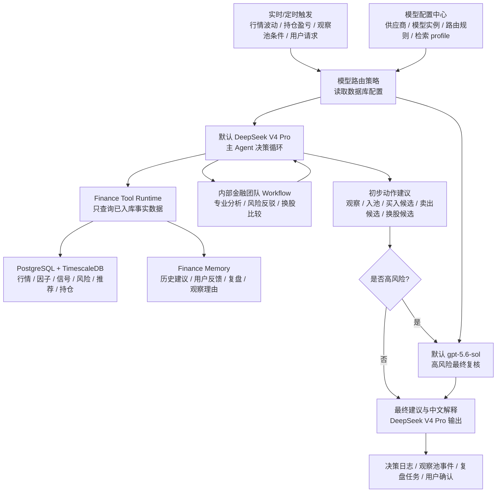

# 金融决策 Agent 模型选型与职责分配

更新时间：2026-07-15

本文记录私人金融助手当前阶段的模型分配决策。模型能力、价格、上下文长度、工具调用协议和供应商命名都可能变化，因此本文是“当前默认方案”，不是永久绑定。当前实现已参考 Dify 的思路，把模型供应商、模型实例、路由规则和检索配置保存到数据库，后续可以通过 CLI、TUI 或前端页面在线切换。

## 1. 选型结论

第一版不再拆分过多模型，采用“双模型主方案”：

| 层级 | 默认模型 | 角色定位 |
| --- | --- | --- |
| 默认主 Agent | DeepSeek V4 Pro | 负责约 90% 的日常决策循环，包括 Agent loop、工具调用、持仓监控、观察池管理、推荐入池、买卖/换股初步决策和普通中文解释 |
| 高风险最终复核 | `gpt-5.6-sol` | 负责约 10% 的高风险复核，包括大仓位调整、卖出、换股、强冲突信号、数据缺口、连续亏损和重大风险事件 |
| 可选国产补充 | Qwen3.5-Plus / Qwen3.5-Flash | 只在需要降低成本时用于中文报告、摘要、低风险巡检；不是第一版核心依赖 |
| 后续实验位 | MiMo-V2.5-Pro | 仅用于后续私有化部署、长周期复盘和量化实验室评估；第一版不进入主决策链路 |

第一版默认只需要启用两个核心模型：

```text
主决策：DeepSeek V4 Pro
高风险复核：gpt-5.6-sol
```

如果短期只接一个模型，优先使用 DeepSeek V4 Pro。它更适合作为长期运行的主 Agent：调用频率高、中文语境好、适合工具调用和结构化输出。`gpt-5.6-sol` 更适合作为高质量、低频、关键决策复核模型，不适合每次行情波动都调用。

模型不是写死在 Prompt 中。默认配置会写入：

- `model_providers`
- `model_instances`
- `model_routing_rules`
- `retrieval_profiles`

JSON/env 配置只作为本地调试入口；正式运行优先读取数据库配置。

## 2. 决策链路

推荐决策链路如下：



高风险复核不是另起一套决策系统，而是复查 DeepSeek V4 Pro 的初步建议、证据链、风险反驳和数据质量。`gpt-5.6-sol` 的输出必须回写到同一套 `decision_logs`、`assistant_memories`、`review_tasks` 和 Workflow 审计链路中。

输出动作仍然必须落在本项目领域协议中定义的动作集合内，例如：

- `buy_candidate`
- `add`
- `hold`
- `reduce`
- `sell_candidate`
- `swap_candidate`
- `watch`
- `avoid`
- `ignore`

模型不能直接下单。真实交易必须经过用户二次确认。

## 3. 工具调用边界

所有模型都必须通过本项目开放的工具、MCP 或应用服务读取数据，不能直接上网抓行情、新闻或财报。

允许调用的工具类型包括：

- 查询持仓和组合风险。
- 查询观察池、候选池、推荐榜和回避池。
- 查询行情、因子、技术指标、信号、评分、风险发现和数据质量快照。
- 查询 Finance Memory、历史决策、用户反馈和复盘任务。
- 调用内部金融团队 Workflow。
- 写入决策日志、观察池事件、提醒、复盘任务和金融记忆。

禁止模型直接执行的行为包括：

- 直接调用 AKShare、Binance、ccxt 或外部网页抓取数据。
- 直接计算或覆盖因子、技术指标和 `AssetScore.total_score`。
- 在没有证据链的情况下生成买卖建议。
- 绕过风险反驳和用户确认生成真实订单。
- 把 Hermes Memory 当作行情、财务、风险或推荐事实。

## 4. 模型路由策略

模型路由不应该散落在 Prompt 中，当前已先落地为本项目内部协议和数据库配置中心：

- `src/finance_agent/agents/runtime/model_router.py`
- `ModelRoutingPolicy.route_primary()`：常规分析路由到 `deepseek-v4-pro`。
- `ModelRoutingPolicy.build_review_result()`：静态兼容 fallback 仍生成 `gpt-5.5-pro` 协议；正式运行由数据库 `high_risk_reviewer/high_risk_review` 路由覆盖为 `gpt-5.6-sol`。
- `agent_workflow_events` 已新增 `model_route` 和 `model_review` 事件类型，用于记录模型路由和高风险复核协议。
- `model_providers`：供应商连接信息和密钥。
- `model_instances`：模型实例、职责和启停状态。
- `model_routing_rules`：按 Workflow、task、role、decision_type 在线切换路由。
- `retrieval_profiles`：Finance Memory / RAG 的检索方式、embedding、rerank、top_k 和阈值配置。

当前已经由 OpenAI-compatible 模型客户端执行真实模型调用。模型配置中心只决定“用哪个模型”，不替代金融风控、Agent loop 和 Workflow 决策逻辑；模型不可用时仍按 fail-closed 语义写 `review_unavailable`。

建议配置维度：

| 场景 | 默认路由 |
| --- | --- |
| 普通观察池巡检 | DeepSeek V4 Pro |
| 普通推荐决策 | DeepSeek V4 Pro |
| 普通中文解释报告 | DeepSeek V4 Pro |
| 持仓大幅波动 | DeepSeek V4 Pro，命中高风险阈值后交给 `gpt-5.6-sol` 复核 |
| 卖出候选 | DeepSeek V4 Pro + `gpt-5.6-sol` |
| 换股候选 | DeepSeek V4 Pro + `gpt-5.6-sol` |
| 大仓位调整 | DeepSeek V4 Pro + `gpt-5.6-sol` |
| 数据缺口较多 | DeepSeek V4 Pro 先给低置信度建议；若仍涉及买卖或换股，交给 `gpt-5.6-sol` 复核 |
| 成本敏感的低风险摘要 | 可选 Qwen3.5-Flash |
| 成本敏感的中文长报告 | 可选 Qwen3.5-Plus |
| 长周期策略复盘 / 私有化实验 | MiMo-V2.5-Pro 试验位 |

触发 `gpt-5.6-sol` 升级复核的建议条件：

- 建议动作是 `sell_candidate` 或 `swap_candidate`。
- 单次建议影响组合净值比例较高。
- DeepSeek V4 Pro 的置信度低。
- 推荐结果、风险结果、持仓状态或历史记忆之间存在强冲突。
- 数据质量为 `partial`、`stale` 或存在关键缺失。
- 标的存在重大监管、财务、合约杠杆或流动性风险。
- 当前持仓连续亏损或大幅波动。
- 数字货币出现高杠杆、资金费率异常、未平仓量拥挤或强平风险。
- 用户近期连续反馈“建议不符合预期”。

## 5. 与 Hermes / Codex 的关系

上层 Agent Runtime 建议优先使用 Hermes Agent，而不是 Codex。

- Hermes Agent 负责长期运行、自由 loop、工具调用、通用记忆和按需调度。
- Codex 负责开发、调试、代码分析、文档维护和工具实现，不作为正式金融助手运行时。
- 本项目 `finance-agent` 负责金融业务内核、事实库、工具层、Workflow、记忆与审计。

推荐关系：

```text
Hermes Agent
  -> Finance Tool Runtime / MCP / CLI
  -> finance-agent 应用服务
  -> PostgreSQL + TimescaleDB + Finance Memory
  -> DeepSeek V4 Pro 主循环
  -> gpt-5.6-sol 高风险复核
```

## 6. 实现前验证清单

在真正接入模型前，需要先做最小验证：

- DeepSeek V4 Pro 是否支持稳定结构化 JSON 输出。
- DeepSeek V4 Pro 是否支持工具调用，或能通过 Hermes 工具协议间接调用。
- `gpt-5.6-sol` 是否能稳定读取 DeepSeek V4 Pro 的结构化初步建议、证据链和风险列表。
- 两个模型是否都能遵守“只查询事实库，不上网抓数据”的边界。
- 两个模型是否能在固定动作枚举内输出决策。
- 两个模型是否能引用证据 ID、风险 ID、推荐运行 ID 和记忆 ID。
- 模型是否能在数据缺失时主动降低置信度。
- 模型是否能把“建议”和“真实下单”分开。
- DeepSeek V4 Pro 的调用成本是否能支撑日常监控频率。
- `gpt-5.6-sol` 的调用频率是否能被高风险阈值控制在低频范围内。

## 7. 实现落点

当前已落地的第一批实现：

```text
src/finance_agent/agents/runtime/
  model_router.py    # 模型路由策略和高风险复核协议
  model_config.py    # DB / JSON / env 模型配置加载、路由预览和 dry-run 请求
  model_tui.py       # 轻量模型配置 TUI

src/finance_agent/agents/reports/
  templates.py       # 完整中文报告模板，输出结构化 JSON 和 Markdown

src/finance_agent/storage/
  repositories.py    # ModelRuntimeConfigRepository
  orm.py             # model_providers / model_instances / model_routing_rules / retrieval_profiles

src/finance_agent/cli/
  main.py            # finance-agent models config/list/set-provider/set-model/set-route/set-retrieval/retrieval/route-preview/test/tui

scripts/storage/
  smoke_model_router.py
  smoke_model_cli_and_tui.py
  smoke_report_template_and_model_review.py
```

后续如需真实调用模型，再新增以下能力：

```text
src/finance_agent/agents/models/
  registry.py         # 模型注册与能力描述
  client.py           # DeepSeek / OpenAI / 国产模型客户端适配
  structured_output.py # 结构化输出校验和失败降级

src/finance_agent/agents/tools/
  registry.py         # 金融事实工具注册器
  portfolio.py        # 持仓工具
  watchlist.py        # 观察池工具
  recommendation.py   # 推荐结果工具
  risk.py             # 风险工具
  memory.py           # Finance Memory 工具
  workflow.py         # 内部 Workflow 调用工具

src/finance_agent/agents/runtime/
  loop.py             # 主 Agent loop
  state.py            # Agent loop 状态
  audit.py            # 工具调用与模型调用审计
```

第一步已经实现模型无关的工具运行时、报告模板、模型路由和审计协议；下一步才接入具体模型。这样后续替换或新增国产模型时，不需要重写金融业务逻辑。
