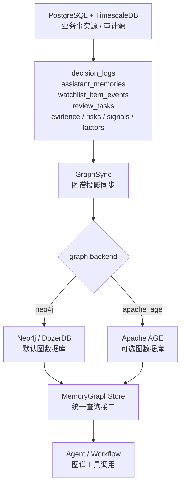

# 知识图谱后端设计

本文定义 Finance Memory 和推荐解释链路中的知识图谱存储后端。当前结论是：正式运行环境只启用一个图数据库后端，通过配置显式选择；默认推荐 Neo4j / DozerDB，Apache AGE 作为另一种部署形态，不做自动 fallback，也不做双写双读。

## 1. 设计结论

```text
GraphStore backend = neo4j | apache_age
```

- `neo4j`：默认推荐后端，使用本地 Neo4j / DozerDB，适合多跳查询、路径推理、风险传导、社区发现和后续 GraphRAG。
- `apache_age`：可选后端，适合希望减少独立中间件、资源较小或单 PostgreSQL 部署的环境。
- 同一运行环境只能启用一个后端。
- 配置错误或目标后端不可用时，图谱工具应显式失败或进入图谱不可用状态，不自动切换到另一个后端。
- PostgreSQL 业务表仍是事实源和审计源，图数据库保存可重建的图谱投影。

## 2. 架构位置



PostgreSQL + TimescaleDB 继续保存行情、因子、评分、风险、证据、决策日志、观察池事件、Finance Memory 和复盘任务。图数据库只保存从这些事实表投影出的节点和关系，因此可以被清空后重建。

## 3. 配置模型

推荐配置形态：

```yaml
graph:
  enabled: true
  backend: neo4j

  neo4j:
    uri: bolt://localhost:7687
    user: neo4j
    password: password123
    database: neo4j

  apache_age:
    graph_name: finance_memory_graph
    schema: ag_catalog
```

运行规则：

- `backend = neo4j` 时，`GraphSync` 只写 Neo4j / DozerDB，`MemoryGraphStore` 只查 Neo4j / DozerDB。
- `backend = apache_age` 时，`GraphSync` 只写 Apache AGE，`MemoryGraphStore` 只查 Apache AGE。
- 不允许同一环境同时写入 Neo4j 和 Apache AGE。
- 不允许图谱查询在失败时自动切换后端。

## 4. 统一图模型

两个后端使用同一套业务语义，差异只存在于驱动和查询语法适配层。

### 4.1 节点

| 节点 | 说明 | 来源 |
| --- | --- | --- |
| `Asset` | 股票或数字货币标的 | `assets` |
| `Portfolio` | 用户组合 | `portfolios` |
| `Position` | 当前或历史持仓 | `positions`、`position_snapshots` |
| `WatchlistItem` | 私人观察池条目 | `watchlist_items` |
| `WatchlistEvent` | 入池、继续关注、移除等事件 | `watchlist_item_events` |
| `Decision` | 买入、卖出、换股、入池、观察等建议 | `decision_logs` |
| `Memory` | Finance Memory 摘要 | `assistant_memories` |
| `Review` | 复盘任务和复盘结论 | `review_tasks` |
| `Evidence` | 数据证据、新闻、公告、指标证据 | evidence 相关表 |
| `Risk` | 风险发现或风险事件 | risk 相关表 |
| `Signal` | 信号快照 | signal 相关表 |
| `FactorSnapshot` | 因子和技术指标摘要 | `factor_frames`、`indicator_frames`、`asset_scores` |
| `Thesis` | 投资假设 | `asset_theses` |
| `UserPreference` | 明确投资偏好 | `assistant_memories` 中的偏好类记忆 |

### 4.2 关系

| 关系 | 含义 |
| --- | --- |
| `(Decision)-[:ABOUT]->(Asset)` | 决策针对某个标的 |
| `(Decision)-[:USES_EVIDENCE]->(Evidence)` | 决策引用证据 |
| `(Decision)-[:WARNED_BY]->(Risk)` | 决策受到风险约束 |
| `(Decision)-[:GENERATES]->(Memory)` | 决策沉淀为 Finance Memory |
| `(WatchlistEvent)-[:SUMMARIZED_BY]->(Memory)` | 观察池事件被记忆摘要承载 |
| `(Memory)-[:SUPPORTS]->(Thesis)` | 记忆支持某个投资假设 |
| `(Memory)-[:CONTRADICTS]->(Thesis)` | 记忆反驳某个投资假设 |
| `(Review)-[:REVIEWS]->(Decision)` | 复盘评价历史决策 |
| `(Signal)-[:ON_ASSET]->(Asset)` | 信号属于某个标的 |
| `(FactorSnapshot)-[:ON_ASSET]->(Asset)` | 因子快照属于某个标的 |
| `(Position)-[:HOLDS]->(Asset)` | 持仓对应某个标的 |
| `(WatchlistItem)-[:WATCHES]->(Asset)` | 观察项跟踪某个标的 |
| `(Risk)-[:AFFECTS]->(Asset)` | 风险影响某个标的 |
| `(Evidence)-[:SUPPORTS]->(Signal)` | 证据支持某个信号 |

### 4.3 通用属性

节点和关系尽量保留以下属性，便于跨后端重建和审计：

| 属性 | 说明 |
| --- | --- |
| `owner_id` | 用户 ID |
| `source_table` | 来源业务表 |
| `source_id` | 来源业务主键 |
| `source_hash` | 来源内容指纹 |
| `as_of` | 数据时点 |
| `created_at` | 创建时间 |
| `updated_at` | 更新时间 |
| `confidence` | 置信度 |
| `status` | active、inactive、invalidated 等 |
| `graph_version` | 图模型版本 |

Neo4j / DozerDB 可以额外保存 `community_id`、`centrality_score`、`risk_cluster_id`、`last_graph_sync_at` 等图算法结果；这些算法结果不是事实源，不反写为业务事实。

## 5. GraphSync

`GraphSync` 负责把 PostgreSQL 业务事实表同步为图谱投影：

```text
业务事实表变更
 -> GraphSync 读取增量
 -> 标准 GraphMutation
 -> 按 graph.backend 写入唯一目标后端
```

当前已同步：

- `assets`
- `watchlist_items`
- `watchlist_item_events`
- `decision_logs`
- `assistant_memories`
- `review_tasks`
- 风险和证据

信号、因子摘要、持仓与观察池条目会继续作为可重建投影扩展，但当前已完成 Agent 决策最依赖的资产、决策、记忆、观察池事件、风险、证据和复盘链路。

同步原则：

- 以 `source_table + source_id` 做幂等键。
- 图谱关系必须能回溯到业务事实表。
- 不从图数据库反向生成金融事实。
- 图数据库可重建，不承担审计唯一副本。

## 6. Agent 工具

Agent 和 Workflow 不直接访问 Neo4j 或 Apache AGE，只通过统一工具层：

```text
memory.trace_asset_graph
memory.explain_candidate_reason_chain
memory.find_similar_decision_paths
memory.detect_risk_contagion
memory.find_memory_conflicts
```

这些工具只返回结构化图谱摘要、路径、节点引用和来源 ID，不返回隐藏推理。最终中文解释报告仍必须引用业务事实、证据、风险和 Finance Memory。

当前落地状态：

- 已实现 `src/finance_agent/graph`：`GraphStoreSettings`、`DryRunGraphStore`、`Neo4jGraphStore`、`ApacheAgeGraphStore`、`GraphSyncService`。
- `MemoryGraphStore` 已统一支持 `initialize_schema()`、`health_check()`、`apply_mutation()`、`trace_asset_graph()`、`explain_candidate_reason_chain()`、`find_memory_conflicts()`、`find_similar_decision_paths()`、`detect_risk_contagion()`。
- `Neo4jGraphStore` 已实现唯一约束、索引、健康检查、GDS 可用性探测、结构相似历史决策查询和风险传导路径查询。
- `ApacheAgeGraphStore` 已实现 AGE 扩展加载、图空间初始化、健康检查、投影写入、路径追踪、入池原因链、相似决策和风险传导查询；AGE 与 Neo4j 仍通过配置二选一，不做 fallback。
- `GraphSyncService` 已支持 `sync_asset_graph()`、`sync_owner_graph()`、`sync_all_graph()`。
- 已新增配置样例：`config/graph.neo4j.example.toml` 和 `config/graph.apache-age.example.toml`。
- `FinanceToolRuntime` 已接入 `memory.trace_asset_graph`、`memory.explain_candidate_reason_chain`、`memory.find_memory_conflicts`、`memory.find_similar_decision_paths`、`memory.detect_risk_contagion`。
- `FinanceAgentInterface`、CLI 和 MCP 均已提供图谱入口：健康检查、初始化、单标的同步、用户同步、路径追踪、原因链、相似决策、风险传导和冲突查询。
- `scripts/storage/smoke_graph_store.py` 已验证配置文件后端选择、dry-run schema/health、资产/用户同步、风险/证据/复盘投影、五类图谱查询、CLI graph 命令和 MCP graph 工具注册。

## 7. 对现有 financial_memory_edges 的处理

`financial_memory_edges` 已经在 M2/M3 阶段落库并通过冒烟验证。新的长期设计不再把它作为正式图数据库方案，但短期不直接删除，避免破坏既有迁移、冒烟脚本和历史数据。

处理策略：

1. 短期保留表和已有写入，作为历史兼容表。
2. 新增 GraphStore / GraphSync 后，新增图谱关系写入应进入配置选择的图数据库。
3. 完成图数据库同步和查询工具验证后，再新增迁移把 `financial_memory_edges` 标记为 deprecated 或迁移旧关系。
4. 文档中不再把 `financial_memory_edges` 描述为长期知识图谱主方案。

## 8. 验收标准

- 配置文件中只能选择 `neo4j` 或 `apache_age` 一个后端。
- 默认配置推荐 `neo4j`。
- 图谱工具在未配置或目标后端不可用时给出明确错误，不自动切换。
- Agent 可追溯单标的入池原因、每日关注原因、历史建议、风险反驳和复盘结果。
- 图谱路径中的每个节点和关系都能回到 PostgreSQL 业务事实源。

当前验证命令：

```powershell
.\.venv\Scripts\python.exe scripts\storage\smoke_graph_store.py
.\.venv\Scripts\python.exe scripts\storage\smoke_finance_tool_runtime.py
.\.venv\Scripts\python.exe scripts\storage\smoke_agent_cli_interface.py
.\.venv\Scripts\python.exe scripts\storage\smoke_agent_mcp_server.py
.\.venv\Scripts\python.exe -m compileall -q src scripts
.\.venv\Scripts\ruff.exe check src scripts
```
