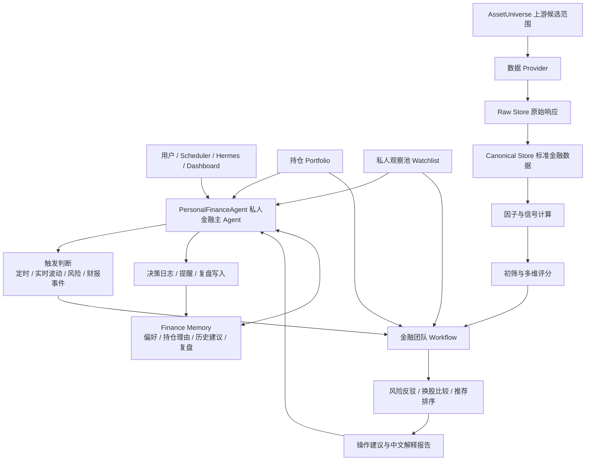

# Hermes 私人金融助手与 AI 标的推荐引擎计划

## 1. 项目定位

构建一套运行在本地 Windows 环境的私人金融助手。它的核心能力不是泛金融工具集，也不是无人值守自动交易，而是持续监控用户持仓、实时观察股票和数字货币波动、维护候选池，并在合适时机给出可追溯、可解释、可反驳的买入、卖出、加仓、减仓、换股和继续观察建议。

AI 标的推荐仍然是第一版核心引擎，必须同时覆盖 **A 股** 和 **数字货币**。用户是金融小白，因此产品不能只输出专业指标，而要把行情、财务、资金流、衍生品、事件、因子、评分、风险和反方观点翻译成能看懂、能追踪、能比较、能复盘的中文建议。

系统采用两层 Agent 架构：上层是高自由度的 `PersonalFinanceAgent`，类似私人投资管家，负责持仓、候选池、用户偏好、长期记忆、触发条件和任务调度；底层是固定的金融团队 Workflow，负责专业分析、风险反驳、换股比较和中文报告。

记忆体系采用分层设计：Hermes-agent 自带的记忆能力负责通用 Agent 记忆，例如对话上下文、任务偏好、工具使用习惯和长期摘要；本项目新增的 `decision_logs`、`assistant_memories`、`review_tasks`、`asset_theses` 等结构是金融业务记忆与审计层，用来保存投资建议为什么产生、用户是否采纳、后续复盘如何评价，以及下次金融分析必须引用哪些历史上下文。两者是互补关系，不重复建设。

第一版不做自动交易，也不把订单草案作为主链路。系统可以生成关注、候选买入、持有、减仓、换股、回避、观察等建议，但真实下单必须由用户在外部交易软件、交易所或后续系统内二次确认完成。交易执行、订单草案和券商/交易所连接只能作为受控扩展，不能绕过推荐、风控和用户确认。

## 2. 核心目标

- 建立私人金融主 Agent，长期维护用户持仓、候选池、观察理由、触发条件、风险偏好、历史建议和复盘记忆。
- 支持持仓监控和实时波动提醒，能回答“该不该买入、卖出、加仓、减仓、换股、继续持有或继续观察”。
- 构建可配置候选池，A 股支持全 A、沪深 300、中证 500、创业板、行业池和用户自选池，数字货币支持 Binance 现货池、合约池、主流币池和用户自选币种池。
- 区分上游 `AssetUniverse` 和私人观察池：前者是数据筛选范围，后者是主 Agent 长期维护的潜力标的清单，包含加入理由、启动条件、失效条件和移除原因。
- 从 AKShare 等数据源采集 A 股行情、财务、估值、资金流、板块和公告新闻数据。
- 从 Binance 官方 API + ccxt 采集数字货币 K 线、成交量、资金费率、未平仓量、多空比例和账户可选数据。
- 用成熟 Python 金融组件计算技术因子、基本面/项目面因子、估值/估值替代因子、资金流/衍生品因子、事件因子、回测结果和绩效指标。
- 用透明规则完成初筛、因子归一化、多维评分和候选排序，不让 LLM 凭感觉打分。
- 用底层金融团队 Workflow 把基本面/项目面、技术面、资金流/衍生品、事件、风险反驳、组合约束和回测证据综合成中文推荐结论。
- 用可视化界面展示候选标的、综合评分、推荐理由、风险点、观察条件和证据。
- 记录每次建议、用户确认、用户反馈和事后复盘，沉淀为金融业务记忆，后续建议必须能引用这些历史上下文。
- 提供 CLI，供 Hermes skill 或自动化流程调用。
- 预留 MCP 服务，但第一版优先 CLI，避免过早增加服务复杂度。

## 3. 第一版边界

### 3.1 覆盖市场

- A 股：
  - 第一版主市场之一。
  - 覆盖股票池、行情、指数、板块、财务、估值、资金流、公告和新闻事件。
  - 第一版优先推荐和自选池分析，不强依赖真实券商交易接口。
- 数字货币：
  - 第一版主市场之一。
  - Binance 现货和 U 本位合约优先。
  - 覆盖币种池、K 线、成交量、资金费率、未平仓量、多空比例、波动率和杠杆拥挤度。
  - 第一版做币种推荐和风险提示，不做自动交易和合约开仓执行。

### 3.2 投资周期

- 第一版支持：
  - 中长期。
  - 波段。
- 暂不做：
  - 日内高频自动交易。
  - 无人值守实盘交易。
  - 复杂期权、套利和做市。

### 3.3 输出原则

每条建议必须包含：

- 建议动作。
- 推荐排序和综合评分。
- 适合周期。
- 支持因子和信号。
- 反方观点。
- 主要风险。
- 缺失或不可用数据。
- 数据来源和时间戳。
- 观察条件或买入触发条件。
- 小白可读解释。

## 4. 总体架构

详细工程架构见：`docs/架构方案.md`。该文档定义模块边界、依赖方向、组件库调用方式、CLI/API/Scheduler/Dashboard 如何复用同一套应用服务。



技术栈：

- 后端：Python、FastAPI、LangGraph、Pydantic、SQLAlchemy。
- 数据库：全环境统一 PostgreSQL + TimescaleDB。业务表使用 PostgreSQL，K 线和衍生品时间序列表使用 TimescaleDB hypertable；开发、测试、演示和生产不提供 SQLite 或普通 PostgreSQL 降级模式。
- 任务调度：APScheduler 或 Celery Beat，第一版优先 APScheduler。
- 前端：React、ECharts、TradingView Lightweight Charts。
- CLI：Typer 或 Click，优先 Typer。
- 包管理：uv 或 poetry，第一版建议 uv。

## 5. 私人金融助手主链路

第一版系统主链路升级为：

```text
持仓 + 私人观察池 + 用户偏好/Finance Memory
 -> 实时/定时数据采集
 -> 因子/信号/风险更新
 -> 触发条件判断
 -> 上层 PersonalFinanceAgent 调度金融团队 Workflow
 -> 专业分析、风险反驳、换股比较
 -> 操作建议
 -> 用户确认/反馈
 -> 决策日志、Finance Memory 和复盘写入
```

标的推荐是这条主链路里的核心子链路。A 股和数字货币都必须进入同一套推荐链路形态，但要作为两条独立链路分别运行、分别排序、分别输出。

### 5.1 标的推荐子链路

标的推荐子链路固定为：

```text
候选池来源/种子池（全 A、指数成分、行业/概念、资金流榜单、热度榜、币种池）
 -> AssetUniverse 构建和基础过滤
 -> 数据采集
 -> 因子计算
 -> 初筛规则
 -> 多维评分
 -> Agent 分析
 -> 风险反驳
 -> 推荐榜/观察池/回避池
 -> 中文解释报告
```

推荐子链路不能和持仓监控割裂。主 Agent 会把推荐结果写入私人观察池，或者把候选标的和当前持仓做换股比较，但底层排序仍然必须引用因子、信号、风险、评分和证据。

### 5.2 候选池构建流程

候选池决定系统从哪里开始推荐。这里的候选池是上游输入范围，不是 Agent 分析后的推荐结果：

1. 读取用户指定候选池来源，例如全 A、沪深 300、中证 500、行业/概念成分、自选股、资金流榜单、热度榜、Binance 现货池、合约池、主流币池或自选币种池。
2. A 股从 AKShare 获取股票基础信息、上市状态、行业、交易所和是否可交易。
3. 数字货币从 Binance/ccxt 获取交易对、市场类型、交易状态、成交额和可用周期。
4. 过滤明显不适合作为第一版推荐对象的标的，例如 A 股停牌/退市整理、数字货币成交额过低/交易对不可用、数据严重缺失。
5. 生成 `AssetUniverse`，记录候选池来源、构建时间、市场、过滤规则和剩余标的数量。Agent 分析后的输出应叫推荐榜、观察池和回避池，不再叫候选池。

### 5.3 持仓监控流程

持仓监控是私人金融助手区别于一次性推荐系统的核心能力：

1. 读取用户持仓、成本、数量、现金、目标仓位、风险偏好和历史操作理由。
2. 按市场刷新持仓标的行情、资金流、事件、风险和相关候选标的信号。
3. 判断是否触发异常：快速下跌、放量破位、资金费率异常、未平仓量拥挤、财报发布、重大公告、风险事件、组合集中度过高。
4. 主 Agent 根据触发类型选择底层 Workflow，例如持仓体检、单标的复核、换股比较或每日盘后复盘。
5. 输出 `hold`、`add`、`reduce`、`sell_candidate`、`swap_candidate`、`watch`、`avoid` 等建议，并记录风险反驳和证据。
6. 用户确认或反馈后写入 `decision_logs`、`assistant_memories` 和后续复盘任务。

### 5.4 私人观察池管理流程

私人观察池不是简单自选股列表，而是主 Agent 长期维护的潜力标的清单：

1. 推荐榜、资金流榜、热度榜、事件触发和用户手动输入都可以把标的加入观察池。
2. 每个观察项必须记录关注理由、来源推荐、观察条件、启动条件、失效条件、风险等级和下一次复核时间。
3. 当价格、信号、风险或事件满足启动条件时，主 Agent 调度金融团队 Workflow 做专项分析。
4. 如果观察理由失效、风险上升或数据长期不可用，主 Agent 应建议降级、暂停观察或移除，并记录移除原因。
5. Agent 入池原因和每日继续关注原因必须进入 Finance Memory：入池写 `candidate_intake_reason` 事件和记忆；每日复核写 `daily_watch_reason` 事件和 `watchlist_daily_reason` 记忆。第一版复用 `watchlist_item_events`、`assistant_memories` 和 `financial_memory_edges`，不新增表。

### 5.5 定时刷新流程

系统每天或按市场频率自动刷新数据：

1. 数据源健康检查。
2. 按市场分别拉取候选池内 A 股或数字货币原始数据。
3. 写入 Raw Store，保留原始响应、来源、时间戳和请求参数。
4. 清洗为统一 OHLCV、财务、估值、资金流、板块、新闻、公告、资金费率、未平仓量和多空比例数据结构。
5. 写入 Canonical Store。
6. 调用成熟库计算技术指标、基本面/项目面特征、估值/估值替代特征、资金流/衍生品特征和事件特征。
7. 生成 `FactorFrame`、`SignalSnapshot` 和 `AssetScore`。
8. 对候选标的运行轻量回测和绩效验证。
9. 写入分析缓存，供 Agent、CLI 和 Dashboard 读取。

### 5.6 用户推荐流程

当用户或 Hermes 调用命令时：

1. 读取用户指定候选池、市场、策略、周期和推荐数量。
2. 检查候选池数据、因子数据和评分数据是否过期。
3. 必要时触发增量刷新。
4. 执行初筛规则，剔除不适合推荐的股票或币种。
5. 读取多维评分、信号快照、回测结果、风险指标和新闻公告事件。
6. 上层主 Agent 选择资产推荐 Workflow，并传入用户偏好、历史记忆、持仓约束和候选池上下文。
7. 底层金融团队 Workflow 分析候选标的，输出推荐排序、观察池、回避池和风险反驳。
8. 生成结构化 `result.json` 和中文 `report.md`。
9. Dashboard 分页或分区展示 A 股推荐列表、数字货币推荐列表、评分拆解、风险反驳和证据链。

### 5.7 典型触发场景

| 场景 | 触发来源 | 调用 Workflow | 输出 |
| --- | --- | --- | --- |
| 盘中急跌 | 实时行情、风控阈值 | 技术面 + 风险反驳 + 决策 | 是否持有、减仓、止损观察 |
| 财报发布 | 公告、财报披露 | 基本面 + 事件 + 风险反驳 + 决策 | 是否继续持有、是否移出观察池 |
| 候选标的启动 | 观察池条件命中 | 技术面 + 资金流/衍生品 + 事件 + 决策 | 是否进入买入候选 |
| 是否换股 | 当前持仓低分、候选池高分 | 当前持仓分析 + 候选标的分析 + 组合决策 | 是否换股、换到哪个、风险差异 |
| 每日盘后 | 定时任务 | 全持仓摘要 + 候选池变化 + 次日计划 | 中文复盘和下一日观察清单 |

### 5.8 后续交易扩展流程

交易不是第一版主链路。后续如需接入交易，只能基于已经生成的 `AssetRecommendation` 或 `Recommendation` 生成订单草案，并且必须由用户在外部或系统内二次确认。

## 6. 数据层设计

### 6.1 Provider 抽象

- `MarketDataProvider`：K 线、实时行情、盘口、成交量。
- `UniverseProvider`：股票池、币种池、指数成分、行业成分、交易对状态。
- `FundamentalsProvider`：财务、估值、行业、公司基础信息。
- `CapitalFlowProvider`：主力资金、北向资金、成交额、换手率。
- `NewsProvider`：新闻、公告、研报、事件。
- `CryptoProvider`：资金费率、未平仓量、多空比、链上数据。
- `AccountProvider`：账户余额、持仓、订单、成交。
- `ExecutionProvider`：订单提交、撤单、订单状态。

### 6.2 数据源选择

A 股：

- 主源：AKShare。
- 可选增强：Tushare、BaoStock、OpenBB provider。
- 交易适配预留：QMT、PTrade、东方财富量化终端。

数字货币：

- 主源：Binance 官方 API + ccxt。
- 可选增强：CoinGecko、DeFiLlama、CoinAnk。
- 连接器参考：Hummingbot、NOFX。

### 6.3 数据可用性状态

任何数据都必须带状态，不允许静默造数：

- `available`：完整可用。
- `partial`：部分字段缺失，但仍可分析。
- `unavailable`：不可用。
- `stale`：过期。
- `error`：拉取或计算失败。

## 7. 金融计算策略

第一版采用“成熟库计算 + 本项目适配、编排、审计”的原则。常见技术指标、回测和绩效统计不手写公式。

### 7.1 技术指标

主引擎：`ta-lib-python`

- PyPI 包名：`TA-Lib`。
- Python 导入名：`talib`。
- GitHub 项目：`ta-lib-python`。
- 底层能力：封装 TA-Lib 技术分析库。
- 用途：RSI、MACD、ATR、布林带、均线、动量、波动率、K 线形态等。

配合组件：`pandas/numpy`

- 用于数据清洗、窗口聚合、收益率、分位数、z-score 和跨表派生因子。
- 用于资金流、估值、基本面、数字货币衍生品等非技术指标库类计算。
- 不替代 TA-Lib 的 RSI、MACD、ATR、布林带、K 线形态等主技术指标计算。

项目内部适配器：

- `TalibIndicatorAdapter`
- `IndicatorRegistry`

### 7.2 回测

主库：`bt`

- 负责组合策略回测。
- 适合中长期、波段、再平衡、权重组合、交易成本模拟。
- 输出统一 `BacktestResult`，不把 bt 的内部对象泄漏给 Agent。

### 7.3 绩效分析

主库：`quantstats`

- 负责夏普、Sortino、CAGR、最大回撤、收益热力图、HTML 报告。
- 输入是策略或账户收益序列。
- 输出统一 `PerformanceReport`。
- 注意胜率等指标默认是周期收益维度，不等同逐笔交易胜率。

### 7.4 暂缓引入 vectorbt

`vectorbt` 功能强，但覆盖指标、信号、组合、参数搜索和可视化，和 TA-Lib、bt、quantstats 重叠明显。同时它是 `Apache-2.0 with Commons Clause`，不适合第一版核心依赖。

结论：

- 第一版不引入 `vectorbt`。
- 后续只作为量化实验室插件评估。
- 若引入，也不能进入推荐主链路，只用于离线参数实验。

## 8. 信号层设计

信号层是第一版核心，不拆成后续补丁。系统内部需要尽可能全面，但允许单项信号降级。

在标的推荐主链路中，信号层由因子计算和透明规则生成，不由 Agent 直接打分。Agent 只读取信号、解释信号冲突、补充风险反驳和生成中文推荐理由。

### 8.1 信号类别

技术信号：

- 趋势。
- 动量。
- 均线。
- 突破。
- RSI。
- MACD。
- 布林带。
- ATR。
- 波动率。
- 最大回撤。

A 股基本面信号：

- 估值。
- 财务质量。
- 成长。
- 现金流。
- 负债。
- 行业强弱。
- 资金流。

数字货币合约信号：

- 资金费率。
- 未平仓量。
- 多空比。
- 成交异常。
- 杠杆。
- 强平/爆仓风险。
- 衍生品拥挤度。

事件信号：

- 新闻。
- 公告。
- 研报。
- 社交舆情。
- 监管事件。
- 链上事件。

选股组合信号：

- 行业暴露。
- 资产类别暴露。
- 推荐名单行业集中度。
- 候选池相关性。
- 候选股近期回撤。
- 候选股流动性。

### 8.2 频率

A 股：

- 主频率：`1d`、`1w`。
- 辅助频率：`30m`、`60m`。

Binance：

- 主频率：`1h`、`4h`、`1d`。
- 辅助频率：`15m`、`30m`。
- 预留：`1m`、`5m`。

### 8.3 信号输出

`SignalSnapshot` 必须包含：

- `signal_id`
- `symbol`
- `market`
- `horizon`
- `status`
- `score`
- `direction`
- `confidence`
- `inputs`
- `rule_version`
- `explanation`
- `as_of`
- `evidence_ids`

第一版评分采用透明规则权重，不直接让 LLM 生成分数。LLM 只负责解释、综合和给出建议。

专业量化模型作为后续 TODO，不进入第一版主链路：

- 机器学习打分模型：XGBoost、LightGBM、RandomForest、CatBoost。
- 深度学习时间序列模型：LSTM、Transformer、PatchTST。
- 多因子回归：用历史收益拟合因子权重。
- 风格暴露和中性化：市值、行业、波动率、中小盘、动量、价值等。
- 风险模型和组合优化：协方差矩阵、Barra 风格风险模型、组合约束优化。
- 因子有效性研究：IC、RankIC、分层回测、因子衰减、换手约束。
- 参数搜索和策略优化：RSI 周期、均线周期、权重组合等。

LLM 不能替代上述统计学习和回测验证。第一版只让 LLM 消费确定性因子、评分、证据和风险数据，负责解释、比较、反驳和生成中文报告。

## 9. Agent 工作流

Agent 层采用“上层自由主 Agent + 底层固定金融团队 Workflow”的两层设计。参考方向是：主 Agent 可以借鉴 Hermes-agent / Vibe-Trading 的高自由任务管理、工具调用和记忆能力；底层金融团队 Workflow 借鉴 TradingAgents-CN 的固定分析流程、报告 section 和金融角色分工。

模型选型不和业务逻辑硬绑定。当前默认模型分配见 `docs/模型选型与职责分配.md`：DeepSeek V4 Pro 作为默认主 Agent，负责约 90% 的日常决策循环；GPT-5.5 Pro 只在卖出、换股、大仓位调整、强冲突信号、数据缺口和重大风险事件中做高风险最终复核。其他国产模型只作为成本敏感场景的可选补充或后续实验位，不进入第一版核心依赖。所有模型都只能通过本项目工具层查询已入库事实数据，不能直接上网抓行情或覆盖确定性因子、评分和风险数据。

### 9.1 上层 PersonalFinanceAgent

`PersonalFinanceAgent` 是私人金融助理，不直接算指标、不直接改评分、不直接下单。它负责：

- 维护用户持仓、现金、成本、目标仓位、风险偏好和投资风格。
- 维护私人观察池，记录关注理由、启动条件、失效条件和移除原因。
- 管理金融业务记忆，沉淀历史建议、用户反馈、复盘教训和偏好变化；通用对话记忆仍交给 Hermes-agent 自身能力。
- 监听定时任务、实时波动、风险阈值、财报公告、候选池启动等触发事件。
- 决定调用哪个底层 Workflow，例如持仓体检、标的推荐、单资产复核、换股比较、每日盘后复盘。
- 汇总底层 Workflow 输出，形成用户可读建议、提醒、决策日志和后续复盘任务。

主 Agent 的权限边界：

- 可以调用工具和 Workflow。
- 可以更新观察池、提醒、决策日志和 Finance Memory。
- 可以生成订单草案请求，但不能绕过用户确认直接下单。
- 不能凭空修改 `AssetScore.total_score`。
- 不能绕过数据层直接抓取行情或编造指标。

### 9.2 记忆分层

本项目不替代 Hermes-agent 自带记忆系统，而是在其上补一层金融领域长期记忆与审计接口。

| 层级 | 负责内容 | 存储/接口 | 使用方式 |
| --- | --- | --- | --- |
| Hermes Memory | 对话上下文、任务偏好、工具使用习惯、长期摘要、通用用户习惯 | Hermes-agent 自带记忆系统 | 帮助上层 Agent 理解用户和延续任务 |
| Finance Memory | 投资假设、建议理由、用户采纳情况、复盘结论、风险偏好、观察池变更原因 | `decision_logs`、`assistant_memories`、`review_tasks`、`asset_theses`、`memory_embeddings`、`financial_memory_edges` | 作为金融建议的可审计上下文和长期业务记忆 |

边界：

- `PersonalFinanceAgent` 可以读取 Hermes Memory 形成通用用户上下文，但不能把它当作行情、财务、风险或推荐事实。
- `Finance Memory` 必须能追溯到结构化事实、决策日志、用户反馈或复盘任务，不能凭空写入偏好结论。
- 两层记忆发生冲突时，金融事实、持仓、风险、证据和 `DecisionLog` 优先。
- 报告里引用历史偏好或历史建议时，应优先引用 `Finance Memory` 的可审计记录；Hermes Memory 只作为辅助上下文。

Finance Memory 的存储策略：

- 结构化事实源优先：`decision_logs`、`assistant_memories`、`review_tasks`、`asset_theses` 是可信来源。
- 向量召回作为增强：`memory_embeddings` 用于检索相似历史场景、相似复盘教训和相似观察理由，不作为事实源。
- 图谱关系先用 PostgreSQL 边表：`financial_memory_edges` 存储 supports、contradicts、derived_from、reviewed_by 等关系。
- 观察池原因记忆最小化落库：`watchlist_item_events` 记录 `candidate_intake_reason` 和 `daily_watch_reason`，`assistant_memories` 记录对应摘要，`financial_memory_edges` 只做事件到记忆的 `summarizes` 关系。
- 第一阶段不引入独立图数据库，避免在记忆模型仍在论证阶段维护过多中间件。
- 后续如果需要复杂路径推理、社区发现、跨资产传导关系或图算法，再从边表同步或迁移到 Neo4j、Apache AGE、DozerDB 等专业图数据库。

### 9.3 底层金融团队 Workflow

底层 Workflow 由固定金融角色组成，确定性的数据、指标、信号、回测和风险计算先执行，LLM Agent 再做综合判断。

第一版金融团队按 A 股和数字货币共同的投资分析职责划分为 6 类：

- 基本面/项目面分析师 Agent：A 股解释财务质量、成长性、盈利能力、现金流、负债、估值和行业位置；数字货币解释项目基本面、生态、流动性、链上或公开指标。
- 技术面分析师 Agent：读取 TA-Lib 和 pandas/numpy 派生计算得到的趋势、动量、均线、RSI、MACD、成交量、波动率和回撤信号，解释技术面状态。
- 资金流/衍生品分析师 Agent：A 股解释主力资金、北向资金、成交额和换手；数字货币解释资金费率、未平仓量、多空比例、合约拥挤度和成交异常。
- 市场事件分析师 Agent：解释公告、新闻、板块热点、政策、监管、行业事件和数字货币重大事件。
- 风险反驳 Agent：专门挑毛病，指出估值过高、项目风险、财务恶化、短期涨幅过大、流动性不足、杠杆拥挤、数据缺失和信号冲突。
- 组合/推荐决策 Agent：综合前面 5 个 Agent 的结论、`AssetScore`、持仓约束和用户偏好，输出推荐排序、观察池、回避池、换股建议、推荐理由和触发条件。

不做成底层 Agent 的确定性能力：

- 候选池构建。
- 数据采集和清洗。
- 指标和因子计算。
- 初筛规则。
- 多维评分。
- 回测和绩效计算。
- 证据完整性校验。

报告 section：

- `universe_report`
- `fundamental_report`
- `technical_report`
- `flow_derivatives_report`
- `event_report`
- `risk_rebuttal_report`
- `score_report`
- `recommendation_rank`
- `watchlist_report`
- `portfolio_impact_report`
- `swap_comparison_report`
- `final_decision`

## 10. 推荐与风险反驳

动作枚举：

- `buy_candidate`：可考虑买入。
- `hold`：继续持有。
- `avoid`：规避。
- `watch`：观察。
- `wait_for_pullback`：等待回调。
- `wait_for_breakout`：等待突破。

默认用户画像：

- 平衡成长。
- 风险提示强。
- 不给出确定收益承诺。

高风险场景必须强提示：

- 财务质量恶化。
- 估值显著高于历史分位。
- 短期涨幅过大。
- 成交额或流动性不足。
- 股价放量下跌或趋势破位。
- 数字货币资金费率异常。
- 数字货币未平仓量快速上升但价格滞涨。
- 数字货币多空比例极端拥挤。
- 合约杠杆风险过高。
- 数据严重缺失。
- 新闻或监管事件异常。
- 推荐名单行业或币种主题过度集中。

## 11. Dashboard

第一版需要可视化界面，不只是 CLI。

详细 UI/UX 规范见：`docs/前端与体验设计/界面体验规范.md`。该文档基于本地 `ui-ux-pro-max` skill 生成的设计系统，并结合金融工作台体验做了项目化调整。

页面：

- 首页总览。
- 持仓监控。
- AI 推荐榜。
- 私人观察池。
- 候选池筛选。
- A 股个股分析。
- 数字货币单币分析。
- 单资产分析。
- 信号中心。
- 因子中心。
- 风险中心。
- 回测中心。
- 决策日志。
- 复盘中心。
- 证据中心。
- 数据源与密钥管理。

图表：

- 推荐榜单。
- 候选池分布。
- 行业分布。
- 币种类型分布。
- 因子雷达图。
- 评分拆解。
- 收益曲线。
- 回撤曲线。
- 相关性热力图。
- K 线图。
- 事件时间线。
- 信号解释卡片。
- 回测绩效面板。

前端图表：

- ECharts：大部分统计图。
- TradingView Lightweight Charts：K 线图。

## 12. Hermes 集成

第一版优先 CLI。

Hermes 集成时需要明确两类记忆的关系：Hermes-agent 自己维护通用 Agent 记忆，本项目通过 CLI/MCP 暴露金融业务记忆查询和写入能力。Hermes 可以调用本项目读取持仓、观察池、决策日志和复盘记忆，但金融建议的事实来源仍以 PostgreSQL + TimescaleDB 中的结构化表为准。

CLI 每次运行输出：

- `result.json`：给 Hermes、Dashboard、自动化流程读取。
- `report.md`：给用户阅读和归档。

后续 MCP 服务：

- 作为 CLI 之上的服务封装，并优先服务上层 `PersonalFinanceAgent`。
- 暴露持仓、观察池、候选池、因子、推荐、信号、回测、决策日志和记忆检索等工具。
- 不在第一版主链路中阻塞开发。

CLI 命令草案：

```bash
finance-agent portfolio monitor --profile balanced_growth
finance-agent portfolio review --account local_csv
finance-agent watchlist add --market ashare --symbol 600519 --reason "估值回落后观察"
finance-agent watchlist review --market ashare
finance-agent universe build --source hs300
finance-agent universe build --source all_ashare --exclude-st --min-turnover 100000000
finance-agent universe build --source binance_spot_top --min-quote-volume 50000000
finance-agent universe build --source binance_futures_top --min-open-interest 100000000
finance-agent factors compute --universe hs300 --horizon swing
finance-agent factors compute --universe binance_spot_top --horizon swing
finance-agent screen run --universe hs300 --strategy balanced_growth
finance-agent screen run --universe binance_spot_top --strategy crypto_swing
finance-agent recommend assets --universe hs300 --strategy balanced_growth --limit 10
finance-agent recommend assets --universe binance_spot_top --strategy crypto_swing --limit 10
finance-agent asset brief --market ashare --symbol 600519
finance-agent asset brief --market crypto_spot --symbol BTCUSDT
finance-agent decision log --asset ashare:600519
finance-agent review daily
finance-agent backtest run --strategy factor_score_topn --universe hs300
finance-agent backtest run --strategy factor_score_topn --universe binance_spot_top
finance-agent dashboard serve
```

## 13. 开源项目复用策略

原则：能作为依赖的用依赖；许可证敏感的只学设计，不复制代码。

### 13.1 TradingAgents-CN

可借鉴：

- LangGraph 多 Agent 工作流。
- Agent state 和报告 section 设计。
- 数据源 fallback 和缓存思路。
- A 股数据接入经验。

不直接复用：

- `app/` 和 `frontend/` 中存在专有许可风险的代码。
- 与项目耦合较重的业务实现。

### 13.2 NOFX

可借鉴：

- 交易所账户状态。
- Binance futures 接口组织。
- 订单、持仓、账户健康状态。
- 本地密钥加密。
- Dashboard 中账户配置思路。

不直接复用：

- AGPL-3.0 源码。
- 过宽的统一交易接口。

### 13.3 其他项目

可作为依赖或参考：

- `ccxt`：交易所统一 API。
- `AKShare`：A 股免费数据主源。
- `docs/AKShare能力矩阵.md`：AKShare A 股能力与选股推荐链路映射。
- `Qlib`：后续因子研究和 ML 实验平台。
- `Hummingbot`：连接器和执行模型参考。
- `vn.py`：国内交易网关和事件驱动架构参考。
- `OpenBB`：Provider 体系参考。

## 14. 数据模型草案

详细协议见：`docs/领域协议.md`。该文档定义金融领域模型、信号协议、推荐协议、风控协议、订单草案协议和证据协议，后续应直接转成 Pydantic 模型、数据库表和 CLI JSON 输出。

核心对象：

- `Portfolio`：用户组合。
- `Position`：持仓。
- `Watchlist`：私人观察池。
- `WatchlistItem`：观察池单标的。
- `AssetThesis`：关注、买入、减仓、移除等动作背后的投资假设。
- `MonitoringAlert`：监控触发和提醒。
- `DecisionLog`：建议、用户确认和反馈记录。
- `AssistantMemory`：Finance Memory。
- `ReviewTask`：后续复盘任务。
- `RawRecord`：原始响应。
- `CanonicalOHLCV`：标准行情。
- `AssetUniverse`：候选池定义和构建结果，兼容股票池和币种池。
- `FundamentalSnapshot`：财务和估值快照。
- `AccountSnapshot`：账户和持仓快照。
- `IndicatorFrame`：指标结果。
- `FactorFrame`：选股因子结果，覆盖基本面、估值、技术面、资金流和事件。
- `FeatureFrame`：跨来源特征，后续兼容更广泛资产。
- `SignalSnapshot`：信号快照。
- `ScreeningResult`：初筛结果和剔除原因。
- `AssetScore`：标的多维评分和权重拆解。
- `BacktestResult`：回测结果。
- `PerformanceReport`：绩效报告。
- `AssetRecommendation`：标的推荐建议。
- `Recommendation`：通用推荐建议，后续兼容持仓和多资产。
- `RiskFinding`：风险发现。
- `OrderDraft`：订单草案。
- `Evidence`：证据记录。

## 15. 目录结构草案

```text
finance-agent/
  docs/
    项目计划.md
  src/
    finance_agent/
      agents/
      api/
      backtesting/
      cli/
      config/
      data/
        providers/
        raw/
        canonical/
      dashboard_api/
      execution/
      indicators/
      recommendations/
      reports/
      risk/
      signals/
      storage/
  web/
    src/
  tests/
```

## 16. 里程碑

### M0：项目骨架

- Python 包结构：已建立 `src/finance_agent`。
- 配置系统：已建立数据库环境变量和 `.env.example`。
- CLI 骨架。
- 数据库连接：已建立 SQLAlchemy 连接工厂。
- 数据库迁移：已建立 Alembic 和 M0 推荐主链路迁移。
- 数据库运行环境：已建立 PostgreSQL + TimescaleDB 的 `docker-compose.yml`。
- 基础日志。
- `result.json` 和 `report.md` 输出规范。

### M1：候选池与数据层

- `AssetUniverse` 模型。
- AKShare A 股股票池、指数成分、行业、日线、实时快照、财务、估值和资金流样例。
- Binance 现货/合约币种池、K 线、成交量、资金费率、未平仓量和多空比例样例。
- Raw Store。
- Canonical Store。
- Provider 健康状态。
- 数据可用性状态。

A 股接入按 `docs/AKShare能力矩阵.md` 分批实现：先让行情和候选池稳定可用，再补资金流、板块、公告新闻、财报估值和风险事件。东方财富接口失败时必须自动降级到腾讯或 `curl_cffi`，不能让单一数据源故障阻断推荐链路。

### M2：因子与信号层

- `ta-lib-python` 指标适配器。
- `ta` 兜底适配器。
- `FactorFrame`。
- A 股基本面因子。
- A 股估值因子。
- 数字货币项目面/流动性因子。
- 数字货币衍生品因子。
- 技术信号。
- 资金流因子。
- 事件因子。
- SignalSnapshot 缓存。

### M3：筛选、评分、回测

- `ScreeningEngine`。
- `ScoringEngine`。
- `AssetScore`。
- bt 组合回测适配器。
- quantstats 绩效报告适配器。
- 因子评分 TopN、动量、趋势、低波动策略模板。
- BacktestResult 和 PerformanceReport。

### M4：Agent 与标的推荐

- 上层 `PersonalFinanceAgent`。
- LangGraph 金融团队 Workflow。
- 基本面/项目面分析师 Agent。
- 技术面分析师 Agent。
- 资金流/衍生品分析师 Agent。
- 市场事件分析师 Agent。
- 风险反驳 Agent。
- 推荐决策 Agent。
- 单资产分析。
- 推荐排序。
- 观察池和回避池。
- 小白中文解释。
- 证据审计。

### M5：持仓监控、观察池和长期记忆

- `Portfolio` 和 `Position` 模型。
- 私人观察池和观察项管理。
- 持仓风险监控。
- 实时/定时触发规则。
- 决策日志。
- 长期记忆。
- 每日盘后复盘。
- 换股比较 Workflow。

### M6：Dashboard

- 首页总览。
- 持仓监控。
- AI 推荐榜。
- 私人观察池。
- 候选池筛选。
- 个股分析。
- 单币分析。
- 信号中心。
- 因子中心。
- 回测中心。
- 风险中心。
- 决策日志和复盘。

### M7：订单草案与交易辅助

- 订单草案仍不进入主链路。
- 订单草案由推荐、持仓和风险共同生成。
- 任何真实下单必须用户二次确认。

### M8：Hermes MCP 扩展

- MCP service wrapper。
- 将 CLI 能力暴露为 Hermes 可调用工具。
- 保持 CLI 和 MCP 输出协议一致。

## 17. 测试计划

数据测试：

- AKShare 能获取 A 股股票池、日线、实时快照、财务、估值和资金流样例。
- Binance 能获取币种池、K 线、资金费率、未平仓量和多空比例样例。
- Provider 失败时能 fallback。
- 完全不可用时返回 `unavailable`。

指标测试：

- 固定 OHLCV 样例能稳定算出 RSI、MACD、ATR、布林带。
- TA-Lib 指标结果在固定样例上保持稳定。
- pandas/numpy 派生因子在窗口口径、缺失值和除零场景下保持稳定。
- 字段缺失时降级为 `partial` 或 `unavailable`。

回测测试：

- 固定策略和固定数据生成稳定收益、回撤、胜率和换手结果。
- 回测结果必须引用数据版本和信号版本。

Agent 测试：

- 推荐标的估值过高或杠杆拥挤时必须触发风险反驳。
- 财务数据缺失严重时必须降低推荐置信度。
- 数字货币衍生品数据缺失严重时必须降低推荐置信度。
- 推荐必须引用因子、信号、回测或证据。
- 主 Agent 的提醒和换股建议必须写入 `DecisionLog`，并能追溯到触发条件。
- 观察池移入、移出和启动条件命中必须有记忆记录。

CLI 测试：

- 主要命令都生成 `result.json` 和 `report.md`。
- Hermes skill 能解析 JSON。

Dashboard 测试：

- 能展示推荐榜、候选池、个股/单币分析、因子、信号、回测、风险和证据。
- 推荐榜必须展示风险点和观察条件，不能只展示分数。

许可证测试：

- CI 或审计脚本列出直接依赖 license。
- 禁止把 AGPL/GPL/专有许可项目源码复制进本项目。

## 18. 关键决策

- 第一版核心引擎是“有证据、有风险反驳、有中文解释的 AI 标的推荐引擎”，产品目标是私人金融助手，不是自动炒股系统。
- 产品目标升级为私人金融助手，标的推荐是核心引擎，持仓监控、观察池管理和长期记忆是闭环能力。
- A 股和数字货币推荐都是第一版主线，交易执行是后续扩展。
- 候选池、因子计算、初筛、评分、回测都是确定性服务，不做成 Agent。
- Agent 分两层：上层 `PersonalFinanceAgent` 管理持仓、观察池、触发、记忆和调度；底层金融团队 Workflow 只消费结构化数据，负责解释、比较、反驳和推荐决策。
- 记忆体系分为 Hermes Memory 和 Finance Memory：前者负责通用 Agent 记忆，后者负责金融业务记忆与审计；Finance Memory 只记录用户偏好、历史建议、用户反馈、观察理由和复盘结论，不能替代事实数据库。
- Finance Memory 采用结构化表 + 向量索引 + PostgreSQL 边表三层存储；图谱关系第一阶段先存关系数据库，后续确有图算法需求再迁移到专业图数据库。
- 信号层第一版就要全面，但每项信号允许降级。
- 常见金融计算不手写，优先成熟库。
- 技术指标主引擎使用 `ta-lib-python`，也就是 PyPI 包 `TA-Lib`，通过 `talib` 模块调用。
- `pandas/numpy` 配合 TA-Lib 做数据整理、窗口聚合和非技术指标库类派生计算。
- `ta` 暂不作为第一版默认依赖，仅作为未来备用方案评估。
- 组合回测使用 `bt`。
- 绩效分析使用 `quantstats`。
- `vectorbt` 暂不进入第一版核心。
- CLI 是 Hermes 第一集成路径。
- MCP 是后续服务化封装，不阻塞第一版。
- 交易必须与推荐分离；第一版不接入自动下单。
- NOFX、TradingAgents-CN 等项目主要借鉴设计，不直接复制许可证敏感代码。
