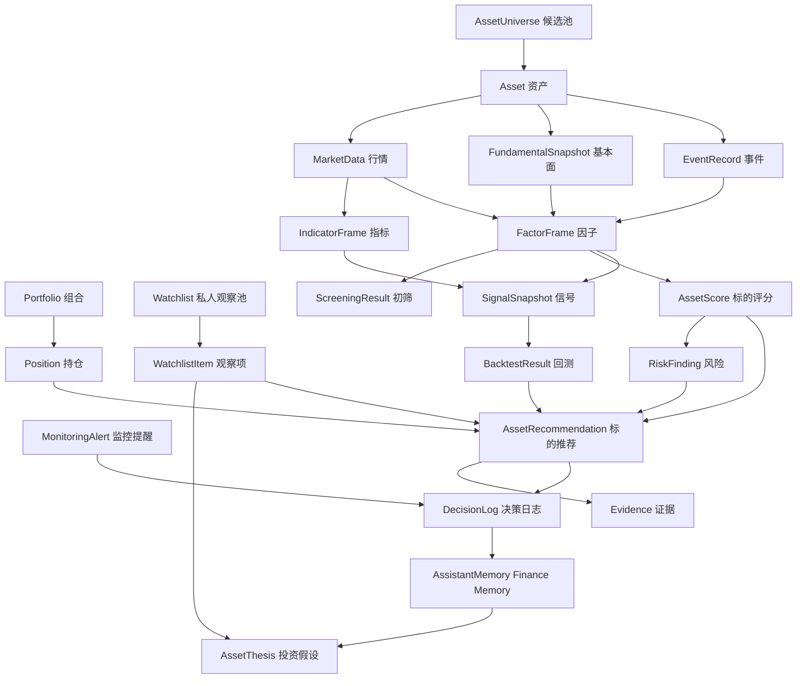

# 金融领域模型与协议设计

本文档面向两个读者：

- 给用户看的解释：你不需要懂金融术语，也能理解系统为什么这样判断。
- 给工程实现看的协议：后续可直接转成 Pydantic 模型、数据库表、CLI JSON 输出和 Dashboard 数据接口。

核心原则：

- 任何结论都必须可追溯。
- 任何数据都必须有时间戳和可用性状态。
- Agent 不能凭空打分，分数来自规则、指标、回测或明确证据。
- 标的推荐和下单必须分离，第一版不把订单草案作为主链路。
- 候选池、因子计算、初筛和评分由确定性服务完成，Agent 只负责解释、比较、反驳和综合。
- 系统目标升级为私人金融助手，推荐只是核心引擎之一；持仓监控、私人观察池、提醒、决策日志和长期记忆都必须进入协议。
- 上层主 Agent 可以管理观察池、提醒、记忆和 Workflow 调度，但不能绕过数据层、评分层和风控层直接给强买卖结论。
- 所有操作建议都必须能写入 `DecisionLog`，并能追溯到触发条件、证据、风险和用户反馈。
- 记忆协议只定义金融业务记忆，也就是 Finance Memory；Hermes-agent 自带的通用记忆只作为上层 Agent 的辅助上下文，不作为金融事实源。
- 对金融小白，所有专业结论都要配一段中文解释。

## 1. 协议总览

系统内部最重要的对象关系如下：



你可以把它理解成：

- **数据** 是原材料。
- **指标** 是计算结果。
- **因子** 是把行情、财务、估值、资金流、衍生品和事件转换成可比较的推荐特征。
- **评分** 是透明规则计算出来的排序依据。
- **信号** 是系统看懂市场后的结构化判断。
- **风险** 是提醒哪里可能亏钱。
- **标的推荐** 是系统建议关注哪些股票或币种、为什么、什么时候再考虑。
- **组合和持仓** 是主 Agent 监控用户当前风险和换股机会的基础。
- **私人观察池** 是主 Agent 长期维护的潜力标的清单，不等同于上游候选池。
- **决策日志和金融业务记忆** 记录为什么建议、用户是否采纳、后续复盘如何评价；它们增强 Hermes-agent 通用记忆，但不替代它。
- **证据** 是每条结论背后的出处。

## 2. 通用枚举

### 2.1 市场类型

```text
ashare        A 股
crypto_spot   数字货币现货
crypto_future 数字货币合约
fund          基金，后续预留
cash          现金
```

### 2.2 数据状态

```text
available    完整可用
partial      部分可用
unavailable  不可用
stale        过期
error        获取或计算失败
```

### 2.3 时间周期

```text
intraday     日内
swing        波段
mid_term     中期
long_term    长期
```

### 2.4 方向

```text
bullish      偏多，看涨
bearish      偏空，看跌
neutral      中性
mixed        多空冲突
unknown      无法判断
```

### 2.5 严重程度

```text
info         提示
low          低
medium       中
high         高
critical     极高
```

## 3. 金融领域模型

### 3.1 Asset：资产

资产是系统分析的最小对象。股票、BTC、ETH、现金都可以是资产。

关键字段：

```json
{
  "asset_id": "ashare:600519",
  "symbol": "600519",
  "name": "贵州茅台",
  "market": "ashare",
  "exchange": "SSE",
  "currency": "CNY",
  "sector": "食品饮料",
  "tradable": true,
  "status": "available"
}
```

字段说明：

- `asset_id`：系统内部唯一 ID，避免不同市场代码冲突。
- `symbol`：交易代码。
- `name`：展示名称。
- `market`：资产属于哪个市场。
- `exchange`：交易所。
- `currency`：计价货币。
- `sector`：行业或板块。
- `tradable`：当前是否可交易。
- `status`：数据是否可用。

### 3.2 AssetUniverse：候选池

候选池是推荐的起点，描述本次从哪些股票或币种里挑选。它是上游输入范围，不是 Agent 分析后的推荐结论。Agent 分析之后输出的是推荐榜、观察池和回避池。

候选池可以来自单一来源，也可以由多个种子源合并生成：

- 全 A、指数成分、行业/概念成分。
- 自选股、自选币种、Binance 现货或合约交易对。
- 资金流榜单、热度榜、涨停池、盘口异动等观察型种子源。
- 风险排除源只负责剔除或降级，例如停牌、退市整理、ST、成交额不足、数据缺失。

```json
{
  "universe_id": "universe:hs300:20260511",
  "name": "沪深300",
  "source": "akshare:index_components",
  "market": "ashare",
  "strategy_context": "balanced_growth",
  "symbols": ["600519", "300750", "002594"],
  "filters": [
    {
      "rule": "exclude_st",
      "description": "剔除 ST 股票",
      "removed_count": 0
    },
    {
      "rule": "min_turnover",
      "description": "近 20 日日均成交额不低于 1 亿元",
      "removed_count": 12
    }
  ],
  "total_before_filter": 300,
  "total_after_filter": 288,
  "status": "available",
  "as_of": "2026-05-11T15:00:00+08:00"
}
```

数字货币候选池示例：

```json
{
  "universe_id": "universe:binance_spot_top:20260511",
  "name": "Binance 现货成交额 Top",
  "source": "binance:spot_markets",
  "market": "crypto_spot",
  "strategy_context": "crypto_swing",
  "symbols": ["BTCUSDT", "ETHUSDT", "SOLUSDT"],
  "filters": [
    {
      "rule": "min_quote_volume",
      "description": "近 24 小时成交额不低于 5000 万 USDT",
      "removed_count": 42
    },
    {
      "rule": "tradable_status",
      "description": "剔除暂停交易或数据不可用交易对",
      "removed_count": 3
    }
  ],
  "total_before_filter": 380,
  "total_after_filter": 335,
  "status": "available",
  "as_of": "2026-05-11T15:00:00+08:00"
}
```

字段说明：

- `universe_id`：本次候选池唯一 ID。
- `source`：候选池来源，例如全 A、沪深 300、中证 500、行业/概念成分、自选池、资金流榜单、热度榜、Binance 现货池、Binance 合约池。
- `strategy_context`：本次推荐策略场景。
- `filters`：候选池构建时已经执行的基础过滤规则。
- `total_before_filter` 和 `total_after_filter`：用于解释为什么候选范围变小。

### 3.3 AccountSnapshot：账户快照

账户快照描述某个时间点你的账户是什么样。

```json
{
  "account_id": "binance_main",
  "account_type": "crypto_future",
  "base_currency": "USDT",
  "as_of": "2026-05-11T15:00:00+08:00",
  "equity": 10000.0,
  "cash": 2800.0,
  "margin_used": 1200.0,
  "unrealized_pnl": -85.5,
  "status": "available"
}
```

字段说明：

- `equity`：账户总权益。
- `cash`：可用现金或可用保证金。
- `margin_used`：合约已占用保证金。
- `unrealized_pnl`：未实现盈亏。
- `as_of`：快照时间。

### 3.4 Position：持仓

持仓描述你现在持有什么、持有多少、盈亏如何。

```json
{
  "position_id": "binance_main:BTCUSDT:future",
  "account_id": "binance_main",
  "asset_id": "crypto_future:BTCUSDT",
  "symbol": "BTCUSDT",
  "side": "long",
  "quantity": 0.05,
  "avg_cost": 62000.0,
  "last_price": 64000.0,
  "market_value": 3200.0,
  "unrealized_pnl": 100.0,
  "unrealized_pnl_pct": 0.0323,
  "portfolio_weight": 0.32,
  "leverage": 2.0,
  "liquidation_price": 43000.0,
  "as_of": "2026-05-11T15:00:00+08:00"
}
```

小白解释：

- `avg_cost` 是你的平均买入成本。
- `last_price` 是当前价格。
- `market_value` 是这笔持仓现在值多少钱。
- `portfolio_weight` 是它占你总资产的比例。
- `liquidation_price` 只对合约重要，表示爆仓价格附近。

### 3.5 Portfolio：组合

组合是私人金融助手监控的对象，可以来自本地 CSV、手工录入、交易所只读 API 或后续券商接口。

```json
{
  "portfolio_id": "portfolio:main",
  "owner_id": "local_user",
  "name": "主账户",
  "base_currency": "CNY",
  "risk_profile": "balanced_growth",
  "total_equity": 120000.0,
  "cash": 20000.0,
  "market_value": 100000.0,
  "max_position_weight": 0.30,
  "max_drawdown_alert": 0.08,
  "status": "available",
  "as_of": "2026-05-11T15:00:00+08:00"
}
```

字段说明：

- `risk_profile`：用户风险画像，影响提醒阈值、仓位建议和风险反驳强度。
- `max_position_weight`：单一资产建议上限。
- `max_drawdown_alert`：组合回撤提醒阈值。
- `status`：组合数据可用性，不可用时不能生成强操作建议。

### 3.6 Watchlist：私人观察池

私人观察池由主 Agent 长期维护，用于持续观察“有潜力但还没到操作时机”的股票或币种。它不是 `AssetUniverse`，后者是一次推荐运行的上游输入范围。

```json
{
  "watchlist_id": "watchlist:default",
  "owner_id": "local_user",
  "name": "默认观察池",
  "market": "ashare",
  "purpose": "swing_candidate",
  "status": "active",
  "created_at": "2026-05-11T15:00:00+08:00"
}
```

`WatchlistItem` 示例：

```json
{
  "watchlist_item_id": "watch:default:ashare:600519",
  "watchlist_id": "watchlist:default",
  "asset_id": "ashare:600519",
  "symbol": "600519",
  "source_recommendation_id": "asset_rec:600519:swing:20260511",
  "reason": "基本面质量高，等待估值和技术面更好的买点。",
  "watch_conditions": ["放量站上 60 日均线", "估值分位回落"],
  "trigger_conditions": ["资金流连续 5 日转正", "技术信号转为 bullish"],
  "invalid_conditions": ["财报明显恶化", "跌破长期支撑位"],
  "risk_level": "medium",
  "status": "active",
  "next_review_at": "2026-05-12T18:00:00+08:00",
  "created_at": "2026-05-11T15:00:00+08:00"
}
```

### 3.7 AssetThesis：投资假设

投资假设记录“为什么关注、为什么买入、为什么减仓、为什么移除”。后续复盘时不能只看盈亏，还要看当时假设是否成立。

```json
{
  "thesis_id": "thesis:ashare:600519:20260511",
  "asset_id": "ashare:600519",
  "source_type": "watchlist",
  "source_id": "watch:default:ashare:600519",
  "thesis": "公司基本面稳定，但当前估值不低，适合等待回调或趋势突破后再考虑。",
  "supporting_points": ["ROE 较高", "现金流稳定"],
  "risk_points": ["估值分位偏高", "消费板块弹性有限"],
  "invalid_if": ["盈利能力明显下滑", "重大负面事件"],
  "status": "active",
  "created_at": "2026-05-11T15:00:00+08:00"
}
```

### 3.8 MonitoringAlert：监控提醒

监控提醒记录某个触发条件被命中，后续主 Agent 会据此决定是否调用底层 Workflow。

```json
{
  "alert_id": "alert:portfolio:drawdown:20260511",
  "owner_id": "local_user",
  "asset_id": "crypto_spot:BTCUSDT",
  "alert_type": "drawdown",
  "severity": "high",
  "triggered_by": "price_change",
  "trigger_condition": "日内跌幅超过 5%",
  "current_value": -0.057,
  "threshold_value": -0.05,
  "status": "triggered",
  "as_of": "2026-05-11T15:00:00+08:00"
}
```

### 3.9 DecisionLog：决策日志

决策日志记录系统给过什么建议、用户是否采纳、后续如何复盘。它是 Finance Memory 和可信复盘的入口，也是金融建议审计链路的核心记录。

```json
{
  "decision_id": "decision:20260511:001",
  "owner_id": "local_user",
  "asset_id": "ashare:600519",
  "decision_type": "watch",
  "source_recommendation_id": "asset_rec:600519:swing:20260511",
  "source_alert_id": null,
  "suggested_action": "watch",
  "user_action": "accepted",
  "summary": "建议加入观察池，等待估值回落或技术突破。",
  "reason_ids": ["thesis:ashare:600519:20260511"],
  "risk_ids": ["risk:600519:valuation:20260511"],
  "evidence_ids": ["ev:akshare:daily:600519:20260511"],
  "created_at": "2026-05-11T15:00:00+08:00"
}
```

### 3.10 AssistantMemory：金融业务长期记忆

`AssistantMemory` 表示 Finance Memory，只记录用户偏好、历史建议、复盘教训和观察理由，不保存唯一事实数据。事实仍以数据库基础表和证据表为准。Hermes-agent 自带记忆负责通用对话、任务偏好和工具使用习惯，不写入这个协议对象。

```json
{
  "memory_id": "memory:user:risk_preference:001",
  "owner_id": "local_user",
  "memory_type": "preference",
  "scope": "user",
  "asset_id": null,
  "content": "用户偏好平衡成长，不希望单一资产超过 30%。",
  "source_decision_id": "decision:20260511:001",
  "confidence": 0.8,
  "status": "active",
  "created_at": "2026-05-11T15:00:00+08:00"
}
```

### 3.11 MemoryEmbedding：记忆向量索引

`MemoryEmbedding` 用于从历史建议、复盘和观察理由中找相似场景。它只是召回索引，不是事实源。

```json
{
  "embedding_id": "mem_emb:001",
  "memory_id": "memory:user:risk_preference:001",
  "source_type": "memory",
  "source_id": "memory:user:risk_preference:001",
  "chunk_text": "用户偏好平衡成长，不希望单一资产超过 30%。",
  "embedding_model": "text-embedding-model",
  "created_at": "2026-05-11T15:00:00+08:00"
}
```

### 3.12 FinancialMemoryEdge：金融记忆关系边

`FinancialMemoryEdge` 是第一阶段的轻量图谱协议，用关系数据库边表表达关系，后续可迁移到专业图数据库。

```json
{
  "edge_id": "mem_edge:001",
  "owner_id": "local_user",
  "source_type": "decision",
  "source_id": "decision:20260511:001",
  "relation_type": "derived_from",
  "target_type": "asset_thesis",
  "target_id": "thesis:ashare:600519:20260511",
  "confidence": 0.9,
  "reason": "本次观察建议来自该投资假设。"
}
```

第一阶段允许的关系类型包括：`derived_from`、`supports`、`contradicts`、`reviewed_by`、`replaces`、`applies_to`、`triggered_by`、`mentions`、`invalidated_by`。

### 3.13 ReviewTask：复盘任务

复盘任务用于提醒系统在未来检查某条建议是否有效。

```json
{
  "review_task_id": "review:600519:20260518",
  "owner_id": "local_user",
  "asset_id": "ashare:600519",
  "source_decision_id": "decision:20260511:001",
  "review_type": "watchlist_followup",
  "due_at": "2026-05-18T18:00:00+08:00",
  "status": "pending",
  "review_questions": [
    "估值是否回落？",
    "资金流是否连续转正？",
    "观察理由是否仍成立？"
  ]
}
```

### 3.14 MarketData：标准行情

标准行情统一股票和数字货币的 K 线数据。

```json
{
  "asset_id": "crypto_spot:BTCUSDT",
  "symbol": "BTCUSDT",
  "market": "crypto_spot",
  "timeframe": "1d",
  "bars": [
    {
      "timestamp": "2026-05-10T00:00:00+08:00",
      "open": 62000.0,
      "high": 65000.0,
      "low": 61000.0,
      "close": 64000.0,
      "volume": 12345.6
    }
  ],
  "source": "binance",
  "status": "available",
  "as_of": "2026-05-11T15:00:00+08:00"
}
```

### 3.15 FundamentalSnapshot：基本面快照

主要用于 A 股，描述公司估值、财务质量、成长性。

```json
{
  "asset_id": "ashare:600519",
  "report_period": "2026Q1",
  "pe_ttm": 28.5,
  "pb": 8.2,
  "roe": 0.31,
  "revenue_growth_yoy": 0.14,
  "net_profit_growth_yoy": 0.16,
  "debt_to_asset": 0.22,
  "operating_cashflow": 12000000000,
  "source": "akshare",
  "status": "partial",
  "missing_fields": ["free_cashflow"],
  "as_of": "2026-05-11T15:00:00+08:00"
}
```

小白解释：

- `pe_ttm`：估值高低的常用指标。
- `roe`：公司赚钱效率。
- `growth_yoy`：同比增长。
- `debt_to_asset`：负债水平。
- `status=partial` 表示有些字段缺失，但还能分析。

### 3.16 EventRecord：事件

事件包括新闻、公告、监管、链上、社交舆情。

```json
{
  "event_id": "news:20260511:001",
  "asset_id": "ashare:600519",
  "event_type": "announcement",
  "title": "公司发布一季度报告",
  "summary": "营收和利润同比增长，现金流保持稳定。",
  "sentiment": "positive",
  "importance": "medium",
  "source": "exchange_announcement",
  "url": "https://example.com/report",
  "published_at": "2026-05-11T09:00:00+08:00",
  "collected_at": "2026-05-11T15:00:00+08:00"
}
```

## 4. 指标与特征协议

### 4.1 IndicatorFrame：指标结果

指标是成熟库算出来的技术分析结果，例如 RSI、MACD、ATR。

```json
{
  "indicator_frame_id": "ind:BTCUSDT:1d:20260511",
  "asset_id": "crypto_spot:BTCUSDT",
  "timeframe": "1d",
  "library": "talib",
  "library_version": "0.6.8",
  "input_window": {
    "start": "2025-11-11T00:00:00+08:00",
    "end": "2026-05-11T00:00:00+08:00",
    "bar_count": 182
  },
  "values": {
    "rsi_14": 63.2,
    "macd": 820.5,
    "macd_signal": 760.1,
    "macd_hist": 60.4,
    "atr_14": 2100.0,
    "bb_percent_b": 0.72
  },
  "status": "available",
  "as_of": "2026-05-11T15:00:00+08:00"
}
```

设计重点：

- `library` 必须记录，第一版技术指标固定为 `talib`，后续如引入备用实现也能追溯来源。
- `input_window` 必须记录，因为不同窗口会导致结果不同。
- 指标只负责“算数值”，不直接说买卖。

### 4.2 FactorFrame：推荐因子结果

因子是 A 股和数字货币推荐的核心输入。它把行情、财务、估值、资金流、衍生品和事件数据转换成可比较、可排序的结构化数值。

```json
{
  "factor_frame_id": "factor:600519:swing:20260511",
  "asset_id": "ashare:600519",
  "symbol": "600519",
  "horizon": "swing",
  "factor_groups": [
    {
      "group": "fundamental",
      "status": "available",
      "score": 82,
      "factors": {
        "roe_ttm": 0.31,
        "revenue_growth_yoy": 0.14,
        "net_profit_growth_yoy": 0.16,
        "operating_cashflow_quality": 86
      },
      "summary": "盈利能力和现金流质量较好。"
    },
    {
      "group": "valuation",
      "status": "partial",
      "score": 61,
      "factors": {
        "pe_ttm_percentile_3y": 0.62,
        "pb_percentile_3y": 0.68
      },
      "missing_factors": ["industry_relative_ev_ebitda"],
      "summary": "估值不便宜，但未达到极端高估。"
    },
    {
      "group": "technical",
      "status": "available",
      "score": 58,
      "factors": {
        "trend_60d": 54,
        "rsi_14": 49.8,
        "macd_state": "neutral",
        "volume_momentum_20d": 57
      },
      "summary": "技术面中性，暂未出现明确突破。"
    },
    {
      "group": "capital_flow",
      "status": "available",
      "score": 55,
      "factors": {
        "main_net_inflow_5d": 120000000,
        "turnover_rank": 0.74
      },
      "summary": "资金流略偏正，但强度一般。"
    },
    {
      "group": "event",
      "status": "partial",
      "score": 50,
      "factors": {
        "news_sentiment_score": 52,
        "announcement_importance": "low"
      },
      "summary": "暂无强事件驱动。"
    }
  ],
  "source_ids": [
    "market:600519:1d:20260511",
    "fundamental:600519:2026Q1",
    "event:news:20260511:001"
  ],
  "status": "partial",
  "as_of": "2026-05-11T15:00:00+08:00"
}
```

数字货币因子示例：

```json
{
  "factor_frame_id": "factor:BTCUSDT:swing:20260511",
  "asset_id": "crypto_spot:BTCUSDT",
  "symbol": "BTCUSDT",
  "horizon": "swing",
  "factor_groups": [
    {
      "group": "technical",
      "status": "available",
      "score": 76,
      "factors": {
        "trend_30d": 81,
        "rsi_14": 63.2,
        "macd_state": "bullish",
        "atr_percentile_90d": 0.72
      },
      "summary": "趋势和动量偏强，但波动率处于偏高区域。"
    },
    {
      "group": "derivatives",
      "status": "available",
      "score": 58,
      "factors": {
        "funding_rate_zscore": 1.1,
        "open_interest_change_24h": 0.08,
        "long_short_ratio": 1.42
      },
      "summary": "衍生品略偏拥挤，但未达到极端风险阈值。"
    },
    {
      "group": "liquidity",
      "status": "available",
      "score": 88,
      "factors": {
        "quote_volume_24h": 32000000000,
        "spread_score": 92
      },
      "summary": "流动性充足，适合进入候选池。"
    },
    {
      "group": "event",
      "status": "partial",
      "score": 54,
      "factors": {
        "news_sentiment_score": 56
      },
      "summary": "暂无明确重大利空，新闻样本仍需补充。"
    }
  ],
  "source_ids": [
    "market:BTCUSDT:1d:20260511",
    "derivatives:BTCUSDT:funding:20260511"
  ],
  "status": "partial",
  "as_of": "2026-05-11T15:00:00+08:00"
}
```

设计重点：

- A 股因子分组优先使用 `fundamental`、`valuation`、`technical`、`capital_flow`、`event`。
- 数字货币因子分组优先使用 `technical`、`derivatives`、`liquidity`、`event`，后续可扩展 `onchain`。
- 每个分组都必须有 `status`，缺失不能静默跳过。
- 因子分数由规则和计算服务生成，Agent 不直接改分。
- `source_ids` 必须能追溯到原始数据、指标或事件。

### 4.3 ScreeningResult：初筛结果

初筛结果记录一只股票或币种为什么进入或退出候选池。

```json
{
  "screening_id": "screen:hs300:balanced_growth:20260511",
  "universe_id": "universe:hs300:20260511",
  "strategy": "balanced_growth",
  "passed_symbols": ["600519", "002594"],
  "removed": [
    {
      "symbol": "300750",
      "reasons": ["近 20 日日均波动率超过策略阈值", "短期跌破 60 日均线"],
      "severity": "medium"
    }
  ],
  "rules": ["exclude_st", "min_turnover", "data_quality", "volatility_guard"],
  "status": "available",
  "as_of": "2026-05-11T15:00:00+08:00"
}
```

初筛规则只做硬过滤，不写推荐理由。推荐理由由后续评分和 Agent 分析生成。

### 4.4 AssetScore：标的综合评分

标的评分用于排序候选股票和币种。它必须可解释，不能只给一个黑盒分数。

```json
{
  "score_id": "score:600519:swing:20260511",
  "asset_id": "ashare:600519",
  "symbol": "600519",
  "horizon": "swing",
  "total_score": 74,
  "rank": 3,
  "rank_in_universe": 288,
  "score_groups": [
    {
      "group": "fundamental",
      "score": 82,
      "weight": 0.3,
      "contribution": 24.6
    },
    {
      "group": "valuation",
      "score": 61,
      "weight": 0.2,
      "contribution": 12.2
    },
    {
      "group": "technical",
      "score": 58,
      "weight": 0.25,
      "contribution": 14.5
    },
    {
      "group": "capital_flow",
      "score": 55,
      "weight": 0.15,
      "contribution": 8.25
    },
    {
      "group": "event",
      "score": 50,
      "weight": 0.1,
      "contribution": 5
    }
  ],
  "confidence": 0.68,
  "missing_penalty": 4,
  "rule_version": "asset_score_v1.0.0",
  "factor_frame_id": "factor:600519:swing:20260511",
  "status": "partial",
  "as_of": "2026-05-11T15:00:00+08:00"
}
```

设计重点：

- `total_score` 用于排序，但最终推荐必须结合风险和解释。
- `score_groups` 必须展示权重和贡献。
- 数据缺失要进入 `missing_penalty`，不能让缺数据标的虚高。
- `confidence` 反映数据完整度、信号一致性和回测支持程度。

### 4.5 FeatureFrame：特征结果

特征比指标更广，它可以来自技术指标、基本面、资金流、新闻、链上数据。

```json
{
  "feature_frame_id": "feat:600519:20260511",
  "asset_id": "ashare:600519",
  "horizon": "mid_term",
  "features": {
    "valuation_percentile": 0.62,
    "roe_rank_in_industry": 0.91,
    "revenue_growth_score": 78,
    "money_flow_score": 55,
    "news_sentiment_score": 68
  },
  "source_ids": [
    "fundamental:600519:2026Q1",
    "event:news:20260511:001"
  ],
  "status": "partial",
  "missing_features": ["free_cashflow_score"],
  "as_of": "2026-05-11T15:00:00+08:00"
}
```

设计重点：

- 特征是信号的输入。
- 特征可以缺失，但必须记录缺什么。
- 不同市场可以有不同特征，但输出结构统一。

## 5. 信号协议

### 5.1 SignalSnapshot：信号快照

信号是系统对某个资产在某个周期上的结构化判断。它不是最终推荐，而是推荐的证据之一。

```json
{
  "signal_id": "sig:BTCUSDT:swing:20260511",
  "asset_id": "crypto_spot:BTCUSDT",
  "symbol": "BTCUSDT",
  "market": "crypto_spot",
  "horizon": "swing",
  "status": "available",
  "direction": "bullish",
  "score": 72,
  "confidence": 0.68,
  "signal_groups": [
    {
      "group": "technical",
      "direction": "bullish",
      "score": 76,
      "weight": 0.4,
      "summary": "趋势和动量偏强，RSI 未进入极端过热区。"
    },
    {
      "group": "derivatives",
      "direction": "neutral",
      "score": 56,
      "weight": 0.25,
      "summary": "资金费率略高，但未达到拥挤阈值。"
    },
    {
      "group": "event",
      "direction": "neutral",
      "score": 50,
      "weight": 0.15,
      "summary": "未发现明显重大利好或利空事件。"
    },
    {
      "group": "portfolio",
      "direction": "bearish",
      "score": 38,
      "weight": 0.2,
      "summary": "当前持仓占比偏高，继续加仓会增加组合波动。"
    }
  ],
  "inputs": [
    "indicator_frame_id:ind:BTCUSDT:1d:20260511",
    "feature_frame_id:feat:BTCUSDT:20260511"
  ],
  "rule_version": "signal_rules_v1.0.0",
  "explanation": "BTCUSDT 波段信号偏多，但组合层面提示仓位已经偏高。",
  "evidence_ids": ["ev:binance:kline:BTCUSDT:20260511"],
  "as_of": "2026-05-11T15:00:00+08:00"
}
```

### 5.2 信号分数含义

统一采用 0 到 100 分：

```text
0-20    强烈偏空
21-40   偏空
41-60   中性或不明确
61-80   偏多
81-100  强烈偏多
```

小白解释：

- 分数高不等于一定会涨。
- 分数低不等于一定会跌。
- 分数表示“当前证据偏向哪一边”。
- 是否买卖还要结合风险、仓位、回测和用户目标。

### 5.3 置信度含义

`confidence` 取值 0 到 1：

```text
0.00-0.30  证据弱，不建议依赖
0.31-0.60  证据一般，需要谨慎
0.61-0.80  证据较充分
0.81-1.00  证据充分，但仍不代表确定
```

置信度来自：

- 数据完整度。
- 数据新鲜度。
- 多个信号是否一致。
- 历史回测是否支持。
- 是否有重大缺失数据。

### 5.4 信号组

第一版固定这些信号组：

```text
technical       技术面
fundamental     基本面，主要用于 A 股
derivatives     合约衍生品，主要用于数字货币合约
event           新闻、公告、监管、链上事件
portfolio       组合与持仓风险
backtest        回测验证
```

不同市场权重不同：

A 股中长期示例：

```json
{
  "technical": 0.25,
  "fundamental": 0.35,
  "event": 0.15,
  "portfolio": 0.15,
  "backtest": 0.10
}
```

数字货币波段示例：

```json
{
  "technical": 0.35,
  "derivatives": 0.25,
  "event": 0.15,
  "portfolio": 0.15,
  "backtest": 0.10
}
```

### 5.5 信号降级规则

信号必须允许降级，而不是失败就没有结果。

```text
available
  数据完整，信号可正常使用。

partial
  部分数据缺失，但仍能给出有限判断。

stale
  数据过期，只能参考，不能作为强推荐依据。

unavailable
  缺少关键数据，不能生成有效信号。

error
  计算失败，需要展示错误原因。
```

例子：

- A 股财务数据缺失，但行情可用：技术信号 `available`，基本面信号 `partial`。
- Binance 资金费率接口失败：技术信号 `available`，衍生品信号 `unavailable`。
- 新闻源失败：事件信号 `unavailable`，推荐必须提示“未纳入新闻事件”。

## 6. 风控协议

### 6.1 RiskFinding：风险发现

风险发现描述“哪里可能亏钱、为什么、严重程度如何”。

```json
{
  "risk_id": "risk:portfolio:concentration:20260511",
  "scope": "portfolio",
  "asset_id": "crypto_spot:BTCUSDT",
  "risk_type": "concentration",
  "severity": "high",
  "score": 82,
  "title": "BTC 持仓占比偏高",
  "description": "BTC 当前占组合权益 42%，超过平衡成长画像建议上限 30%。",
  "metrics": {
    "current_weight": 0.42,
    "suggested_max_weight": 0.30
  },
  "possible_loss_scenario": "如果 BTC 回撤 15%，组合可能损失约 6.3%。",
  "suggested_actions": ["不要继续加仓", "考虑分批降低至 30% 以下"],
  "evidence_ids": ["ev:account:binance_main:20260511"],
  "as_of": "2026-05-11T15:00:00+08:00"
}
```

### 6.2 风险类型

```text
concentration       持仓过度集中
drawdown            回撤风险
volatility          波动风险
liquidity           流动性风险
leverage            杠杆风险
liquidation         爆仓风险
valuation           估值过高
fundamental         基本面恶化
event               新闻或监管事件风险
correlation         资产相关性过高
data_quality        数据质量风险
execution           下单执行风险
```

### 6.3 风险分数含义

```text
0-20    很低
21-40   低
41-60   中
61-80   高
81-100  极高
```

风险分数不是亏损概率，而是提醒级别。高风险不代表一定会亏，但代表一旦出问题，影响可能很大。

## 7. 推荐协议

### 7.1 AssetRecommendation：标的推荐建议

标的推荐是第一版给用户看的核心结论。它必须同时支持 A 股和数字货币，引用评分、信号、风险、证据和 Agent 分析摘要。

```json
{
  "recommendation_id": "asset_rec:600519:swing:20260511",
  "asset_id": "ashare:600519",
  "symbol": "600519",
  "name": "贵州茅台",
  "market": "ashare",
  "horizon": "swing",
  "action": "watch",
  "rank": 3,
  "total_score": 74,
  "conviction": "medium",
  "confidence": 0.68,
  "summary": "基本面质量较高，但估值和短期技术位置不算便宜，建议先放入观察池，等待更好的买点。",
  "score_id": "score:600519:swing:20260511",
  "factor_frame_id": "factor:600519:swing:20260511",
  "signal_ids": ["sig:600519:swing:20260511"],
  "risk_ids": ["risk:600519:valuation:20260511"],
  "evidence_ids": [
    "ev:akshare:daily:600519:20260511",
    "ev:akshare:fundamental:600519:2026Q1"
  ],
  "reasons": [
    "盈利能力和现金流质量较好，基本面分组得分较高。",
    "行业龙头属性稳定，财务数据没有显示明显恶化。",
    "技术面没有破位，但也没有出现强突破。"
  ],
  "risk_rebuttals": [
    "估值分位不低，追高的性价比一般。",
    "消费板块短期弹性有限，如果市场风格切换，可能跑输高弹性行业。"
  ],
  "watch_conditions": [
    "估值分位回落到近三年 50% 以下。",
    "股价放量站上 60 日均线并维持 3 个交易日。",
    "资金流连续 5 日转正。"
  ],
  "invalid_if": [
    "财报显示盈利能力明显下滑。",
    "放量跌破关键支撑位。",
    "出现重大负面监管或食品安全事件。"
  ],
  "missing_data": ["行业 EV/EBITDA 可比估值"],
  "created_at": "2026-05-11T15:00:00+08:00"
}
```

字段说明：

- `rank`：本次推荐榜排名。
- `total_score`：确定性评分服务生成的综合分。
- `action`：推荐动作，第一版主要是候选买入、观察、等待回调、等待突破、回避。
- `risk_rebuttals`：风险反驳 Agent 必须输出的反方观点。
- `watch_conditions`：用户下一步观察什么，不让推荐停留在“可以买/不能买”的空话。
- `invalid_if`：哪些情况发生后，本条推荐失效。

数字货币推荐示例：

```json
{
  "recommendation_id": "asset_rec:BTCUSDT:swing:20260511",
  "asset_id": "crypto_spot:BTCUSDT",
  "symbol": "BTCUSDT",
  "name": "Bitcoin / USDT",
  "market": "crypto_spot",
  "horizon": "swing",
  "action": "watch",
  "rank": 2,
  "total_score": 72,
  "conviction": "medium",
  "confidence": 0.66,
  "summary": "BTC 趋势和流动性较强，但波动率和合约拥挤度偏高，适合观察回调后的机会，不建议盲目追高。",
  "score_id": "score:BTCUSDT:swing:20260511",
  "factor_frame_id": "factor:BTCUSDT:swing:20260511",
  "signal_ids": ["sig:BTCUSDT:swing:20260511"],
  "risk_ids": ["risk:BTCUSDT:derivatives_crowding:20260511"],
  "evidence_ids": [
    "ev:binance:kline:BTCUSDT:20260511",
    "ev:binance:funding:BTCUSDT:20260511"
  ],
  "reasons": [
    "趋势和动量仍然偏强。",
    "24 小时成交额和盘口流动性充足。",
    "未平仓量上升，说明市场关注度较高。"
  ],
  "risk_rebuttals": [
    "资金费率偏高时追多成本会上升。",
    "如果未平仓量继续上升但价格不涨，可能出现多头拥挤。"
  ],
  "watch_conditions": [
    "价格回踩关键均线后企稳。",
    "资金费率回落到中性区间。",
    "未平仓量不再快速上升。"
  ],
  "invalid_if": [
    "放量跌破关键支撑位。",
    "资金费率和多空比同时进入极端拥挤区。",
    "交易所或监管出现重大负面事件。"
  ],
  "missing_data": ["链上活跃地址数据"],
  "created_at": "2026-05-11T15:00:00+08:00"
}
```

### 7.2 RecommendationRank：推荐排序结果

推荐排序结果是一次 A 股或数字货币推荐运行的总输出。

```json
{
  "rank_id": "rank:hs300:balanced_growth:20260511",
  "universe_id": "universe:hs300:20260511",
  "strategy": "balanced_growth",
  "horizon": "swing",
  "top_recommendations": ["asset_rec:002594:swing:20260511", "asset_rec:600519:swing:20260511"],
  "watchlist": ["asset_rec:600519:swing:20260511"],
  "avoidlist": ["asset_rec:300750:swing:20260511"],
  "summary": "本次从沪深300中筛出 18 只候选股，推荐优先关注低估值修复和资金流改善的标的。",
  "risk_summary": "推荐名单在新能源和消费行业暴露较高，需避免一次性集中买入。",
  "as_of": "2026-05-11T15:00:00+08:00"
}
```

### 7.3 Recommendation：通用推荐建议

通用推荐用于后续持仓分析和多资产扩展。第一版 A 股和数字货币推荐优先使用 `AssetRecommendation`。

```json
{
  "recommendation_id": "rec:BTCUSDT:swing:20260511",
  "asset_id": "crypto_spot:BTCUSDT",
  "symbol": "BTCUSDT",
  "market": "crypto_spot",
  "horizon": "swing",
  "action": "hold",
  "conviction": "medium",
  "confidence": 0.64,
  "target_position": {
    "mode": "portfolio_weight",
    "current_weight": 0.42,
    "suggested_weight": 0.30,
    "min_weight": 0.25,
    "max_weight": 0.35
  },
  "summary": "BTC 波段信号偏多，但当前持仓已经偏高，建议暂时持有，不继续加仓。",
  "reasons": [
    "技术信号偏多，趋势和动量仍然较强。",
    "资金费率略高，说明多头交易开始拥挤。",
    "组合风险提示 BTC 占比已经超过建议上限。"
  ],
  "counter_arguments": [
    "如果宏观风险上升，BTC 可能快速回撤。",
    "如果资金费率继续上升，追多风险会加大。"
  ],
  "risk_ids": ["risk:portfolio:concentration:20260511"],
  "signal_ids": ["sig:BTCUSDT:swing:20260511"],
  "evidence_ids": ["ev:binance:kline:BTCUSDT:20260511"],
  "missing_data": [],
  "invalid_if": [
    "BTC 跌破关键支撑位并放量下跌。",
    "资金费率持续异常升高。",
    "组合总回撤超过用户设定阈值。"
  ],
  "created_at": "2026-05-11T15:00:00+08:00"
}
```

### 7.4 推荐动作

```text
buy_candidate  可考虑买入，但还不是立即下单
add            可考虑加仓
hold           继续持有
reduce         可考虑减仓
sell_candidate 可考虑卖出，但还需要用户确认
swap_candidate 可考虑换股或换币，即用候选池中更优标的替换当前持仓
avoid          规避，不建议碰
watch          观察，暂不行动
wait_for_pullback 等待回调后再考虑
wait_for_breakout 等待突破确认后再考虑
```

小白解释：

- `buy_candidate`：进入候选池，等价格、风险和仓位合适再说。
- `add`：已有或准备建立仓位，可以考虑增加。
- `hold`：不用动。
- `reduce`：风险或仓位偏高，考虑降低。
- `sell_candidate`：系统建议卖出候选，但不能自动下单。
- `swap_candidate`：当前持仓相对候选标的吸引力下降，建议做换股/换币比较。
- `avoid`：不建议买。
- `watch`：信息不够或时机不明确，先观察。

### 7.5 信念等级

```text
low       低，把它当观察意见
medium    中，可以认真考虑，但要看风险
high      高，证据较一致，但仍需确认
```

### 7.6 仓位建议

仓位建议不能只说“买一点”，必须结构化。

```json
{
  "mode": "portfolio_weight",
  "current_weight": 0.10,
  "suggested_weight": 0.15,
  "min_weight": 0.10,
  "max_weight": 0.18,
  "rebalance_style": "batch",
  "explanation": "建议分批从 10% 提高到 15%，不要一次性买满。"
}
```

仓位模式：

```text
portfolio_weight   占总资产比例
notional           固定金额
quantity           固定数量
no_change          不改变仓位
```

第一版优先使用 `portfolio_weight`，因为它对小白最直观。

## 8. 订单草案协议

### 8.1 OrderDraft：订单草案

订单草案不是订单。它只是系统根据推荐生成的“下单预案”，必须用户确认后才能提交。第一版标的推荐不实现自动交易，`OrderDraft` 作为后续扩展协议保留。

```json
{
  "order_draft_id": "draft:BTCUSDT:20260511:001",
  "source_recommendation_id": "rec:BTCUSDT:swing:20260511",
  "account_id": "binance_main",
  "asset_id": "crypto_spot:BTCUSDT",
  "symbol": "BTCUSDT",
  "market": "crypto_spot",
  "side": "buy",
  "order_type": "limit",
  "quantity": 0.01,
  "notional": 640.0,
  "limit_price": 64000.0,
  "time_in_force": "GTC",
  "reduce_only": false,
  "leverage": null,
  "stop_loss": {
    "enabled": true,
    "price": 60800.0,
    "loss_pct": 0.05
  },
  "take_profit": {
    "enabled": false,
    "price": null
  },
  "estimated_fee": 0.64,
  "estimated_slippage": 0.001,
  "risk_warnings": [
    "BTC 当前组合占比已偏高，不建议继续加仓。"
  ],
  "validation": {
    "status": "blocked",
    "reasons": ["目标仓位超过建议上限"],
    "can_override": true
  },
  "expires_at": "2026-05-11T16:00:00+08:00",
  "created_at": "2026-05-11T15:00:00+08:00"
}
```

### 8.2 下单方向

```text
buy         买入
sell        卖出
close       平仓
reduce      减仓
```

合约可扩展：

```text
open_long    开多
open_short   开空
close_long   平多
close_short  平空
```

### 8.3 订单类型

```text
market      市价单
limit       限价单
stop        止损触发单
take_profit 止盈触发单
```

第一版默认偏向 `limit`，因为限价单对小白更安全，能明确知道自己愿意用什么价格成交。

### 8.4 草案校验状态

```text
ok          可以确认
warning     有风险，但允许确认
blocked     不建议确认，但用户可强制覆盖
invalid     参数错误，不能提交
expired     已过期，需要重新生成
```

注意：

- `blocked` 表示系统强烈不建议，但按当前产品策略，用户可以覆盖。
- `invalid` 表示技术上不能提交，例如数量小于交易所最小下单量。

## 9. 证据协议

### 9.1 Evidence：证据

证据是每个结论的出处。

```json
{
  "evidence_id": "ev:binance:kline:BTCUSDT:20260511",
  "evidence_type": "market_data",
  "source": "binance",
  "title": "BTCUSDT 1d K 线",
  "summary": "最近 30 日价格处于上升趋势，波动率扩大。",
  "data_ref": "raw_record:binance:BTCUSDT:1d:20260511",
  "url": null,
  "collected_at": "2026-05-11T15:00:00+08:00",
  "as_of": "2026-05-11T00:00:00+08:00",
  "reliability": "high"
}
```

证据类型：

```text
market_data      行情数据
fundamental      财务和估值
account          账户和持仓
indicator        技术指标
backtest         回测结果
performance      绩效报告
news             新闻
announcement     公告
onchain          链上数据
manual_input     用户手动输入
```

## 10. 一次完整输出示例

CLI 的 `result.json` 顶层结构建议如下：

```json
{
  "run_id": "run:20260511:asset_recommend:001",
  "as_of": "2026-05-11T15:00:00+08:00",
  "profile": "balanced_growth",
  "universe": {
    "universe_id": "universe:hs300:20260511",
    "name": "沪深300",
    "total_after_filter": 288
  },
  "screening_result": {},
  "factor_frames": [],
  "asset_scores": [],
  "recommendation_rank": {},
  "asset_recommendations": [],
  "accounts": [],
  "positions": [],
  "watchlists": [],
  "watchlist_items": [],
  "signals": [],
  "risks": [],
  "recommendations": [],
  "order_drafts": [],
  "monitoring_alerts": [],
  "decision_logs": [],
  "assistant_memories": [],
  "review_tasks": [],
  "backtests": [],
  "performance_reports": [],
  "evidence": [],
  "unavailable_data": [],
  "human_readable_summary": "本次从沪深300中筛出 18 只候选股，优先关注基本面稳定、估值不过热且资金流改善的标的。"
}
```

## 11. Agent 使用规则

上层 `PersonalFinanceAgent` 必须遵守：

- 只能通过服务和工具读取持仓、观察池、记忆、信号、风险和推荐结果。
- 读取记忆时必须区分 Hermes Memory 和 Finance Memory；金融建议优先引用 Finance Memory、决策日志、证据和结构化事实。
- 可以新增、更新、暂停或移除观察项，但必须写入原因和证据。
- 可以创建提醒、复盘任务和订单草案请求，但不能直接下单。
- 每次操作建议必须写入 `DecisionLog`。
- Finance Memory 必须能追溯到用户反馈、决策日志或复盘任务，不能凭空写入偏好结论。

底层金融团队 Agent 必须遵守：

- 标的推荐必须引用 `AssetScore`、至少一个 `SignalSnapshot` 或 `RiskFinding`。
- 高风险推荐建议必须包含 `risk_rebuttals`。
- 数据缺失必须写入 `missing_data`。
- 风险反驳必须写入 `risk_rebuttals`。
- LLM 不允许直接编造价格、盈亏、指标和财务数据。
- LLM 不允许直接修改因子分数和标的总分。
- 小白解释必须避免只写专业术语。
- 换股建议必须同时说明当前持仓的继续持有理由、候选标的的替换理由、组合风险变化和反方观点。

## 12. Dashboard 展示方式

Dashboard 不直接展示所有字段，而是按用户能理解的方式展示：

- 推荐榜：排名、标的、市场、动作、总分、置信度、适合周期。
- 持仓监控：当前仓位、成本、盈亏、风险等级、建议动作。
- 私人观察池：关注理由、启动条件、失效条件、下次复核时间。
- 候选池卡片：来源、市场、过滤规则、候选数量。
- 因子拆解卡片：基本面、估值、技术面、资金流、事件分数。
- 信号卡片：偏多/偏空、分数、置信度、主要原因。
- 风险卡片：严重程度、可能亏损场景、建议动作。
- 推荐卡片：建议动作、推荐理由、风险反驳、观察条件、失效条件。
- 决策日志：系统建议、用户动作、反馈、证据和复盘结果。
- Finance Memory：只展示可解释摘要，不展示隐藏推理。
- 证据抽屉：数据来源、时间、原始链接或缓存引用。

## 13. 实现优先级

第一批必须实现：

- `Asset`
- `AssetUniverse`
- `MarketData`
- `IndicatorFrame`
- `FactorFrame`
- `ScreeningResult`
- `AssetScore`
- `SignalSnapshot`
- `RiskFinding`
- `AssetRecommendation`
- `RecommendationRank`
- `Evidence`

第二批实现：

- `Portfolio`
- `Position`
- `Watchlist`
- `WatchlistItem`
- `AssetThesis`
- `MonitoringAlert`
- `DecisionLog`
- `AssistantMemory`
- `MemoryEmbedding`
- `FinancialMemoryEdge`
- `ReviewTask`
- `FundamentalSnapshot`
- `EventRecord`
- `FeatureFrame`
- `BacktestResult`
- `PerformanceReport`
- `Recommendation`

第三批扩展：

- `AccountSnapshot`
- 多账户组合。
- A 股券商成交同步。
- 合约逐仓/全仓细节。
- 税费和滑点模型。
- MCP 工具协议。

## 14. 关键决策

- 第一版主线是 A 股 + 数字货币标的推荐，不是自动交易。
- 产品定位升级为私人金融助手，必须支持持仓监控、私人观察池、触发提醒、决策日志、长期记忆和复盘。
- 候选池、因子、初筛、评分、回测是确定性服务。
- Agent 分为上层主 Agent 和底层金融团队 Workflow；主 Agent 负责调度和记忆，底层 Agent 不抓数据、不算指标、不编分数，只做解释、比较、反驳和综合。
- 信号不是推荐，推荐必须综合信号、风险、仓位和回测。
- 标的推荐不是订单，第一版不自动下单。
- 观察池不是候选池；`AssetUniverse` 是上游输入范围，`Watchlist` 是主 Agent 长期维护的私人观察清单。
- Hermes Memory 是通用 Agent 记忆，Finance Memory 是金融业务记忆与审计层；两者互补，不重复建设。
- Finance Memory 不是事实源，不能替代行情、财务、风险、推荐和证据表。
- Finance Memory 的图谱关系第一阶段使用关系数据库边表存储，后续确有复杂图算法需求时再迁移到专业图数据库。
- 风险不是禁止令，第一版以强提示为主，但技术错误必须阻止提交。
- 所有模型都要支持 `status`、`as_of`、`source` 或 `evidence_ids`。
- 对小白用户，最终展示必须翻译成中文自然语言。
